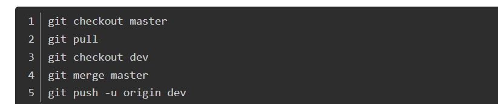

# 分布式版本管理git
### git命令
#### 1. 创建版本库

1. 创建目录  --- $ mkdir learngit
2. 进入目录	--- $ cd learngit	
3. 显示当前目录  --- $ pwd			或$ ls		?
4. 将目录变成Git可以管理的仓库  --- $ git init
5. -------------------------------------
6. 把文件添加到仓库	--- $ git add readme.txt
7. 把文件提交到仓库	--- $ git commit -m "wrote a readme file"
8. -------------------------------------  修改文件
9. 查看仓库当前的状态	--- $ git status
10. 查看difference（对比）	--- $ git diff
11. 提交修改	--- 还是用add commit

#### 2. 版本回退

1. 查看提交历史记录	--- $ git log 
2. 查看历史记录简洁	--- $ git log --pretty=oneline 
3. 当前版本 HEAD 上一版本 ^HEAD 上上版本^^HEAD 或者（HEAD~2）
4. 还原版本	--- $ git reset --hard HEAD^
5. 查看命令历史记录	--- $ git reflog
6. 还原版本（根据commit_id[版本号]）   --- $ git reset --hard 1094a

#### 3. 工作区和暂存区

1. 把暂存区的修改撤销，重新放回工作区	--- $ git reset HEAD readme.txt
2. 丢弃工作区的修改	--- $ git checkout -- readme.txt
3. 删除文件	--- $ rm test.txt
4. 确实要从版本库中删除该文件，那就用命令git rm删掉，并且git commit

#### 4. 远程仓库

1. SSh	---- $ ssh-keygen -t rsa -C "youremail@example.com"
2. 在github上,复制到github SSH keys
3. 新建仓库Create a new repo
4. 把一个已有的本地仓库与之关联 	--- $ git remote add origin https://github.com/Evakkk/Sugus.git
5. 把本地库的内容推送到远程	--- $ git push -u origin master（第一次提交用-u，不仅推送到远程，并且把本地master和远程master关联起来）
6. 以后推送可简化命令	--- $ git push origin master
7. ----------------------------从远程库克隆
7. 克隆到本地		--- $ git clone git@github.com:Evakkk/Sugus.git
8. add commit
9. 把更改同步到远程

#### 5. 常用命令

##### （1）git合并代码

