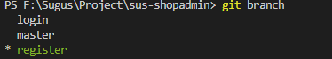
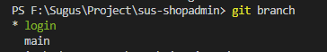

## 一些命令

#### 基础命令

#### 命令

* git remote rm origin	：删除远程仓库（删除git管理的项目与远程仓库的关联）
* git remote add origin 【ssh】  ：添加远程仓库（git管理的项目与远程仓库进行关联）
* git branch -M 【main】   ：好像是修改上一个创建的分支并将其修改成main
* git push -u origin 【main】   ：将项目传到远程仓库【main分支】
* git checkout -b login    ：创建一个login分支，并切换到该分支
* git branch    ：查看所有分支（* 代表所处分支）
* git bash 里
  * ls :  ls的作用是查看你目前所定位的文件夹中的文件

####  组合

* git checkout -b register



* git branch -M main



#### 参考

[git branch -m_您必须知道的 Git 分支开发规范，附 Git 常用命令大全！](https://blog.csdn.net/weixin_39747511/article/details/111162247)

[git 创建分支 并 提交到远程分支](https://blog.csdn.net/songxiugongwang/article/details/86750522)


## github使用

[参考文档](https://blog.csdn.net/qq_37512323/article/details/80693445)

#### 密匙相关

```js
# 获取密匙
//在git bash
$ ssh-keygen -t rsa -C "your_email@youremail.com"

# 复制到自己github上

# 检查是否成功绑定
$ ssh -T git@github.com

# 简单配置
$ git config --global user.name "your name"
$ git config --global user.email "yuor_email..."
//name最好和github上面一样，email一定要是注册github的那个邮箱地址
```

#### 创建库...

```js
# github上创建仓库

# 本地上克隆
//进入要放置的磁盘位置
cd /D
//克隆
$ git clone https://github.com/Evakkk/susShopAdmin.git

```

## 参考文档

[GitHub项目、代码搜索、使用等技巧](https://blog.csdn.net/xiaomu_347/article/details/80729892)