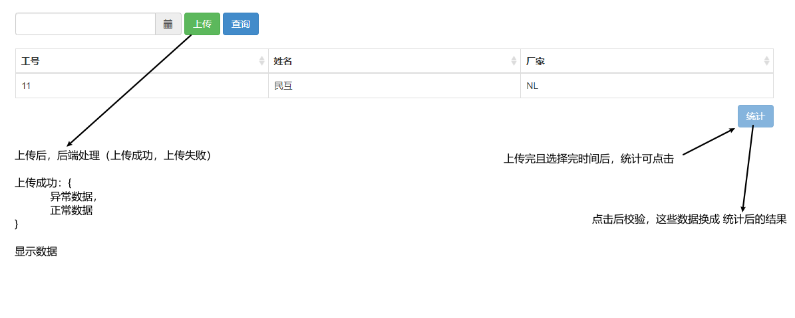
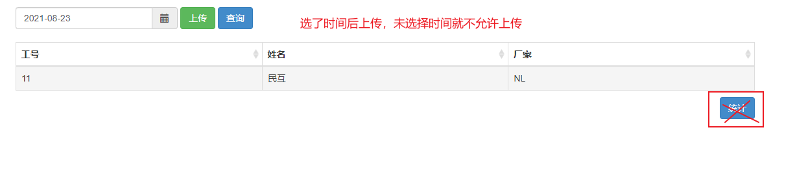

### 数据报表

#### 上传文件

参考bakusersuminfo.html

传一个参数标志 这次为 4

更改以前上传的参数标志，因为原来是定死的


关于时间插件：[bootstrap-datetimepicker 获取时间](https://www.cnblogs.com/liuXiaoDi/p/12868673.html)




### 更改

​	


### 版本管理

cvs


## 一些使用到的

* bootstrap获取整个表格的数据的方式和获取选中行的数据

  ```js
  var Allrows = $('#dataTable').bootstrapTable('getData');//整个表格的数据
  
  var rows = $('#dataTable').bootstrapTable('getSeletctions');//选中行的数据
  ```


木 火 冰 水 雷 岩 风


1. 漫游地与新增列 对应是否相同 优先展示 dataflag：1表示差异 差异标红		------暂时不用
2. 导出按钮文字显示
3. 导出文件名：手机号_大数据行程码
4. 导出文件名：`手机号_日期_信令位置`
5. 工单号展示
6. 查询：清除缓存 （关闭）


## 蓝鲸

蓝鲸-插件前端开发


