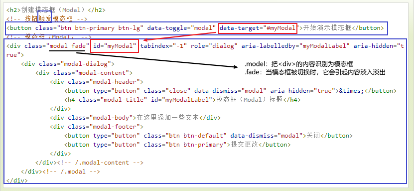
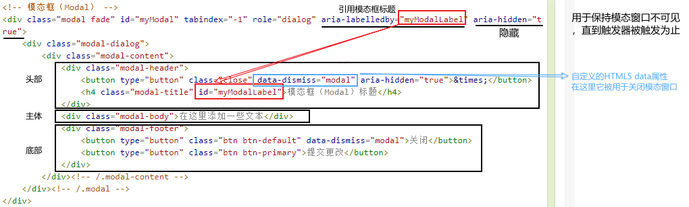

# bootstrap框架

## 基本

* xs(<768px)、sm(≥768px)、md(≥992px)、lg(≥1200px)
* 后面覆盖前面，也就是说：
  1. 如果只设置xs 后面宽度更大的会按照xs的设置的份数分
  2. 如果只设置lg 前面宽度更小的会堆叠，lg不会生效
* bootstrap有默认padding值15px左右
* 列嵌套最好加个行row 这样可以去掉父级的padding值，而且高度自动与父级一致
* 列偏移 col-md-offset-6		（偏移6份）
* .col-md-push-* (推) 和 .col-md-pull-* （拉）
* 响应式工具
  * hidden-xs（在超小屏下隐藏，其他显示）	visible-xs（在超小屏下显示，其他隐藏）
  * hidden-sm（在小屏下隐藏，其他显示） visible-sm
  * hidden-md（在中屏下隐藏，其他显示） visible-md
  * hidden-lg（在大屏下隐藏，其他显示） visible-lg

#### [bootstrap简单介绍](https://blog.csdn.net/vanliujian/article/details/106226397)

## 概括

### 1. data属性

关于data属性，Bootstrap许多的效果都是由class=””来实现的，而这个data属性在这里就显得比较的特别。


这里的data属性是HTML5允许开发者自由为其标签添加属性，这种自定义属性一般以“data-”开头。

* 关于data-\*的定义和用法：
  * data-* 属性用于存储页面或应用程序的私有自定义数据。
  * data-* 属性赋予我们在所有 HTML 元素上嵌入自定义 data 属性的能力。
  * 存储的（自定义）数据能够被页面的 JavaScript 中利用，以创建更好的用户体验（不进行 Ajax 调用或服务器端数据库查询）。
* data-*属性包括两部分：
  * 属性名不应该包含任何大写字母，并且在前缀“data-”之后必须有至少一个字符。
  * 属性值可以是任意字符串

所以说，这里的data属性**不属于Bootstrap**的，是**属于HTML5**中的，这里只是Bootstrap开发者自定义的一个自定义属性，方便于用户调用。


**你可以仅仅通过data属性API就能使用所有的Bootstrap插件，无需写一行JavaScript代码。这是Bootstrap中的一等API，也应该是你的首选方式。**

话又说回来，在某些情况下可能需要将此功能关闭。因此，我们还提供了关闭data属性API的方式，即解除绑定到文档命名空间上的所有事件`data-api`。就像下面这样： 

```javascript
$(document).off('.data-api')
```

<u>==总结一下，bootstrap中的data-api是方便我们调用bootstrap.js中各种包括JQuery.js在内的丰富的插件。==</u>

#### 常见的data属性

##### 1. data-toggle

data-toggle主要用于标签选择器，参见其于bootstrap.css中的部分源码：

```html
[data-toggle="buttons"] > .btn input[type="radio"],
[data-toggle="buttons"] > .btn-group > .btn input[type="radio"],
[data-toggle="buttons"] > .btn input[type="checkbox"],
[data-toggle="buttons"] > .btn-group > .btn input[type="checkbox"] {
  position: absolute;
  clip: rect(0, 0, 0, 0);
  pointer-events: none;
}
```

例如：
```html
<div class=”dropdown”>
  <a href=”#” class="dropdown-toggle" data-toggle="dropdown"></a>
  <ul class="dropdown-menu" role="menu" aria-labelledby="dLabel">
    ...
  </ul>
</div>
```
这里data-toggle=”dropdown”设置为a的属性，用于切换下拉菜单。

data-toggle非常常用，常见的有下拉菜单，配合data-target一起使用。data-toggle，用于告诉 JavaScript 需要对按钮做什么。data-target，指示要切换到哪一个元素。

##### 2. data-target

data-target主要用于配合data-toggle使用，常用于模态窗口、轮播图，作用是指定加载以及切换的目标。

##### 1.2. data-target与data-toggle

​	在模态窗口中配合data-toggle一起使用：
​	在控制器元素（比如按钮或者链接）上设置属性 data-toggle="modal"，同时设置data-target="#identifier"或href="#identifier"来指定要切换的特定的模态框（带有 id="identifier"）。

bootstrap.js中关于data-toggle与data-target的部分源码：

```js
var Collapse = function (element, options) {
    this.element      = (element)
    this.options       = .extend({}, Collapse.DEFAULTS, options)
    this.trigger      = $('data-toggle="collapse",' +
                           'data-toggle="collapse"')
this.transitioning = null
```

* 下拉菜单示例

```html
<div class="dropdown">
  <a id="dLabel" role="button" data-toggle="dropdown" data-target="#" href="# ">
    下拉菜单（Dropdown） <span class="caret"></span>
  </a>
  <ul class="dropdown-menu" role="menu" aria-labelledby="dLabel">
    ...
  </ul>
</div>
```

* 模态窗口示例

```html
<!-- 按钮触发模态框 -->
<button class="btn btn-primary btn-lg" data-toggle="modal" data-target="#myModal">开始演示模态框</button>
<!-- 模态框（Modal） -->
<div class=”modal fade” id=”myModal” tabindex=”-1” role=”dialog”>
</div>                                                                                                                   
```

* 轮播图示例

```html
<div id="myCarousel" class="carousel slide">
  <!-- 轮播（Carousel）指标 -->
    <ol class="carousel-indicators">
        <li data-target="#myCarousel" data-slide-to="0" class="active"></li>
        …
    </ol>  
 <!-- 轮播（Carousel）项目 -->
 <div class="carousel-inner">
 </div>
</div>
```

##### 3. data-dismiss

常见的是在模态窗口中用于关闭模态窗口 ***\*data-dismiss="modal"\****

##### 4. data-slide-to、data-slide、data-ride


## bootstrap

#### 1. 媒体查询

```js
/* 超小设备（手机，小于 768px） */
/* Bootstrap 中默认情况下没有媒体查询 */

/* 小型设备（平板电脑，768px 起） */
@media (min-width: @screen-sm-min) { ... }

/* 中型设备（台式电脑，992px 起） */
@media (min-width: @screen-md-min) { ... }

/* 大型设备（大台式电脑，1200px 起） */
@media (min-width: @screen-lg-min) { ... }
```


## bootstrap JavaScript插件

### 模态框

```html
<h2>创建模态框（Modal）</h2>
<!-- 按钮触发模态框 -->
<button class="btn btn-primary btn-lg" data-toggle="modal" data-target="#myModal">开始演示模态框</button>
<!-- 模态框（Modal） -->
<div class="modal fade" id="myModal" tabindex="-1" role="dialog" aria-labelledby="myModalLabel" aria-hidden="true">
    <div class="modal-dialog">
        <div class="modal-content">
            <div class="modal-header">
                <button type="button" class="close" data-dismiss="modal" aria-hidden="true">&times;</button>
                <h4 class="modal-title" id="myModalLabel">模态框（Modal）标题</h4>
            </div>
            <div class="modal-body">在这里添加一些文本</div>
            <div class="modal-footer">
                <button type="button" class="btn btn-default" data-dismiss="modal">关闭</button>
                <button type="button" class="btn btn-primary">提交更改</button>
            </div>
        </div><!-- /.modal-content -->
    </div><!-- /.modal -->
</div>
```






* 点击关闭按钮检查事件功能

  ```html
  <script>
  $(function() {
      $('#myModal').on('hide.bs.modal',
      function() {
          alert('嘿，我听说您喜欢模态框...');
      })
  });
  </script>
  ```

  