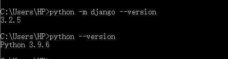
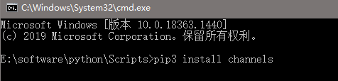
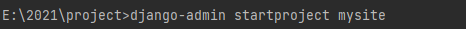
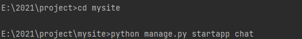
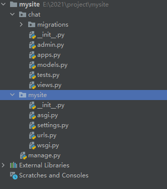

# Django Channel

[channel](https://www.cnblogs.com/Sunzz/p/12788608.html)

[Django Channels 入门指南](https://www.oschina.net/translate/in_deep_with_django_channels_the_future_of_real_time_apps_in_django)

[Django-Channels使用和部署](https://blog.csdn.net/sinat_41292836/article/details/107173795)

[websocket知识汇总以及websocket在Django中的实现](https://blog.csdn.net/guyunzh/article/details/80595567)

[django 实现websocket](https://www.cnblogs.com/caodneg7/p/10446715.html)

[建立应用 ------ python manage.py startapp 应用名](https://www.cnblogs.com/dan-baishucaizi/articles/9149961.html)


[Django channels](https://blog.csdn.net/weixin_42009030/article/details/92611296)

[django channels 路由误导](https://blog.csdn.net/weixin_43159092/article/details/106380481)

[django websocket踩坑项](https://blog.csdn.net/qq_38327141/article/details/118519372)

[django channels](https://www.cnblogs.com/ciquankun/p/11973197.html)

[Django使用Channels实现websocket](https://www.jianshu.com/p/3de90e457bb4)

[django channels](https://www.cnblogs.com/wupeiqi/articles/9593858.html)

[Django通过channels实现websocket聊天室](https://blog.csdn.net/weixin_39726347/article/details/88038563)



django使用websocket最好的办法是用tornado做websocket服务器


## 一、安装channel

```js
pip3 install channels 
pip3 install channels_redis

#pip3 相关指令在python安装目录下 ->Scripts 下执行
```




## 二、新建Django项目

### 1. 新建项目

```
django-admin startproject mysite
```



### 2. 新建应用

```
python manage.py startapp chat
```



形成文件目录



### 3. 编辑 `mysite/settings.py`文件

```js
#注册应用
INSTALLED_APPS = [
    ....
    'chat.apps.ChatConfig',
    "channels",
]
# 在文件尾部新增如下配置
#将ASGI_APPLICATION设置设置为指向该路由对象作为您的根应用程序：
ASGI_APPLICATION = 'mysite.routing.application'

#配置Redis
CHANNEL_LAYERS = {
    'default': {
        'BACKEND': 'channels_redis.core.RedisChannelLayer',
        'CONFIG': {
            "hosts": [('10.0.6.29', 6379)],
        },
    },
}
```


## 三、详细代码与配置


# 一步步

### 1. 安装channel

```js
pip3 install channels 
pip3 install channels_redis

pip install -U channels
```

在settings.py当中的配置

```js

INSTALLED_APPS = [
    'django.contrib.admin',
    'django.contrib.auth',
    'django.contrib.contenttypes',
    'django.contrib.sessions',
    'django.contrib.messages',
    'django.contrib.staticfiles',
    'channels',
    ...
]
 
ASGI_APPLICATION = "项目名.routing.application"
 
# WebSocket
CHANNEL_LAYERS = {
    'default': {
        'BACKEND': 'channels_redis.core.RedisChannelLayer',
        'CONFIG': {
            "hosts": [('127.0.0.1', 6379)],
        },
    },
}

```


