## 概要

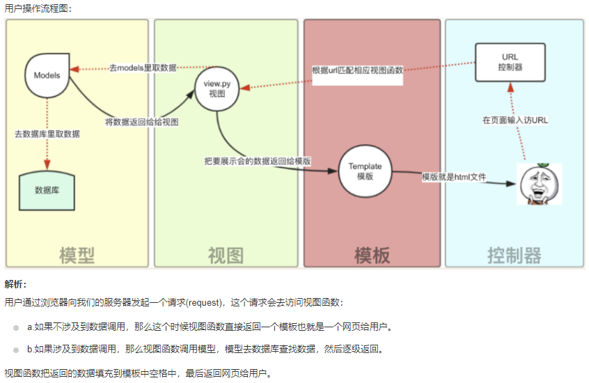

## 一些问题

### 1. pip相关

安装指令

```shell
pip install -U channels
```

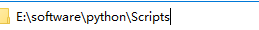

cd 到Script目录，然后执行pip安装命令


## 创建运行项目

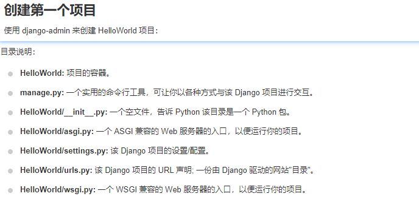

```js
# 项目结构
    setting.py: 项目的配置文件
    urls.py: 进行url路由的配置
    wsgi.py: web服务器与django交互的入口
    manage.py: 项目的管理文件
```


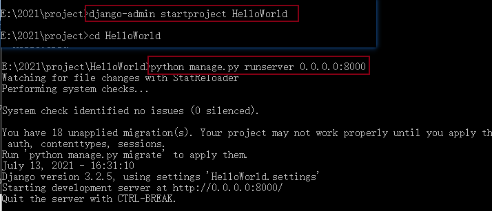

​	

## 配置

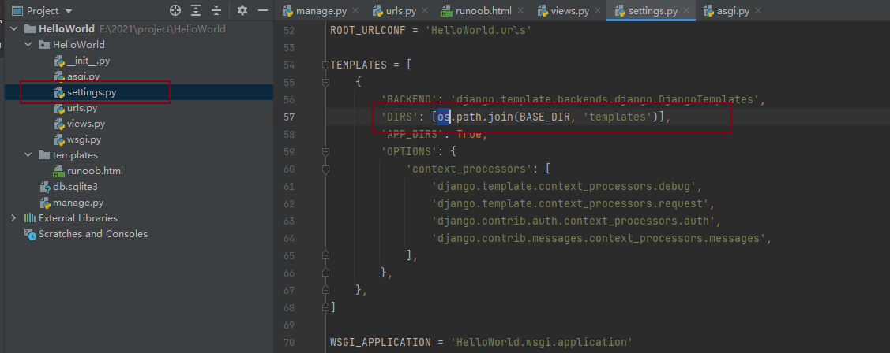

注：settings.py 需改成以下的。

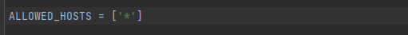

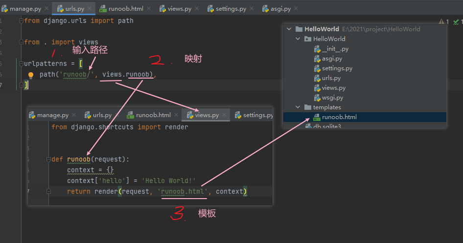

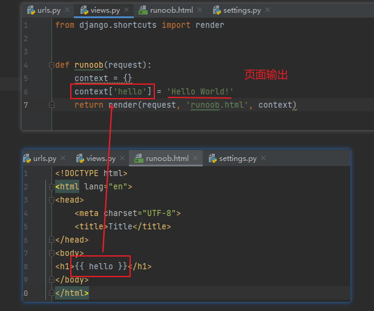


```js
# 执行项目： 
	python manage.py runserver 192.168.32.1:8999

```


## 创建一个应用

​	在Web应用中，通常有一些业务功能模块是在不同的项目中都可以复用的，故在开发中通常将工程项目拆分为不同的子功能模块，各功能模块间可以保持相对的独立，在其他工程项目中需要用到某个特定功能模块时，可以将该模块代码整体复制过去，达到复用。

####  1. 创建子应用

```js
python manage.py startapp 子应用名称   #manage.py是创建工程时自动生成的管理文件
```

#### 2. 子应用目录说明

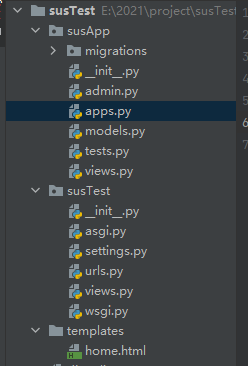

```js
admin.py 文件跟网站的后台管理站点配置相关。
apps.py 文件用于配置当前子应用的相关信息。
migrations 目录用于存放数据库迁移历史文件。
models.py 文件用户保存数据库模型类。
tests.py 文件用于开发测试用例，编写单元测试。
views.py 文件用于编写Web应用视图。
```

#### 3. 注册安装子应用

创建出来的子应用目录文件虽然被放到了工程项目目录中，但是django工程并不能立即直接使用该子应用，需要注册安装后才能使用。

在工程配置文件settings.py中，**INSTALLED_APPS**项保存了工程中已经注册安装的子应用，初始工程中的INSTALLED_APPS如下：

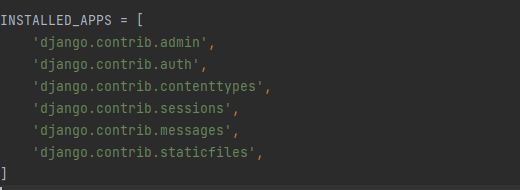

**注册安装一个子应用的方法，即是将子应用的配置信息文件apps.py中的Config类添加到INSTALLED_APPS列表中。**

例如，将刚创建的susApp子应用添加到工程中，可在INSTALLED_APPS列表中添加**'users.apps.UsersConfig'**。

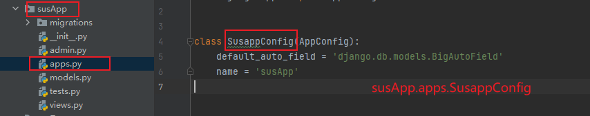


### Django 模板标签

#### 1. 变量

```js
# 模板语法：
    view：｛"HTML变量名" : "views变量名"｝
    HTML：｛｛变量名｝｝	
```

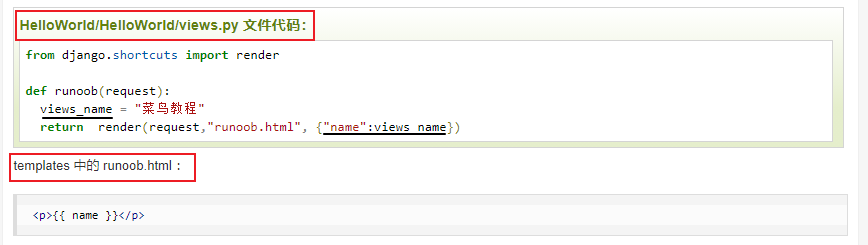

#### 2. 列表

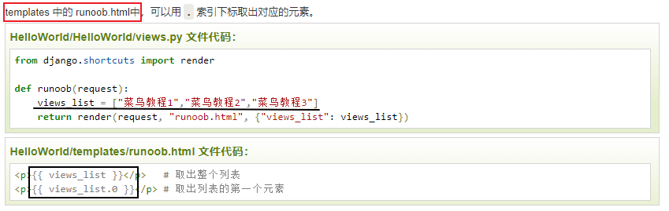

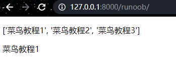

#### 3. 字典

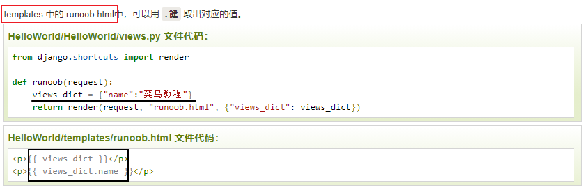

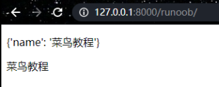

#### 4. 过滤器

```js
# 模板语法：
	{{ 变量名 | 过滤器：可选参数 }}

# 模板过滤器可以在变量被显示前修改它，过滤器使用管道字符，如下所示：
	{{ name|lower }}
	//{{ name }} 变量被过滤器 lower 处理后，文档大写转换文本为小写。

# 过滤管道可以被* 套接* ，既是说，一个过滤器管道的输出又可以作为下一个管道的输入：
	{{ my_list|first|upper }}
	//以上实例将第一个元素并将其转化为大写。

# 有些过滤器有参数。 过滤器的参数跟随冒号之后并且总是以双引号包含。 例如：
	{{ bio|truncatewords:"30" }}
	//这个将显示变量 bio 的前30个词。

# 其他过滤器：
    addslashes : 添加反斜杠到任何反斜杠、单引号或者双引号前面。
    date : 按指定的格式字符串参数格式化 date 或者 datetime 对象，
    	实例：{{ pub_date|date:"F j, Y" }}
    length : 返回变量的长度。
```

* upper/lower：将元素转化为大写/小写

* first：取第一个元素

* truncatewords：取其前n个词

  * 如果字符串包含的字符总个数多于指定的字符数量，那么会被截断掉后面的部分。
  * 截断的字符串将以 **...** 结尾。

  ```django
  {{ bio|truncatewords:"30" }}
  ```

  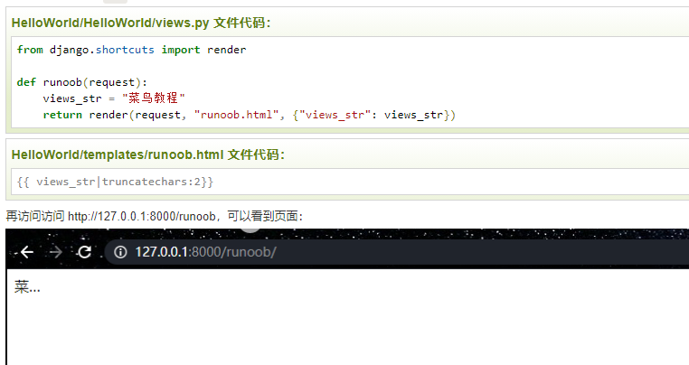

* addslashes：添加反斜杠到任何反斜杠、单引号或者双引号前面。

* date：按指定的格式字符串参数格式化 date 或者 datetime 对象

  ```django
  {{ pub_date|date:"F j, Y" }}
  ```

  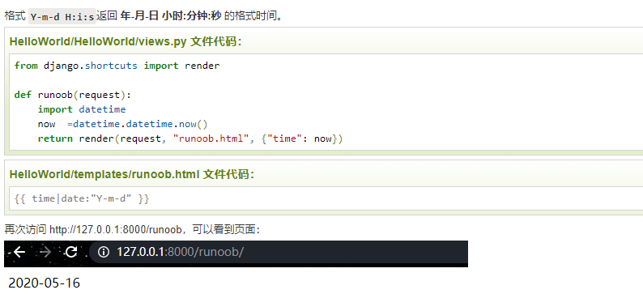

* length：返回对象的长度，适用于字符串和列表。

  * 字典返回的是键值对的数量，集合返回的是去重后的长度。

* default：为变量提供一个默认值。

  * 如果 views 传的变量的布尔值是 false，则使用指定的默认值。

  * 以下值为 false：

    ```django
    0  0.0  False  0j  ""  []  ()  set()  {}  None
    ```

    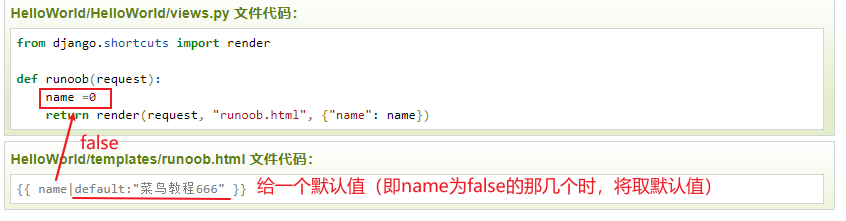

* filesizeformat：以更易读的方式显示文件的大小（即'13 KB', '4.1 MB', '102 bytes'等）

  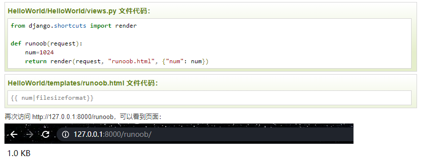

* safe：将字符串标记为安全，不需要转义。

  * 要保证 views.py 传过来的数据绝对安全，才能用 safe。
  * 和后端 views.py 的 mark_safe 效果相同。
  * Django 会自动对 views.py 传到HTML文件中的标签语法进行转义，令其语义失效。加 safe 过滤器是告诉 Django 该数据是安全的，不必对其进行转义，可以让该数据语义生效。

  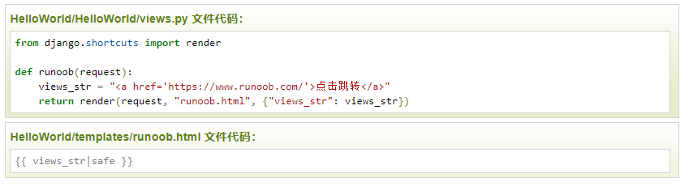

#### 5. if/else标签

* 基本语法格式

  ```django
  
       ... display
  
  
  或者
  
  
     ... display 1
  
     ... display 2
  
     ... display 3
  
  ```

*  标签接受 and ， or 或者 not 关键字来对多个变量做判断 ，或者对变量取反（ not )

  ```django
  
       athletes 和 coaches 变量都是可用的。
  
  ```

#### 6. for标签


## test项目

执行命令

```js
python manage.py runserver 192.168.32.1:8999
```


### 1. 创建

```js
django-admin startproject susTest
```

目录如下：	

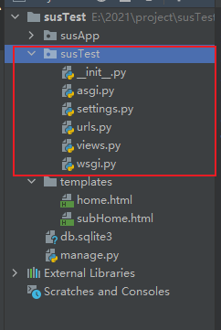

更改susTest/settings.py设置

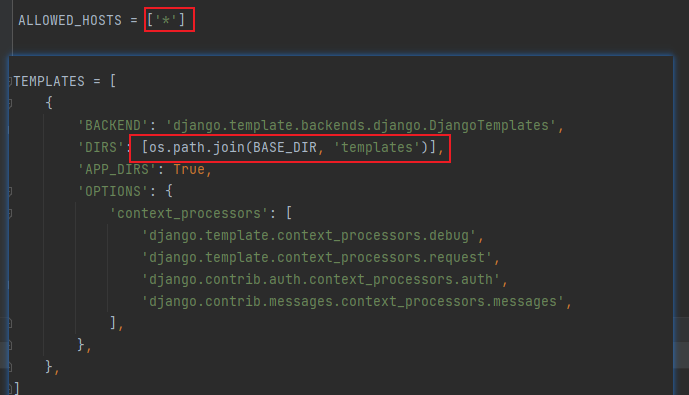

susTest/urls.py

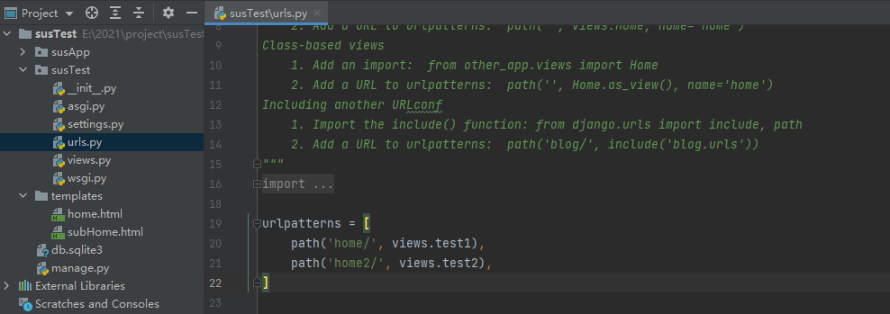

susTest/views.py

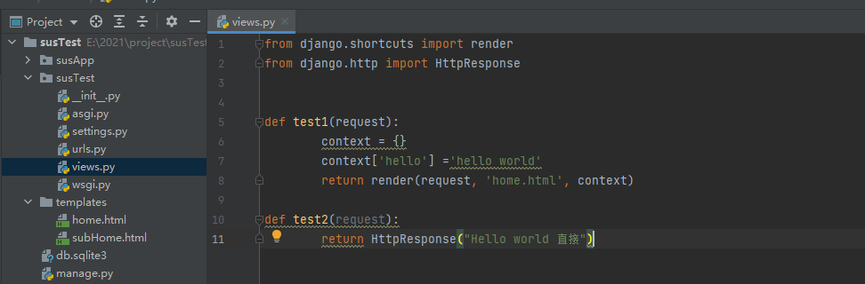

### 2. 创建子应用

```js
cd susTest
python manage.py startapp susApp
```

在susTest/urls.py

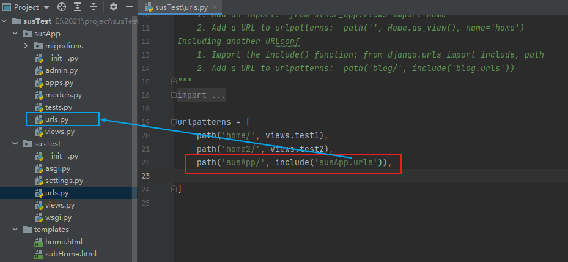

在susApp/urls.py

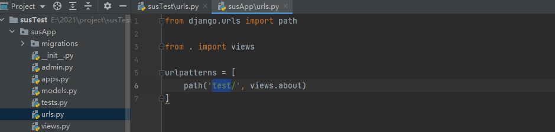

所以访问的地址为

susApp/test