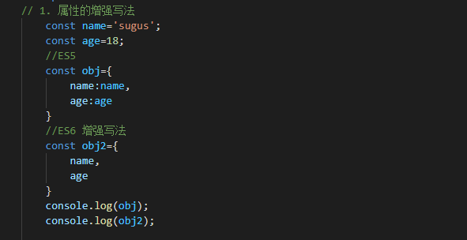
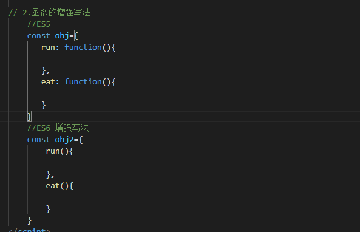
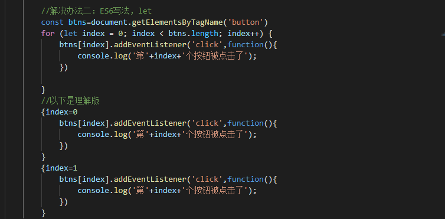

# ES6
### JavaScript由三部分组成：ECMAScript（核心）+DOM（文档对象模型）+BOM（浏览器对象模型）
* ECMAScript作为核心，规定了语言的组成部分：语法、类型、语句、关键字、保留字、操作符、对象
* DOM把整个页面映射为一个多层节点结果，开发人员可借助DOM提供的API，轻松地删除、添加、替换或修改任何节点。
* BOM支持可以访问和操作浏览器窗口的浏览器对象模型，开发人员可以控制浏览器显示的页面以外的部分
### ES5简介：ECMAScript第五个版本
* strict模式
* Array的every、some、forEach、filter、indexOf、lastIndexOf、isArray、map、reduce、reduceRight等方法
* Object方法
### ES6：ECMAScript第六个版本，增加的新特性：
* 块级作用域 关键字let，常量const
* 对象字面量的属性赋值简写
* 对象解构赋值
* ...
* 最常用的ES6特性：let，const，class，extends，super，arrow functions，template string，destructuring，default，rest arguments。
### es6、es5
* let、var、const
	1. var只有全局作用域和函数作用域，没有块级作用域。
	2. let有了块级作用域
	3. const修饰的标识符为常量 
		1. 常量的含义是指向的对象不能修改，但是可以改变对象的属性
	4. 建议在ES6开发中，优先使用const
* 场外： 字面量 
	* const obj=new Obejct();	//正常写法
	* const obj={};		//字面量
* 对象字面量增强写法
	* 
	* 
* 
### js经典问题
* 闭包，立即执行函数（形参传入）？箭头函数
[闭包](https://blog.csdn.net/educast/article/details/69567650)
* 一个js经典问题-按钮监听里的i值-[经典问题](https://blog.csdn.net/qq_25107499/article/details/52644796)
 
 