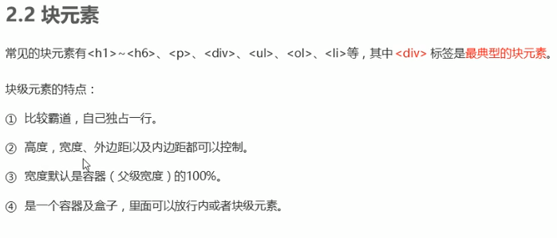
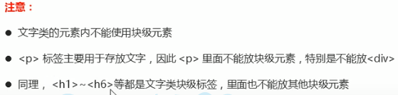
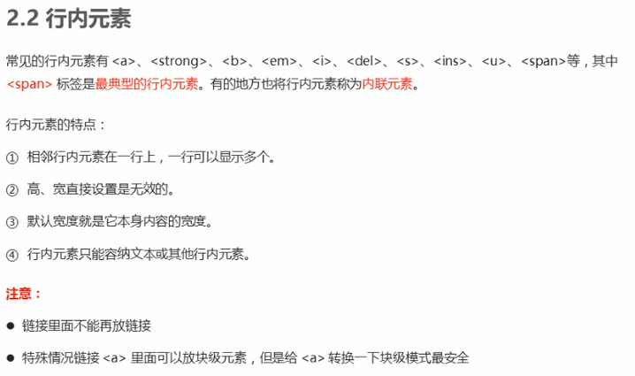
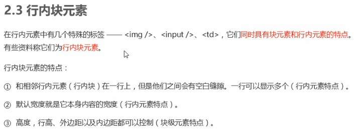
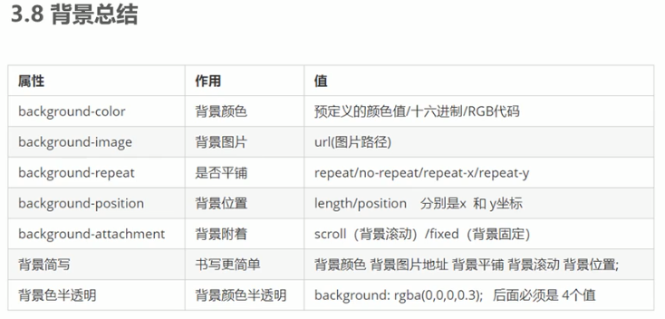
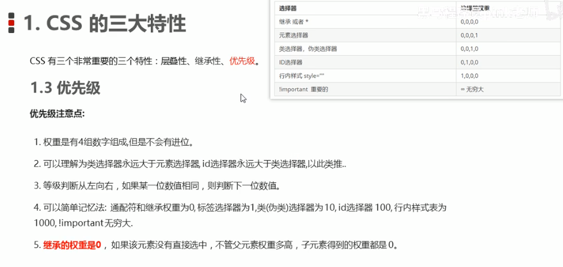
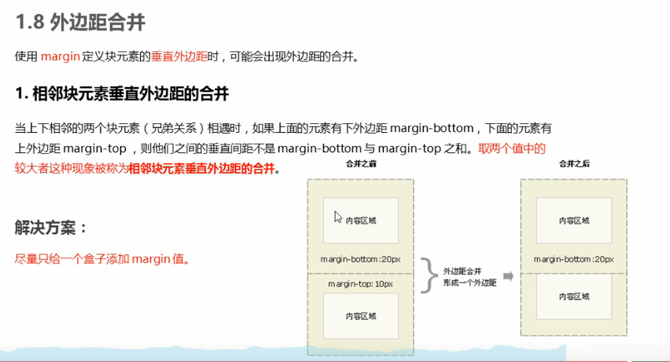
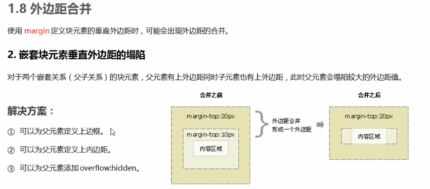
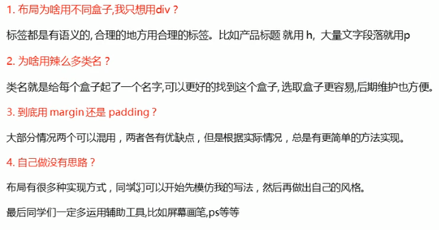
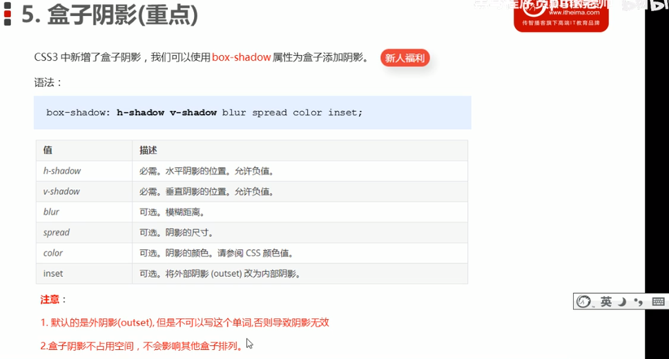

# 前端 css部分
* 文本
```
color 文本颜色
text-align 文本对齐
text-indent 文本缩进
text-deroration 文本装饰（下划线等）
line-height 行高
```

* 复合选择器
```
	后代选择器： div ul(div下所有的ul)
	子元素选择器： div>ul（div下的儿子 ul）
	并集选择器： div，p{} (两个都改)
	伪类选择器： （用冒号表示） :hover :first-child等
			链接伪类： （最好按顺序写 lvha）(通常需要给a单独指定 body指定颜色不生效)
						a:link{}（未被访问）
						a:visited{}（已被访问）
						a:hover{}（鼠标位于链接上 鼠标悬停）
						a:active{}（选择活动链接即鼠标按下未弹起）
			:focus伪类选择器：（用于选取获得焦点的表单元素）（这个选择器一般针对表单）
						input:focus{}（获得光标的input元素）


```

* css元素的显示模式
	
	

	

	

* css元素显示模式的转换
	转换为块元素： display:block; (块)
	转换为行内元素： display:inline; (在行内)
	转换为行内块元素：display:inline-block;

* 背景图片
	background-color
	background-image
	background-repeat
	background-position:x y;
		（方位名词 left top bottom center...）（只设置一个另一个默认center）
		（精确单位 20px 50px ...）（只设置一个另一个默认center） 	百分比（50%）
		（混合单位 20px center...）（只设置一个另一个默认center）
	

* css三大特性（重要！）
	

权重计算1

```
li {
	color: red;
}
ul li {
	color:green
}


<ul>
	<li>	将会是绿色	</li>
	<li>	因为ul li 的权重叠加高 为11	</li>
	<li>	li的权重为1	</li>
</ul>

```
	
权重计算2

```
//想要第一个li标签内容为粉色
.list li{
	color:red;
}
.pink{		//此方法不行.list li权重为11 .pink为10
	color:pink;
}

//解决方法
.list .pink{
	color:pink;		//权重为20
}

<ul class="list">
	<li class="pink">	变色	</li>
	<li>	变色	</li>
	<li>	变色	</li>
</ul>
```

* 盒子模型
	1. 组成部分：（边框、外边距、内边距、实际内容）（border、margin、padding、content）

```
			边框简写：	border: 1px solid red;
			边框分开写：	border-top: 1px solid pink;
			表格细线边框：	border-collapse: collapse;   
					（表格需要设置该属性、否则边框会重叠 一个td 1px 左边右边合在一起为2px）
```
		
注意事项

```
	边框、内边距会撑大盒子 原来200**200
			（边框10px 盒子会变成 220220）
			（再设内边距10px 盒子会变成240*240）

	例子：
		导航栏字数不一样 此时设置盒子宽高固定盒子大小不合理
		解决：采用padding会撑大盒子的原理，只设置内边距。则可以合理分配不同字数盒子大小不
```

   外边距可以让`块级盒子`水平居中

```
	    需满足的条件：1. 盒子必须指定宽度	2. 盒子左右外边距设为auto
	    常见三种写法：1. margin-left: auto; 	margin-right: auto
					 2.	margin: auto;
					 3.	margin: 0 auto;
 ```


   2. `相邻块元素`垂直外边距的合并（ `外边距合并问题`）
		
```
	解决方案：(这个可以避免)
		1.尽量只给一个盒子添加margin值
```
   3. `嵌套块元素`垂直外边的距塌陷（ `外边距合并问题`）
		
```
父元素盒子{
	width: 400px;
    height: 400px;
	margin:40px auto;
    background-color: #ff8500;	
}
子元素盒子{
	width: 100px;
    height: 100px;
	margin:30px auto;
    background-color: red;	
}	父元素会塌陷较大的外边距值


	解决方案：（这个很难避免）
		1.可以为父元素定义上边框 （或边框）
			border: 1px solid transparent; (设置边框透明，但是会撑大盒子 设置边框透明，边框部分颜色为background设置的颜色)
		2.可以为父元素定义上内边距（或内边距）
			padding: 1px; (会撑大盒子)
		3.可以为父元素添加overflow:hidden	（不会撑大盒子，比较常用）

```

   4. 清除内外边距
		元素很多都带有默认内外边距，因此在进行网页布局前需要先清除内外边距
```
	* {
		margin: 0;
		padding: 0;
	}


	!注意：
		行内元素为了照顾兼容性，尽量只设置左右内外边距，不要设置上下内外边距。但是转换为块级和行内块元素就可以了。


```

* 遇到的问题
	


* css3新增的三个样式（有兼容性的问题，IE9及以上才可以）
```
圆角边框	border-radius:10px;  // (可以写百分制 50%;)
			border-radius:10px 20px 30px 40px;（左上开始顺时针）
盒子阴影	box-shadow:10px 10px 10px -4px rgba(0,0,0,0.3)
文字阴影	text-shadow:5px 5px 6px rgba(0,0,0,0.3)
				h-shadow（水平移动） v-shadow（垂直移动） blur(虚实) color
	
```




