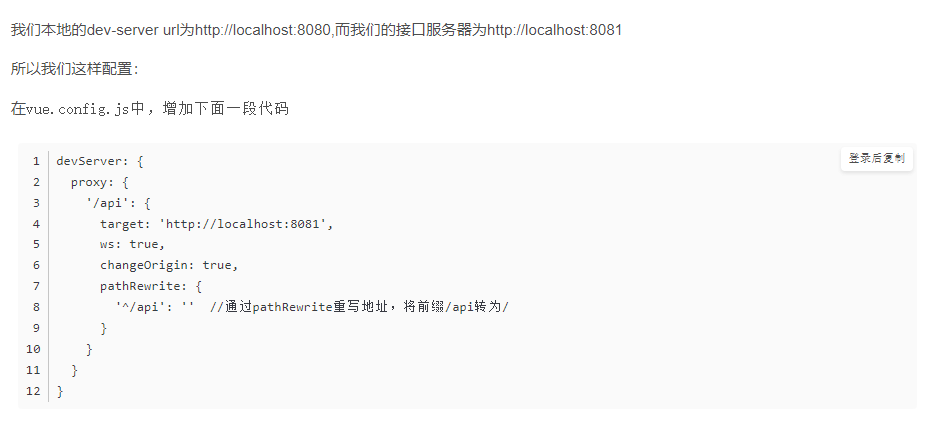

[vuecli官方文档](https://cli.vuejs.org/zh/config)

## 一、 axios

[对比jQuery与vue+axios，两者发送ajax请求的方法和不同](https://blog.csdn.net/weixin_45901207/article/details/105967941)

### 前端跨域处理的两种方式

#### proxyTable

* proxyTable：主要用于解决vue**开发环境**跨域的问题


#### nginx

* nginx：我们有的时候也需要处理**生产环境**的跨域问题，这个时候就需要借助于nginx来处理
  * http服务器，可以独立提供http服务；
  * 虚拟主机：多个域名指向同一个服务器，服务器根据不同的域名把请求转发到不同的应用服务器；
  * 反向代理：负载均衡，将请求转发至不同的服务器

* 安装与使用
  * 可以百度搜索nginx下载，将下载的文件解压后，启动命令行开启web服务器,【注意】**nginx的下载包不可放在有中文目录的文件夹**。
  * 解决跨域问题，主要是**更改nginx的配置文件nginx.conf**，通过配置修改地址的转发。
* 详细请看 [前端跨域处理的两种方式proxyTable和nginx](https://blog.csdn.net/weixin_38684316/article/details/103021860)

### 1. 跨域


#### 关于跨域

​	业界解决浏跨域问题的方案很多, 笔者在这里粗略介绍一下: ***JSONP实现跨域** 通过script标签和url回调来实现跨域, 缺点是只支持get请求* **CORS** CORS需要浏览器和后端同时支持, 后端设置**Access-Control-Allow-Origin** 就可以开启 CORS ***postMessage** 可以实现跨文本档、多窗口、跨域消息传递(笔者之前写可插拔式聊天机器人就是采用该方案)* **websocket** websocket是**HTML5**的一个持久化的协议，它实现了浏览器与服务器的全双工通信，也是跨域的一种解决方案 ***nginx反向代理*** **document.domain + iframe** 比较传统的跨域解决方案

​	目前作为大规模跨域开发使用最多的模式还是**CORS方案**,所以笔者接下来将具体介绍采用**cors模式**搭建前后端跨域访问通用解决方案, 为了方便,笔者后端将采用**nodejs+koa**, (**java/php**开发类似), 前端采用**axios**作为请求库来配合实现完整的**cors模式**.


#### 解决跨域


#### 一些理解

​	==跨域是js的特性，服务端不受影响==

*  方法一：后端可以下载cors包，对指定的前端域名允许请求；具体操作可以自行百度；
   *  后端一般配置跨域策略有两个维度，视为同源的域名（Access-Control-Allow-Origin）、可执行的http方法（Access-Control-Allow-Methods）
*  方法二：前端设置服务器代理；
   *    **服务器代理**：Nginx。跨域是js的特性，服务端不受影响，所以可以用服务器来请求对应的数据，再返给前端
   *    jsonp
   *    ....


#### 一些文章 

1.  [原因:CORS 头缺少 ‘Access-Control-Allow-Origin’ 解决办法](https://www.fujieace.com/html/cors.html)

    [与上面一样](https://blog.csdn.net/qlin_11/article/details/99302292)

2.  [我觉得讲得很好：前端使用Vue框架解决跨域问题](https://blog.csdn.net/weixin_44836296/article/details/88927644)

3. [我觉得讲得很好：Vue 前端跨域的解决方案（心得记录）](https://blog.csdn.net/u012436704/article/details/83314729)

4. [【较复杂】，但我觉得要看：CORS 跨域(前端+后端代码实例讲解)](https://juejin.cn/post/6844904055148380173)

5. [【较复杂】当遇到跨域开发时, 我们如何处理好前后端配置和请求库封装(koa/axios版)](https://zhuanlan.zhihu.com/p/164674675)

6. [【较复杂】ajax跨域，这应该是最全的解决方案了](https://segmentfault.com/a/1190000012469713)

7. [前端跨域原理及测试方式](https://www.cnblogs.com/ls-shiyi/p/13347762.html)


#### 实例

* 后端

  ```java
  	@RequestMapping("/sugus/test")
  	@ResponseBody
  	public String getLCate(){
  
  		return "Sugus Test";
  	}
  //启动项目，运行http://localhost:8080/sugus/test
  ```

  

* vue中请求

  ```vue
  import axios from 'axios'	
  
  axios({
      url:'/api/sugus/test',
      method:'get'			//不写默认就是get
  }).then(res=>{
      console.log(res)
  })
  ```

  可以看到出现跨域


* 解决

  * vue-cli2中，在config文件夹中配置服务器代理

  

  * vue-cli3中，在项目根目录下建立一个vue.config.js的文件（一定要记住是根目录）

  

  

  **简洁版：**

  

  

  

  

  **详细版：**

  ```js
  // vue.config.js 配置说明
  //官方vue.config.js 参考文档 https://cli.vuejs.org/zh/config/#css-loaderoptions
  // 这里只列一部分，具体配置参考文档
  module.exports = {
      // 部署生产环境和开发环境下的URL。
      // 默认情况下，Vue CLI 会假设你的应用是被部署在一个域名的根路径上
      //例如 https://www.my-app.com/。如果应用被部署在一个子路径上，你就需要用这个选项指定这个子路径。例如，如果你的应用被部署在 https://www.my-app.com/my-app/，则设置 baseUrl 为 /my-app/。
          //baseUrl 从 Vue CLI 3.3 起已弃用，请使用publicPath
        //baseUrl: process.env.NODE_ENV === "production" ? "./" : "/",
        publicPath: process.env.NODE_ENV === "production" ? "./" : "/",
     
      // outputDir: 在npm run build 或 yarn build 时 ，生成文件的目录名称（要和baseUrl的生产环境路径一致）
      outputDir: "mycli3",
      //用于放置生成的静态资源 (js、css、img、fonts) 的；（项目打包之后，静态资源会放在这个文件夹下）
      assetsDir: "assets",
      //指定生成的 index.html 的输出路径  (打包之后，改变系统默认的index.html的文件名)
      // indexPath: "myIndex.html",
      //默认情况下，生成的静态资源在它们的文件名中包含了 hash 以便更好的控制缓存。你可以通过将这个选项设为 false 来关闭文件名哈希。(false的时候就是让原来的文件名不改变)
      filenameHashing: false,
     
      //   lintOnSave：{ type:Boolean default:true } 问你是否使用eslint
      lintOnSave: true,
      //如果你想要在生产构建时禁用 eslint-loader，你可以用如下配置
      // lintOnSave: process.env.NODE_ENV !== 'production',
     
      //是否使用包含运行时编译器的 Vue 构建版本。设置为 true 后你就可以在 Vue 组件中使用 template 选项了，但是这会让你的应用额外增加 10kb 左右。(默认false)
      // runtimeCompiler: false,
     
      /**
       * 如果你不需要生产环境的 source map，可以将其设置为 false 以加速生产环境构建。
       *  打包之后发现map文件过大，项目文件体积很大，设置为false就可以不输出map文件
       *  map文件的作用在于：项目打包后，代码都是经过压缩加密的，如果运行时报错，输出的错误信息无法准确得知是哪里的代码报错。
       *  有了map就可以像未加密的代码一样，准确的输出是哪一行哪一列有错。
       * */
      productionSourceMap: false,
     
      // 它支持webPack-dev-server的所有选项
      devServer: {
        host: "localhost",
        port: 8081, // 端口号
        https: false, // https:{type:Boolean}
        open: true, //配置自动启动浏览器
        // proxy: 'http://localhost:4000' // 配置跨域处理,只有一个代理
     
        // 配置多个代理
        proxy: {
          "/api": {
            target: "http://localhost:8080/",// 要访问的接口域名
            ws: true,// 是否启用websockets
            changeOrigin: true, //开启代理：在本地会创建一个虚拟服务端，然后发送请求的数据，并同时接收请求的数据，这样服务端和服务端进行数据的交互就不会有跨域问题
            pathRewrite: {
                '^/api': '' 		
                //请求'/api/user/add'地址； '/api'会重写为'' 因此加上代理，请求的即为'http://40.00.100.100:3002/user/add'	， '^'代表限定开头
              }
          }
        }
      }
    };
  ```

  主要设置target、ws、changeOrigin:true

  **target：**对应的属性值为你准备向后端服务器发送请求的主机+端口，含义为：相当于把前端发送请求的主机+端口自动替换成挂载的主机和端口，这样前后端的主机端口都一一就不会存在跨域问题；

  **ws：**表示WebSocket协议；

  **changeOrigin:true；** 表示是否改变原域名；这个一定要选择为true;

  **pathRewrite：**路径重写。

  ```js
  pathRewrite
  例如，我要请求	'http://localhost:8080/sugus/test'
  	配置代理	'http://localhost:8080/'
  	设置重写	'^/api': ''
  
  	这样的话写axios请求url为'/api/sugus/test'
  	会把'/api'重写为''
  
  为什么要这样子呢？？
  	不设置重写的话，将请求写成'/api/sugus/test' 
  	会导致真正的请求变成'http://localhost:8080/api/sugus/test'
  
  但是我们为什么要 请求'/api/sugus/test' 设置重写，而不是直接请求'/sugus/test'
  	我猜是因为前面的proxy:{"/api":{...}}配置，所以要写api，并且可能有多个代理
  ```


### 2. 接口请求

[关于vue使用axios post发送json数据跨域请求403的解决方法](https://blog.csdn.net/w770583069/article/details/81777892)


关于vue接口请求可以看上面文章的后面部分。

### 3. 实现

* 看 1. 中的实例
* [VUE项目中的跨域问题，实现](https://zhuanlan.zhihu.com/p/274238013)
* [请求实现](https://blog.csdn.net/weixin_33862993/article/details/93279771)
* [vue中使用axios给生产环境和开发环境配置不同的 baseUrl:process.env.BASE_API](https://blog.csdn.net/qq_41348029/article/details/84133983)
* [axios 的理解和使用 axios.create(对axios请求进行二次封装) 拦截器 取消请求(axios.CancelToken)](https://blog.csdn.net/weixin_42448623/article/details/104773280)