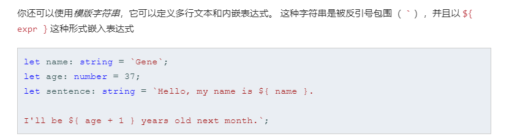
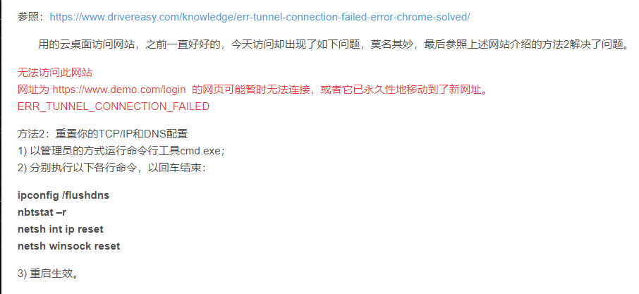

#### ^

[正则表达式中的“^“这个符号的一些思考](https://blog.csdn.net/sufubo/article/details/50990684)

我发现了只要是"^“这个字符是在中括号”[]“中被使用的话就是表示**字符类的否定**，如果不是的话就是表示**限定开头**。我这里说的是直接在”[]“中使用，不包括嵌套使用。

#### 模板字符串

#### 谷歌有些网页打不开

[网页可能暂时无法连接，或者它已永久性地移动到了新网址，返回ERR_TUNNEL_CONNECTION_FAILED](https://blog.csdn.net/u014034329/article/details/84393296)