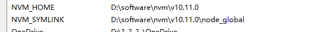
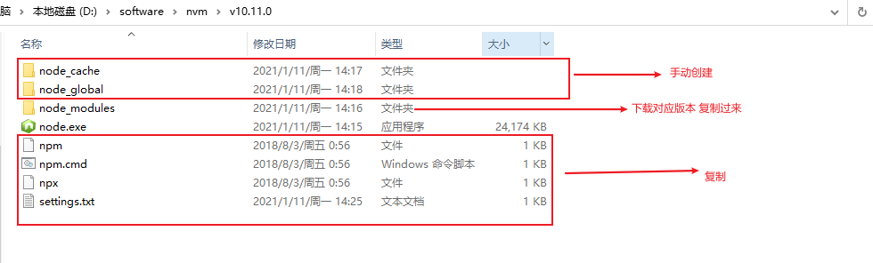
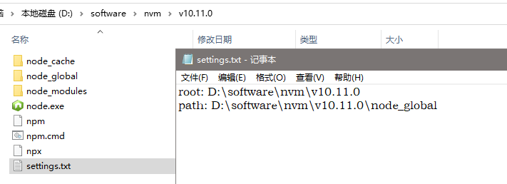

1. nvm install 12.4.0   安装不同node版本

   nvm list  	--查看有何版本

   nvm use 12.4.0		--选择使用版本

2. 更改环境变量 
   NVM_HOME ： 使用的node版本
   NVM_SYMLINK : 使用的node版本全局安装位置

3. 

4. set config prifix... global、cache

5. 用脚本写切换环境变量？  .bat文件