## datav

### 一、 使用其他

* 创建vue项目

```sh
vue create datav-project
```

* 安装datav

```sh
cd datav-project
npm install @jiaminghi/data-view
```

* 使用datav

```js
//在main.js里
import dataV from '@jiaminghi/data-view'
Vue.use(dataV)
```

* 使用组件

### 二、 datav组件开发

#### 1. 安装开发工具

```sh
npm install --registry=https://registry.npm.taobao.org datav-cli -g
```

#### 2. 用户登录

 登录不是必须的，如果您只想使用创建组件和预览组件功能，可以不进行登录操作。只有发布功能需要登录。

#### 3. 生成组件包

​	`datav init`

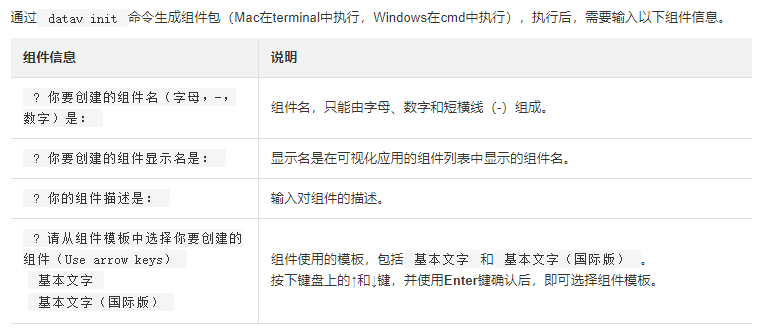

#### 4. 预览组件

```shell
cd 您的组件名
datav run
```

####  5. package.json配置文件介绍

* **view：**视图窗口配置

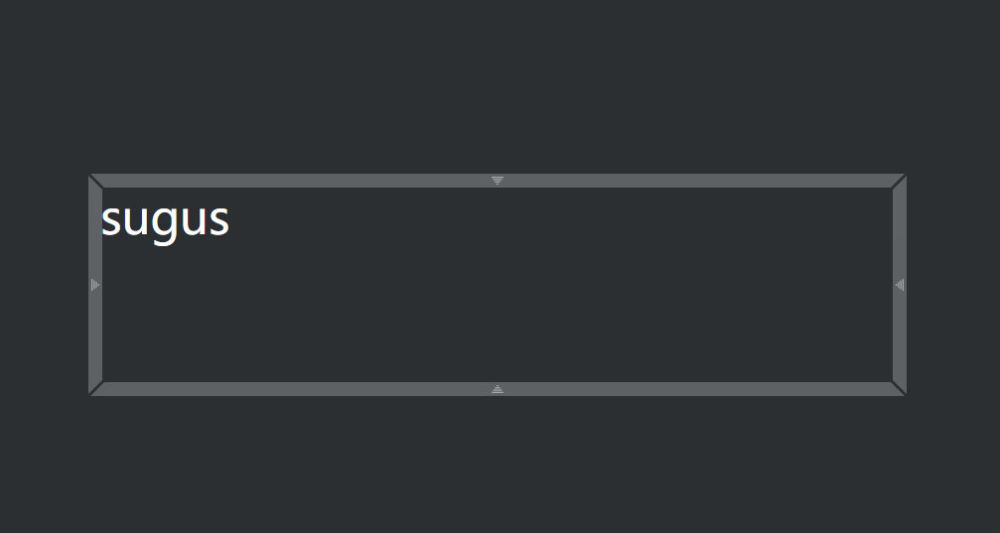

* **config：**组件配置

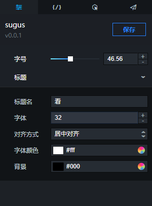

* **apis：**组件接口

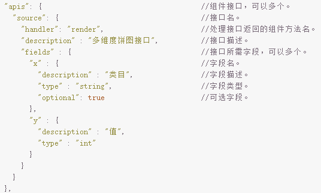

* **api_data：**接口数据

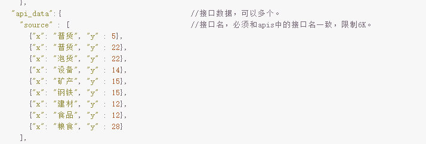

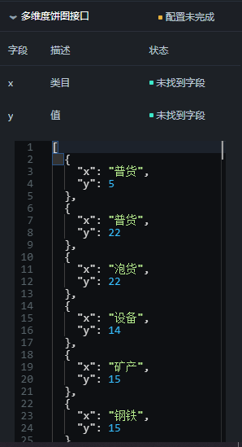

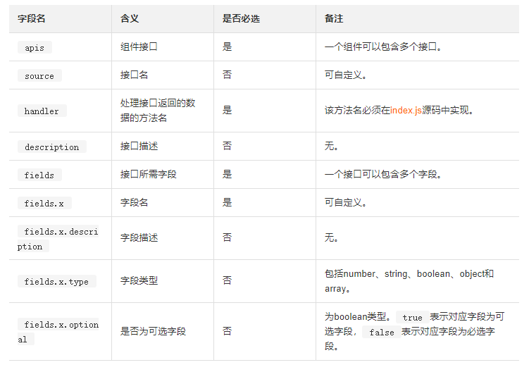

* **events**

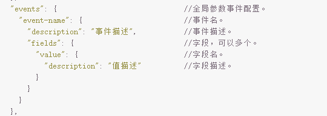

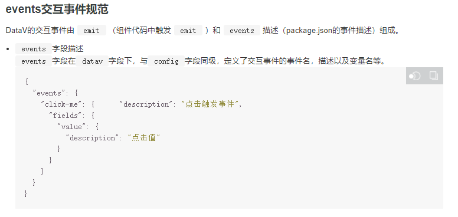

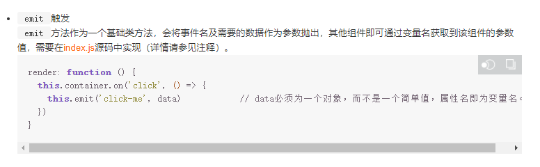

* **publicHandler**

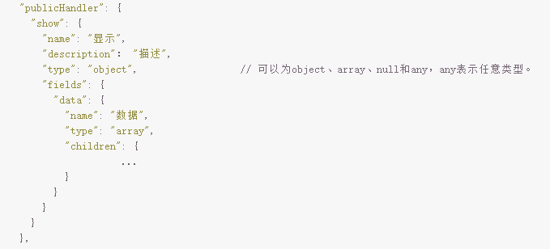

* **icon**

#### 6. index.js介绍

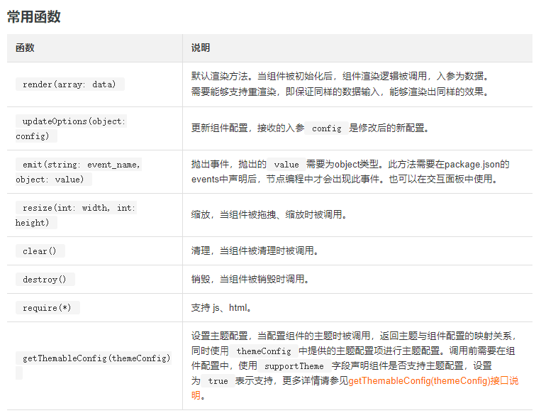

#### 7. 控件config配置

##### 1）组合控件

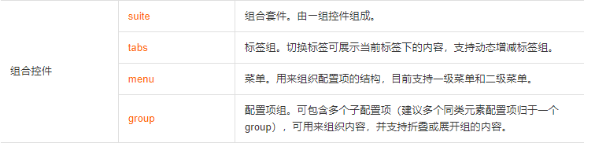

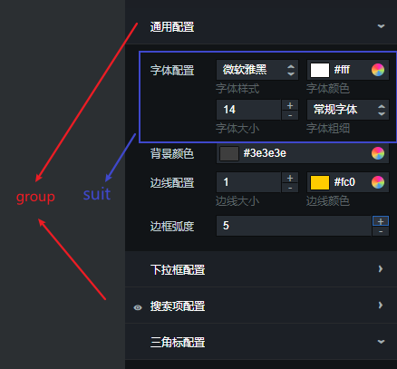

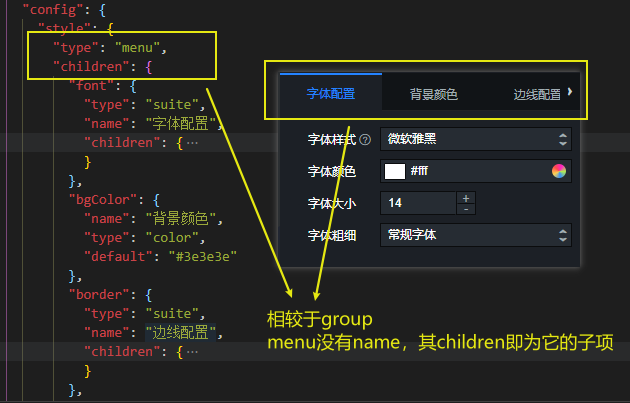

##### 2） 控件相关

​		[看官方文档](https://help.aliyun.com/document_detail/155352.html?spm=a2c4g.11186623.6.992.1a8f6859Pb5ZHr)

##### 3）其中一部分

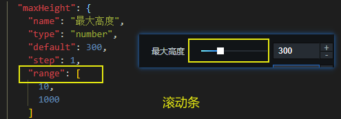


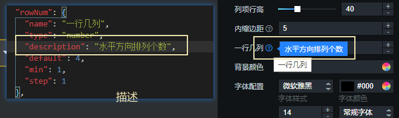


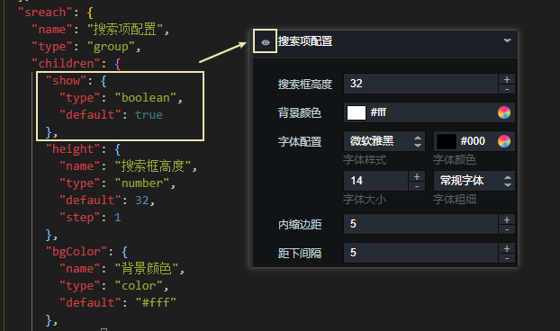


##### 4）试例

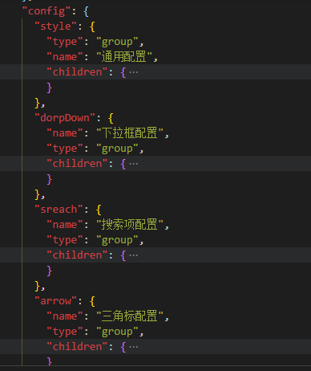

### 三、 命令

#### 1. 运行

```shell
datav run
```

以其他端口运行

```shell
datav run -p 1112
```


### 四、 蓝图编辑器

#### 1. 操作示例

下面以**Tab列表**和**通用标题**组件为例，为您演示蓝图编辑器的具体使用方法。

1. 整理**Tab列表**和**通用标题**组件的交互需求。

   例如单击**Tab列表**中的某一列，可将该列表项中的文本直接显示在**通用标题**组件上。

2. 在可视化画布编辑器页面，搭建所需要的**Tab列表**和**通用标题**组件。

   [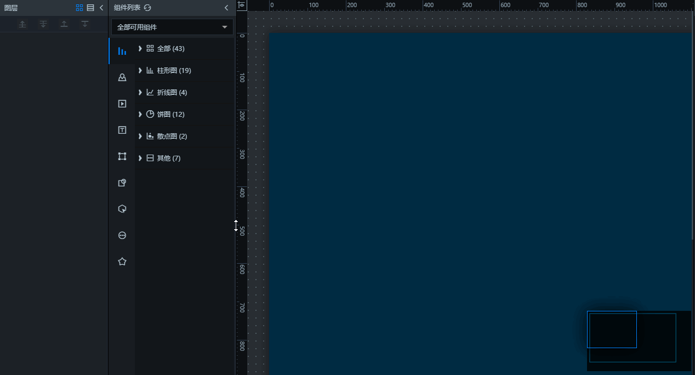](https://static-aliyun-doc.oss-cn-hangzhou.aliyuncs.com/assets/img/zh-CN/1960888951/p52632.gif)

3. 在图层栏内，分别右键单击**Tab列表**和**通用标题**组件，选择**导出到蓝图编辑器**。

   [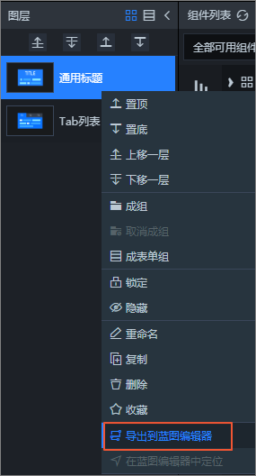](https://static-aliyun-doc.oss-cn-hangzhou.aliyuncs.com/assets/img/zh-CN/2960888951/p113385.png)

4. 成功导出后，单击画布编辑页面左上角的**蓝图编辑器**图标。

   [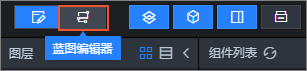](https://static-aliyun-doc.oss-cn-hangzhou.aliyuncs.com/assets/img/zh-CN/2901888951/p80688.png)

5. 在蓝图编辑器页面，将**导入节点**面板中的**Tab列表**和**通用标题**，拖至画布上并连线。

   **说明** 每次在两个节点之间连线都会默认自动在连线之间添加一个**串行数据处理**节点。您如果不需要使用该逻辑节点可以自行删除。

   [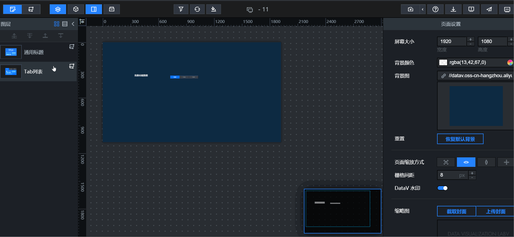](https://static-aliyun-doc.oss-cn-hangzhou.aliyuncs.com/assets/img/zh-CN/2960888951/p80693.gif)

   **注意** 如果**导入节点**面板不显示，可单击上方工具栏的**导入节点**图标（[](https://static-aliyun-doc.oss-cn-hangzhou.aliyuncs.com/assets/img/zh-CN/2960888951/p66743.png)），显示**导入节点**面板。

6. 在**逻辑节点**面板中，将**分支判断**节点拖动到画布上并连线到**串行数据处理**节点之前。

7. 在右侧**分支判断**配置面板中，配置具体上下游情况和处理方式，设置单击可执行的触发判断条件。

   [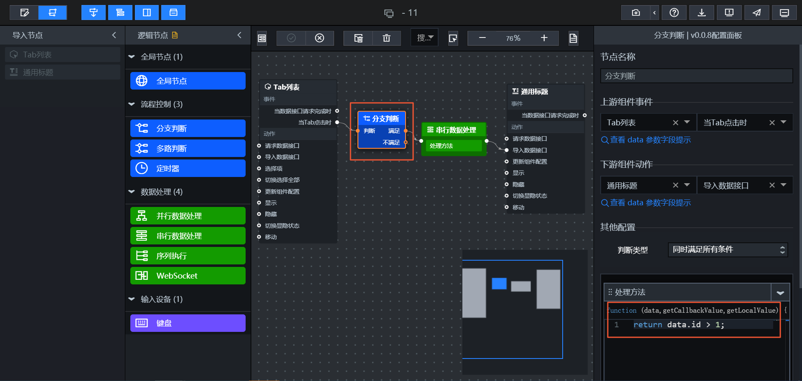](https://static-aliyun-doc.oss-cn-hangzhou.aliyuncs.com/assets/img/zh-CN/2960888951/p80702.png)

   上图中的示例触发判断条件如下。

   ```
   return data.id>1;
   ```

8. 以同样的方式，配置右侧的**串行数据处理**节点（此步骤作用是将列表的数据格式转换成标题的数据格式）。

   [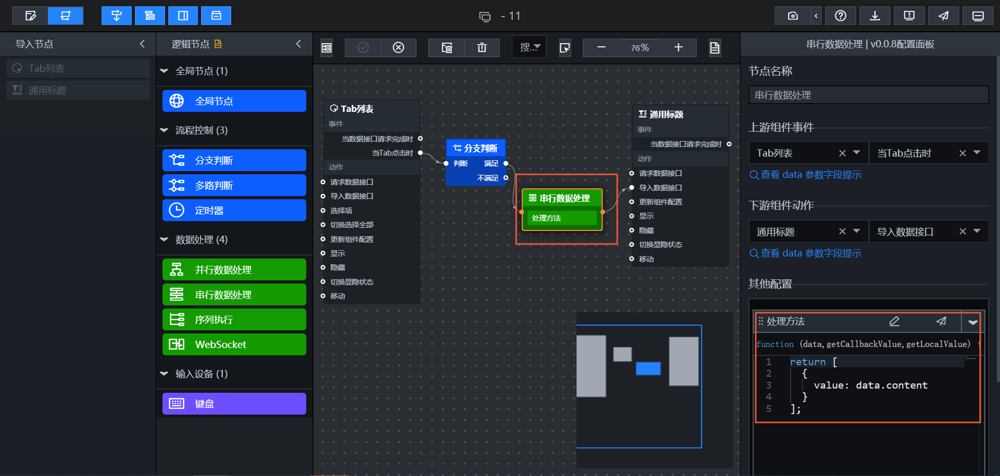](https://static-aliyun-doc.oss-cn-hangzhou.aliyuncs.com/assets/img/zh-CN/2960888951/p80703.png)

   上图中的示例转换格式的规则如下。

   ```
   return [
    {
      value:data.content
    }
   ];
   ```

9. 单击右上角的**预览**图标（[](https://static-aliyun-doc.oss-cn-hangzhou.aliyuncs.com/assets/img/zh-CN/0290888951/p66740.png)），在预览页面进行交互操作（例如单击列表某一格等），查看交互效果。

   [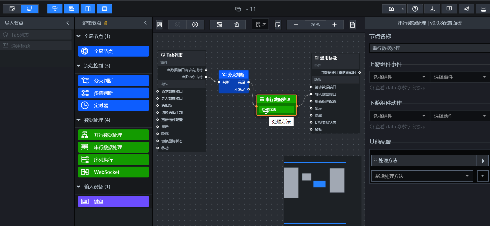](https://static-aliyun-doc.oss-cn-hangzhou.aliyuncs.com/assets/img/zh-CN/2960888951/p80704.gif)

   如果需求中有多个组件需要配置交互链路，则重复以上几步直至满足全部交互需求。

10. 配置并预览成功后，单击左上角的**发布**图标（[](https://static-aliyun-doc.oss-cn-hangzhou.aliyuncs.com/assets/img/zh-CN/2960888951/p66810.png)）。选择发布样式后，即可在线展示具有交互功能的可视化应用。

#### 2. 蓝图编辑器详细功能介绍

##### 导出到蓝图编辑器

​	只有当组件导入到蓝图编辑器后，才可以为该组件配置交互。

##### 取消导出到蓝图编辑器

​	对于已经导入到蓝图编辑器中的组件，如果不再需要对该组件配置交互，可将该组件取消导出到蓝图编辑器。

##### 在蓝图编辑器内定位

​	对于已经导入到蓝图编辑器中的组件，如果需要快速定位到该组件在蓝图编辑器中的位置，可使用蓝图编辑器定位功能实现。

##### 工具栏

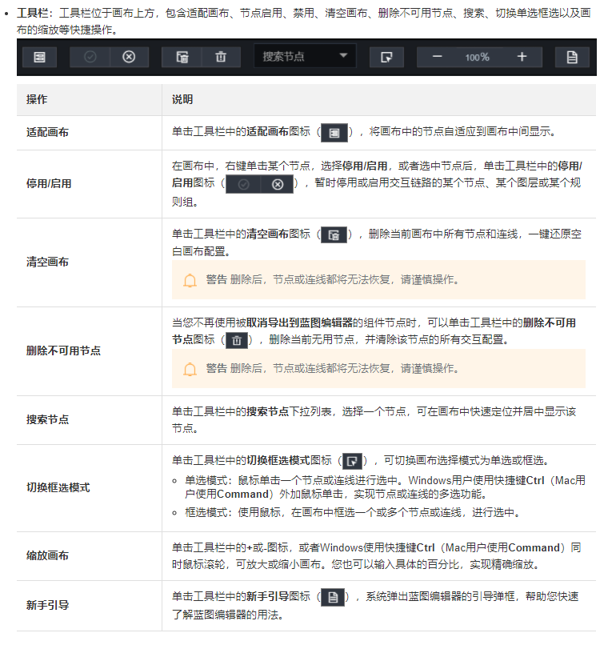

##### 画布操作

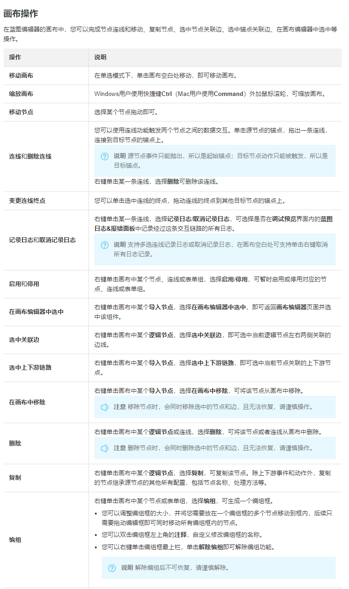

#### 3. 逻辑节点配置

