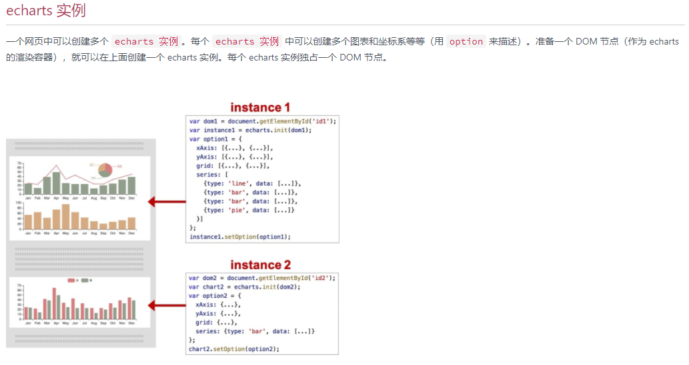
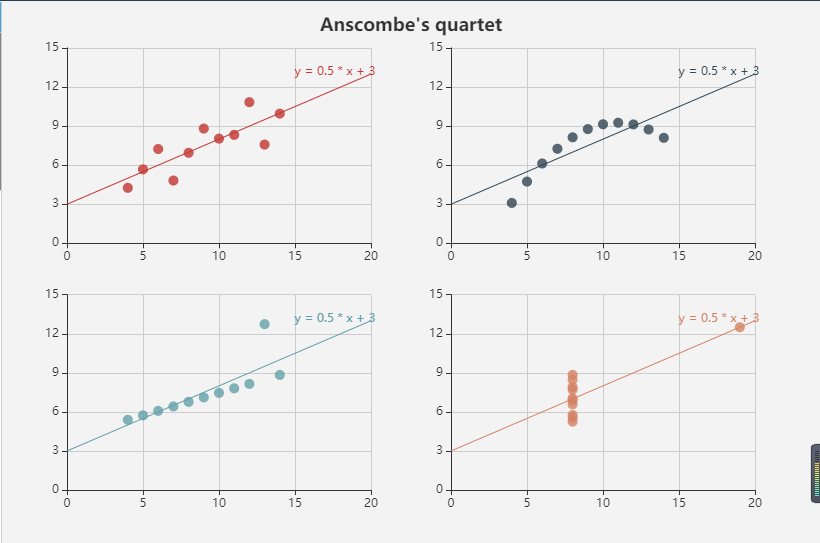
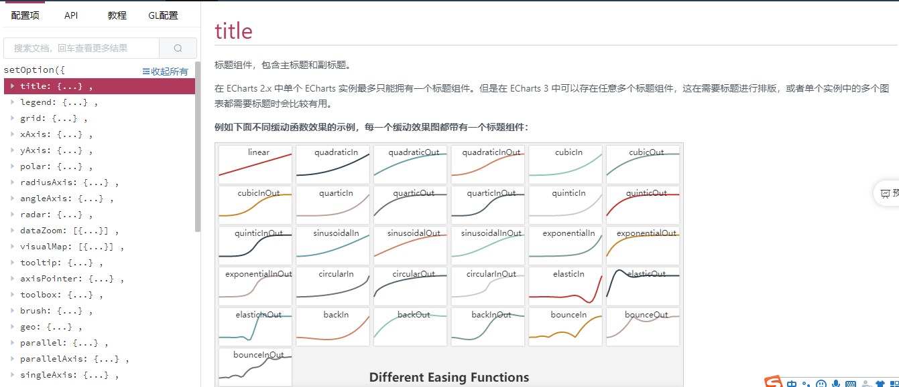

#### [官方文档](https://echarts.apache.org/zh/tutorial.html)

#### 一、 echart实例

```html
<!DOCTYPE html>
<html>
<head>
    <meta charset="utf-8">
    <title>ECharts</title>
    <!-- 引入 echarts.js -->
    <script src="js/echarts.min.js"></script>
</head>
<body>
    <!-- 为ECharts准备一个具备大小（宽高）的Dom -->
    <div id="main" style="width: 500px;height:400px;"></div>
    <script type="text/javascript">
        // 基于准备好的dom，初始化echarts实例
        var myChart = echarts.init(document.getElementById('main'));

        // 指定图表的配置项和数据
        var option = {
            title: {
                text: 'ECharts 入门示例'
            },
            tooltip: {},
            legend: {
                data:['销量']
            },
            xAxis: {
                data: ["衬衫","羊毛衫","雪纺衫","裤子","高跟鞋","袜子"]
            },
            yAxis: {
                
            },
            series: [{
                name: '销量',
                type: 'bar',
                data: [10, 20, 36, 10, 5, 20]
            }]
        };

        // 使用刚指定的配置项和数据显示图表。
        myChart.setOption(option);
    </script>
</body>
</html>
```




[代码地址](https://echarts.apache.org/examples/zh/editor.html?c=scatter-anscombe-quartet)



#### 二、 系列（series）

* 在 echarts 里，`系列`（[series](https://echarts.apache.org/zh/option.html#series)）是指：一组数值以及他们映射成的图。一个 `系列` 包含的要素至少有：一组数值、图表类型（`series.type`）、以及其他的关于这些数据如何映射成图的参数。

* 系列类型（`series.type`）就是图表类型。系列类型（`series.type`）至少有：[line](https://echarts.apache.org/zh/option.html#series-line)（折线图）、[bar](https://echarts.apache.org/zh/option.html#series-bar)（柱状图）、[pie](https://echarts.apache.org/zh/option.html#series-pie)（饼图）、[scatter](https://echarts.apache.org/zh/option.html#series-scatter)（散点图）、[graph](https://echarts.apache.org/zh/option.html#series-graph)（关系图）、[tree](https://echarts.apache.org/zh/option.html#series-tree)（树图）、...
* [选择图标](https://echarts.apache.org/zh/builder.html)

#### 三、 setOption介绍

[setOption配置项](https://echarts.apache.org/zh/option.html)




[参考文档](https://blog.csdn.net/weixin_34248487/article/details/93785100)