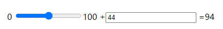

## HTML5 新特性

- 用于绘画的 canvas 元素
- 用于媒介回放的 video 和 audio 元素
- 对本地离线存储的更好的支持
- 新的特殊内容元素，比如 article、footer、header、nav、section
- 新的表单控件，比如 calendar、date、time、email、url、search

### 一、 canvas

​	见canvas笔记


### 二、 svg

​	见svg笔记


### 三、 MathML

HTML5 可以在文档中使用 MathML 元素，对应的标签是 \<math>...\</math> 。

MathML 是**数学标记语言**，是一种基于XML（标准通用标记语言的子集）的标准，用来在互联网上书写数学符号和公式的置标语言。

[参考文档](https://www.runoob.com/html/html5-mathml.html)


### 四、 拖放（Drag 和 Drop）

拖放是一种常见的特性，即抓取对象以后拖到另一个位置。

[参考文档](https://www.runoob.com/html/html5-draganddrop.html)

**来回拖放图片：**

```html
<!DOCTYPE html>
<html>
<head>
<meta charset="utf-8"> 
<title>菜鸟教程(runoob.com)</title>
<style type="text/css">
#div1, #div2
{float:left; width:100px; height:35px; margin:10px;padding:10px;border:1px solid #aaaaaa;}
</style>
<script>
function allowDrop(ev)
{
	ev.preventDefault();
}

function drag(ev)
{
	ev.dataTransfer.setData("Text",ev.target.id);
}

function drop(ev)
{
	ev.preventDefault();
	var data=ev.dataTransfer.getData("Text");
	ev.target.appendChild(document.getElementById(data));
}
</script>
</head>
<body>

<div id="div1" ondrop="drop(event)" ondragover="allowDrop(event)">
	</div>
<div id="div2" ondrop="drop(event)" ondragover="allowDrop(event)"></div>

</body>
</html>
```


### 五、Video和Audio

```html
<video width="320" height="240" controls>
  <source src="movie.mp4" type="video/mp4">
  <source src="movie.ogg" type="video/ogg">
您的浏览器不支持Video标签。
</video>
```


\<video> 元素提供了 **播放、暂停和音量控件**来控制视频。

\<video> 和 \<audio>元素的方法、属性和事件可以**使用JavaScript进行控制**.

其中的方法用于播放、暂停以及加载等。其中的属性（比如**时长、音量**等）可以被读取或设置。其中的 DOM 事件能够通知您，比方说，\<video> 元素开始播放、已暂停，已停止，等等。

* play()		播放

* pause()		暂停

  

### 六、 input类型

- color

  

- date


- datetime

- datetime-local

- email

- month

- number

  * \<input type="number" name="quantity" min="1" max="5">
    
  * 

- range

  

- search

- tel

- time

- url

- week


### 七、 表单元素

- \<datalist>
- \<keygen>
- \<output>

##### 1. \<datalist> 元素

使用 \<input> 元素的列表属性与 \<datalist> 元素绑定.

```html
<input list="browsers">
 
<datalist id="browsers">
  <option value="Internet Explorer">
  <option value="Firefox">
  <option value="Chrome">
  <option value="Opera">
  <option value="Safari">
</datalist>
```


##### 2. \<keygen> 元素

##### 3. \<output> 元素

\<output> 元素用于不同类型的输出，比如计算或脚本输出：

```html
<form oninput="x.value=parseInt(a.value)+parseInt(b.value)">
    0
	<input type="range" id="a" value="50">100 +
	<input type="number" id="b" value="50">=
	<output name="x" for="a b"></output>
</form>
```




### 八、 语义元素

- \<header>
- \<nav>
- \<section>
- \<article>
- \<aside>
- \<figcaption>
- \<figure>
- \<footer>


### 九、 Web存储

​	HTML5 web 存储,一个比cookie更好的本地存储方式。

​	客户端存储数据的两个对象为：

- localStorage - 用于**长久保存整个网站的数据**，保存的数据没有过期时间，直到**手动去除**。
- sessionStorage - 用于临时保存同一窗口(或标签页)的数据，在**关闭窗口或标签页**之后将会删除这些数据。

```js
使用前检查
if(typeof(Storage)!=="undefined")
{
    // 是的! 支持 localStorage  sessionStorage 对象!
    // 一些代码.....
} else {
    // 抱歉! 不支持 web 存储。
}
```


#### 1. localStorage 对象

localStorage 对象存储的数据没有时间限制。第二天、第二周或下一年之后，数据依然可用。

```js
localStorage.sitename="菜鸟教程";
document.getElementById("result").innerHTML="网站名：" + localStorage.sitename;

//移除localStorage
localStorage.removeItem("sitename");
```

#### 2. API

不管是 localStorage，还是 sessionStorage，可使用的API都相同，常用的有如下几个（以localStorage为例）：

- 保存数据：localStorage.setItem(key,value);					localStorage.key=value;
- 读取数据：localStorage.getItem(key); 					         localStorage.key
- 删除单个数据：localStorage.removeItem(key);
- 删除所有数据：localStorage.clear();
- 得到某个索引的key：localStorage.key(index);

#### 3. sessionStorage 对象

sessionStorage 方法针对一个 session 进行数据存储。当用户关闭浏览器窗口后，数据会被删除。

#### 4. 复杂数据存储

使用 [JSON.stringify](https://www.runoob.com/js/javascript-json-stringify.html) 来存储对象数据，[JSON.stringify](https://www.runoob.com/js/javascript-json-stringify.html) 可以将对象转换为字符串。

之后我们使用 [JSON.parse](https://www.runoob.com/js/javascript-json-parse.html) 方法将字符串转换为 JSON 对象：

#### 5. 其范围


### 十、 应用程序缓存

HTML5 引入了应用程序缓存，这意味着 web 应用可进行缓存，并可在没有因特网连接时进行访问。

应用程序缓存为应用带来三个优势：

1. 离线浏览 - 用户可在应用离线时使用它们
2. 速度 - 已缓存资源加载得更快
3. 减少服务器负载 - 浏览器将只从服务器下载更新过或更改过的资源。

#### 1. 启用应用缓存

如需启用应用程序缓存，请在文档的\<html> 标签中包含 manifest 属性：

```html
<!DOCTYPE HTML>
<html manifest="demo.appcache">
...
</html>
```

manifest 文件的建议的文件扩展名是：".appcache"。