## 基本属性

### 一、 Path路径

#### 1. 基本指令

**M：**新建起点，参数x，y（M20， 30）
**L：**连接直线，参数x，y（L30， 20）
**H：**纵坐标不变，横向连线，参数x（H20）
**V：**横坐标不变，纵向连线，参数y（V30）
**Q：**二次贝塞尔曲线，参数x1，y1，x2，y2（Q10，20，30，40）
**C：**三次贝塞尔曲线，参数x1，y1，x2，y2，x3，y3（C10，20，30，40，50， 60）
**Z：**连接首尾，闭合曲线，无参数

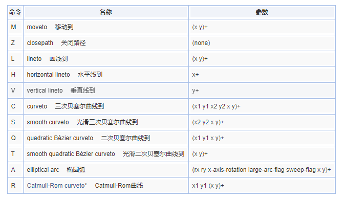

**指令字母是大写的，例如`M`, 则表示坐标位置是绝对位置；如果指令字母小写的，例如`m`, 则表示坐标位置是相对位置。**

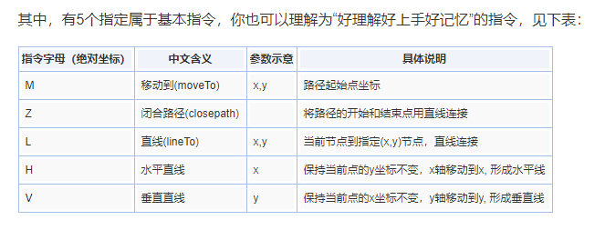


#### 2. 贝塞尔曲线

[参考文章](https://www.zhangxinxu.com/wordpress/2014/06/deep-understand-svg-path-bezier-curves-command/)

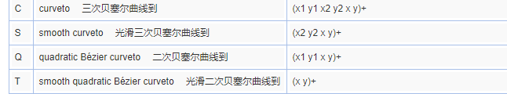


##### **C指令：**三次贝塞尔曲线到

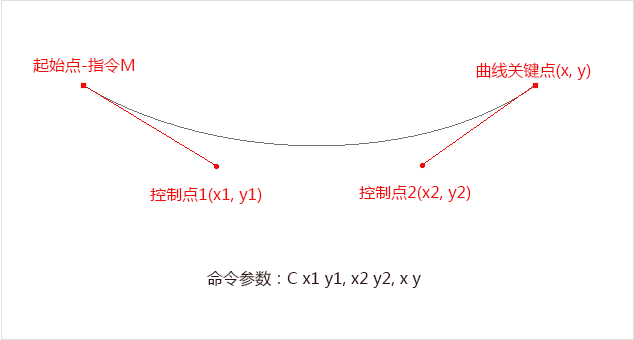

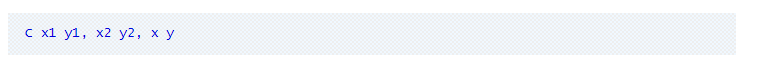


##### **S指令：**光滑三次贝塞尔曲线到

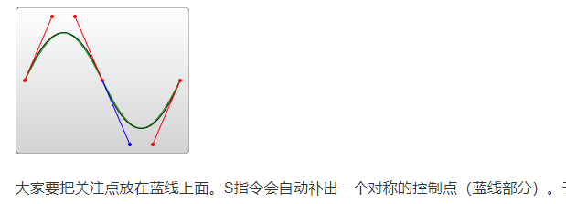

​		一般是**C+S组合**，若没有C指令，**只有S指令**，其表现将与**二次贝塞尔曲线**（即Q指令）一样。

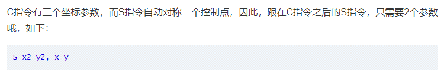


##### **Q指令：**二次贝塞尔曲线到

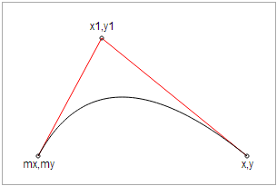


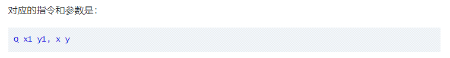


##### **T指令：**光滑二次贝塞尔曲线到

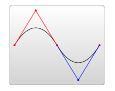

**自动补全对称的控制点**

一般是**Q+T组合**，若没有Q指令，**只有T指令**，其表现将与**一次贝塞尔曲线**（即直线）一样。

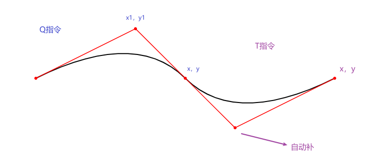

```html
<path d="M400 400 Q600 300 700 400 T 1000 400" stroke="black" stroke-width="2"  fill="none"/>
```

上图：

```html
<svg width="1500" height="1500" xmlns="http://www.w3.org/2000/svg">
    <path d="M400 400 Q600 300 700 400 T 1000 400" stroke="black" stroke-width="2"  fill="none"/>
    <circle cx="400" cy="400" r="2" stroke="red" stroke-width="2" fill="red"></circle>
    <circle cx="600" cy="300" r="2" stroke="red" stroke-width="2" fill="red"></circle>
    <circle cx="700" cy="400" r="2" stroke="red" stroke-width="2" fill="red"></circle>
    <circle cx="800" cy="500" r="2" stroke="red" stroke-width="2" fill="red"></circle>
    <circle cx="1000" cy="400" r="2" stroke="red" stroke-width="2" fill="red"></circle>
    <path d="M400 400 L600 300 L700 400 L800 500 L1000 400" stroke="red" stroke-width="1.5"  fill="none"/>
</svg> 
```


#### 3. 逗号两种写法

逗号区分纵横轴：

​	\<path d="M20,20 C90,40 130,40 180,20" stroke="#000000" fill="none" style="stroke-width: 2px;">\</path>


逗号用来区分每个点坐标（主流写法）：

​	\<path d="M20 20 C90 40, 130 40, 180 20" stroke="#000000" fill="none" style="stroke-width: 2px;">\</path>


或者不需要逗号：

​	\<path d="M20 20 C90 40 130 40 180 20" stroke="#000000" fill="none" style="stroke-width: 2px;">\</path>


### 二、 常用元素

[svg常用元素和属性](https://blog.csdn.net/zjw_python/article/details/103276311)

[SVG常用元素标签列表](https://blog.csdn.net/xjl271314/article/details/78286754)

#### 1. \<path>

​	绘制路径

​	属性有：d（值为绘制指令）

#### 2. \<line>

​	属性有：x1,y1,x2,y2

#### 3. \<rect>

​	属性有：x,y,width,height

#### 4. \<polygon>

​	绘制多边形

​	属性有：points

#### 5. \<circle>

​	属性有：cx,xy,r

#### 6. \<ellipse>

​	绘制椭圆

​	属性有：cx,cy,rx,ry

#### 7. \<text>

​	属性有：x,y,dx,dy,text-anchor	

​	分别代表文本标签的的横纵坐标、文本水平方向和垂直方向的偏移量，以及文本的对齐方式

#### 8. \<g>

​	多个形状捆绑一个组，在g标签上定义的属性会被所有的子元素继承，添加到g元素上的变换也会应用到其所有子元素上

#### 9. \<image>

​	属性有： width,height,xmlns:xlink指定图片url

#### 10. 其他

​	\<defs> 、\<use> 、 \<pattern>  、\<animagte>等 

### 三、 常用属性

#### 1. transform

其值：

* translate：平移
* scale：缩小
* rotate：旋转

#### 2. stroke相关

* stroke：定义一条 线，文本或元素 轮廓颜色【参数：颜色】
* stroke-width：定义一条 线，文本或元素 轮廓厚度【参数：宽度】
* stroke-linecap：端点表现样式【参数：butt|round|square】
* stroke-dasharray：创建虚线【参数：实线长度，间距】
* stroke-dashoffset：定义一条 线，文本或元素 距离（相当于基于position：relative；设置left值。只是不像left单纯的基于x方向设置， stroke-dashoffset是基于svg路径设置的）
* stroke-opacity：描边透明度

#### 3. fill相关

* fill：定义 svg 元素的填充颜色
* fill-opacity：定义 svg 元素的填充透明度

#### 4. class、id


## 动画 

[**笔记参考**](https://www.zhangxinxu.com/wordpress/2014/08/so-powerful-svg-smil-animation/)

### 一、SVG animation元素及效果概览

动画实现：动画元素需要是图形元素子元素 

```html
例如 
<svg>
    <g>
        <animate></animate>
    </g>
    <rect>
        <animate></animate>
    </rect>
</svg>

```


#### 1. \<set>

​	`set`虽然不能触发连续的动画,可以实现基本的延迟功能,可以在特定时间之后修改某个属性值（也可以是CSS属性值）

#### 2. \<animate>

​	实现单属性的动画过渡效果。通过attributeName控制改变哪个属性

#### 3. \<animateColor>

​	颜色动画。不过，animate可以实现其功能与效果，因此，此属性已经被废弃。

#### 4. \<animateTransform>

​	动画上一个目标元素变换属性，从而使动画控制平移，缩放，旋转或倾斜

* attributeName
* begin：开始时间
* dur：持续时间
* type：动画类型 'translate', 'scale', 'rotate', 'skewX', 'skewY'"
* from：起始值
* to：结束值
* repeatCount...


#### 5. \<animateMotion>

​	`animateMotion`元素可以让SVG各种图形沿着特定的`path`路径运动~

### 二、SVG animation参数详解

#### 1. attributeName

​	**attributeName = \<attributeName>**

​	要变化的元素属性名称，① 可以是元素直接暴露的属性，例如，对于本文反复出现的「马」对应的`text`元素上的`x`, `y`或者`font-size`; ② 可以是CSS属性。例如，透明度`opacity`.


#### 2. attributeType 

​	**attributeType = “CSS | XML | auto”**

​	`attributeType`支持三个固定参数，`CSS`/`XML`/`auto`. 用来表明`attributeName`属性值的列表。`x`, `y`以及`transform`就属于`XML`, `opacity`就属于`CSS`. `auto`为默认值，自动判别的意思（实际上是先当成CSS处理，如果发现不认识，直接XML类别处理）。因此，如果你不确信某属性是XML类别还是CSS类别的时候，我的建议是不设置`attributeType`值，直接让浏览器自己去判断，几乎无差错。


#### 3. from,to,by,values

* from = “**\<value>**“			动画的起始值。

* to= “**\<value>**“			     指定动画的结束值。

* by= “**\<value>**“			     动画的相对变化值。

* values= “**\<list>**“			     用分号分隔的一个或多个值，可以看出是动画的多个关键值点。

  **a.** 如果动画的起始值与元素的默认值是一样的，`from`参数可以省略。
  **b.** （不考虑`values`）`to`,`by`两个参数至少需要有一个出现。否则动画效果没有。`to`表示绝对值，`by`表示相对值。
  **c.** 如果`to`,`by`同时出现，则`by`打酱油，只识别`to`.
  **d.** 如果`to`,`by`,`values`都没设置，自然没动画效果。
  **e.** `values`可以是一个值或多值。当`values`值设置并能识别时候，`from`, `to`, `by`的值都会被忽略。我们实现动画，不可能就是单纯的从a位置到b位置，有时候，需要去c位置过渡下。此时，实际上有3个动画关键点。而`from`, `to`/`by`只能驾驭两个。

  **总结下，也就是`from-to`动画、`from-by`动画、`to`动画、`by`动画以及`values`动画。**


#### 4. begin,end

​	`begin`的定义是分号分隔的一组值。默认秒（s）

​	`begin`的单值除了普通value，还有下面这些类别的value：
​	`offset-value` | `syncbase-value` | `event-value` | `repeat-value` | `accessKey-value` | `media-marker-value` | `wallclock-sync-value` | `"indefinite"`


① `offset-value`表示偏移值，数值前面有`+`或`-`. 应该指相对于documentdocument的`begin`值而言。
② `syncbase-value`基于同步确定的值。语法为：`[元素的id].begin/end +/- 时间值`. 就是说借用其他元素的begin值再加加减减，这个可以准确实现两个独立元素的动画级联效果。	

```html
<svg width="320" height="200" xmlns="http://www.w3.org/2000/svg">
    <text font-family="microsoft yahei" font-size="120" y="160" x="160">马
        <animate id="x" attributeName="x" to="60" begin="0s" dur="3s" fill="freeze" />
        <animate attributeName="y" to="100" begin="x.end" dur="3s" fill="freeze" />
    </text>
</svg>
<!-- 第二个动画延用第一个动画的时间 第一个的结束为第二个的开始，begin="x.end" -->
```

③ `event-value`这个表示与事件相关联的值。类似于PowerPoint动画的“点击执行该动画”。语法是：`[元素的id].[事件类型] +/- 时间值`. 

​		**begin="circle.click"**

④ `repeat-value`指重复多少次之后干嘛干嘛。语法为：`[元素的id].repeat(整数) +/- 时间值`.

​		**begin="x.repeat(2)"**								x重复两次后

⑤ `accessKey-value`定义快捷键。即按下某个按键动画开始。语法为：`accessKey(" character ")`. 

​		**begin="accessKey(s)"**								按下“s”按键后

⑦ `"indefinite"`就是这个字符串值，表示“无限等待”。据说需要`beginElement()`方法触发或者指向该动画元素的超链接(SVG中的`a`元素)。

```html
<svg width="320" height="200" font-family="microsoft yahei" xmlns="http://www.w3.org/2000/svg" xmlns:xlink="http://www.w3.org/1999/xlink">
     <text font-size="120" y="160" x="160">马
          <animate id="animate" attributeName="x" to="60" begin="indefinite" dur="3s" repeatCount="indefinite" />
     </text>
     <a xlink:href="#animate">
          <text x="10" y="20" fill="#cd0000" font-size="30">点击我</text>
     </a>
</svg>
```


#### 5. dur

​	`dur`属性值：常规时间值 | `"indefinite"`


#### 6. calcMode, keyTimes, keySplines

​		[很复杂，整篇在这要看再看](https://www.zhangxinxu.com/wordpress/2014/08/so-powerful-svg-smil-animation/)

​	这几个参数是控制动画先快还是先慢类似这样作用的。

​	**calcMode**属性支持4个值：`discrete` | `linear` | `paced` | `spline`. 中文意思分别是：“离散”|“线性”|“踏步”|“样条”。

​	**keyTimes = “\<list>”**

​		`keyTimes`值的数目要和`values`一致，如果是`from/to/by`动画，`keyTimes`就必须有两个值。

​	**keySplines = “\<list>”**

​		`keySplines`表示的是与`keyTimes`相关联的一组贝塞尔控制点（默认`0 0 1 1`）。

```html
<animate attributeName="x" dur="5s" values="0; 20; 160" calcMode="linear" />
<animate attributeName="x" dur="5s" values="0; 20; 160" calcMode="paced"/>
<animate attributeName="x" dur="5s" values="0; 80; 160" keyTimes="0; .8; 1" calcMode="linear"/>
<animate attributeName="x" dur="5s" values="0; 80; 160" keyTimes="0; .8; 1" calcMode="spline"  keySplines=".5 0 .5 1; 0 0 1 1" />
```


#### 7. repeatCount, repeatDur

`repeatCount`表示动画执行次数，可以是合法数值或者”`indefinite`“（动画循环到电脑死机）。

`repeatDur`定义重复动画的总时间。可以是普通时间值或者”`indefinite`（”动画循环到电脑死机）。

```html
<animate attributeName="x" to="60" dur="3s" repeatCount="indefinite" repeatDur="10s" />

<!-- 动画执行了3次+1/3-->
```


#### 8. fill

`fill`表示动画间隙的填充方式。支持参数有：`freeze` | `remove`. 其中`remove`是默认值，表示动画结束直接回到开始的地方。`freeze`“冻结”表示动画结束后像是被冻住了，元素保持了动画结束之后的状态。


#### 9. accumulate, additive
​	`accumulate`是累积的意思。支持参数有：`none` | `sum`. 默认值是`none`. 如果值是`sum`表示动画结束时候的位置作为下次动画的起始位置。

​	`additive`控制动画是否附加。支持参数有：`replace` | `sum`. 默认值是`replace`. 如果值是`sum`表示动画的基础知识会附加到其他低优先级的动画上，

```js
<animateTransform attributeName="transform" type="scale" from="1" to="3" dur="10s" repeatCount="indefinite" additive="sum"/>
<animateTransform attributeName="transform" type="rotate" from="0 30 20" to="360 30 20" dur="10s" fill="freeze" repeatCount="indefinite" additive="sum"/>;
```

​	这里，两个动画同时都是`transform`，都要使用一个`type`属性，好在这个例子`additive="sum"`是累加的而不是`replace`替换。于是，我们就可以是实现一边旋转一边放大的效果。


#### 10. restart

​	`restart`支持的参数有：`always` | `whenNotActive` | `never`.

​	`always`是默认值，表示总是，也就是点一次执行一次。`whenNotActive`表示动画正在进行的时候，是不能重启动画的。`never`表示动画是一波流。


### 三、 动画的暂停与播放

```js
// svg指当前svg DOM元素
// 暂停
svg.pauseAnimations();

// 重启动
svg.unpauseAnimations()
```

## 实例

### translate、rotate、scale

[实例详细介绍](https://www.softwhy.com/article-114-1.html)