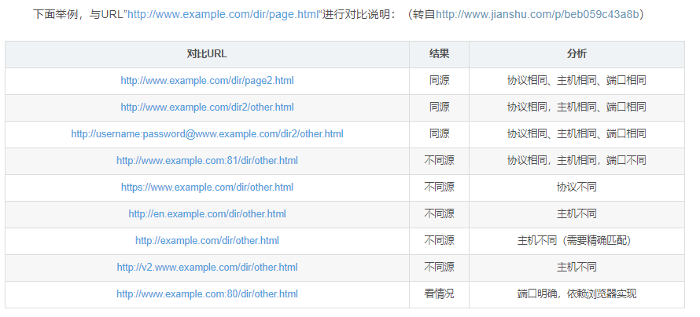

## 跨域

  	浏览器只对==XMLHttpRequest请求==有同源请求**限制**，而对==script标签src属性、link标签ref属性和img标签src属性==**没有这种限制**，利用这个“漏洞”就可以很好的解决跨域请求。

### 一、 url

http://www.aspxfans.com:8080/news/index.asp?boardID=5&ID=24618&page=1#name

从上面的URL可以看出，一个完整的URL包括以下几部分：
**1.**协议部分：该URL的协议部分为“http：”，这代表网页使用的是HTTP协议。在Internet中可以使用多种协议，如HTTP，FTP等等本例中使用的是HTTP协议。在"HTTP"后面的“//”为分隔符

**2.**域名部分：该URL的域名部分为“www.aspxfans.com”。一个URL中，也可以使用IP地址作为域名使用

**3.**端口部分：跟在域名后面的是端口，域名和端口之间使用“:”作为分隔符。端口不是一个URL必须的部分，如果省略端口部分，将采用默认端口

**4.**虚拟目录部分：从域名后的第一个“/”开始到最后一个“/”为止，是虚拟目录部分。虚拟目录也**不是一个URL必须**的部分。本例中的虚拟目录是“/news/”

**5.**文件名部分：从域名后的最后一个“/”开始到“？”为止，是文件名部分，如果没有“?”,则是从域名后的最后一个“/”开始到“#”为止，是文件部分，如果没有“？”和“#”，那么从域名后的最后一个“/”开始到结束，都是文件名部分。本例中的文件名是“index.asp”。文件名部分也**不是一个URL必须**的部分，如果省略该部分，则使用默认的文件名

**6.**锚部分：从“#”开始到最后，都是锚部分。本例中的锚部分是“name”。锚部分也**不是一个URL必须**的部分

**7.**参数部分：从“？”开始到“#”为止之间的部分为参数部分，又称搜索部分、查询部分。本例中的参数部分为“boardID=5&ID=24618&page=1”。参数可以允许有多个参数，参数与参数之间用“&”作为分隔符。

### 二、 同源策略

#### 2.1 含义

​	同源是指：**协议，域名，端口**相同。

​	不同源的客户端脚本(javascript、ActionScript)在没明确授权的情况下，不能读写对方的资源。



#### 2.2 目的

同源政策的目的，是为了**保证用户信息的安全**，防止恶意的网站窃取数据。

设想这样一种情况：A网站是一家银行，用户登录以后，又去浏览其他网站。如果其他网站可以读取A网站的 Cookie，会发生什么？

很显然，如果 Cookie 包含隐私（比如存款总额），这些信息就会泄漏。更可怕的是，Cookie 往往用来保存用户的登录状态，如果用户没有退出登录，其他网站就可以冒充用户，为所欲为。因为浏览器同时还规定，提交表单不受同源政策的限制。

由此可见，"同源政策"是必需的，否则 Cookie 可以共享，互联网就毫无安全可言了。

#### 2.3 限制范围

随着互联网的发展，"同源政策"越来越严格。目前，如果非同源，共有三种行为受到限制。

```js
（1） Cookie、LocalStorage 和 IndexDB 无法读取。

（2） DOM 无法获得。

（3） AJAX 请求不能发送。
```

​	虽然这些限制是必要的，但是有时很不方便，合理的用途也受到影响。下面，我将详细介绍，如何规避上面三种限制。

### 三、 跨域

​	浏览器安全的基石是"同源政策"

​	浏览器不能执行其他网站的脚本。它是由浏览器的同源策略造成的，是浏览器对JavaScript施加的安全限制。

#### 针对不同的限制解决

#### 1. cookie

*    Cookie 是服务器写入浏览器的一小段信息，只有同源的网页才能共享。


​	两个网页一级域名相同，只是二级域名不同，浏览器允许通过设置`document.domain`共享 Cookie。

​	举例来说，A网页是`http://w1.example.com/a.html`，B网页是`http://w2.example.com/b.html`，那么只要设置相同的`document.domain`，两个网页就可以共享Cookie。

```js
document.domain = 'example.com';
```

**iframe也可通过此方法**

#### 2. iframe

如果两个网页不同源，就无法拿到对方的DOM。典型的例子是`iframe`窗口和`window.open`方法打开的窗口，如果不同源它们与父窗口无法通信。

* 如果两个窗口一级域名相同，只是二级域名不同，那么设置上一节介绍的`document.domain`属性，就可以规避同源政策，拿到DOM。
* 对于完全不同源的网站，目前有三种方法，可以解决跨域窗口的通信问题。

```js
片段识别符（fragment identifier）
window.name
跨文档通信API（Cross-document messaging）
```

##### （1）片段识别符

片段标识符（fragment identifier）指的是，URL的`#`号后面的部分，比如`http://example.com/x.html#fragment`的`#fragment`。如果只是改变片段标识符，页面不会重新刷新。

父窗口可以把信息，写入子窗口的片段标识符。

> ```javascript
> var src = originURL + '#' + data;
> document.getElementById('myIFrame').src = src;
> ```

子窗口通过监听`hashchange`事件得到通知。

> ```javascript
> window.onhashchange = checkMessage;
> 
> function checkMessage() {
>   var message = window.location.hash;
>   // ...
> }
> ```

同样的，子窗口也可以改变父窗口的片段标识符。

> ```javascript
> parent.location.href= target + "#" + hash;
> ```

##### （2）window.name

浏览器窗口有`window.name`属性。这个属性的最大特点是，无论是否同源，只要在同一个窗口里，前一个网页设置了这个属性，后一个网页可以读取它。

父窗口先打开一个子窗口，载入一个不同源的网页，该网页将信息写入`window.name`属性。

> ```javascript
> window.name = data;
> ```

接着，子窗口跳回一个与主窗口同域的网址。

> ```javascript
> location = 'http://parent.url.com/xxx.html';
> ```

然后，主窗口就可以读取子窗口的`window.name`了。

> ```javascript
> var data = document.getElementById('myFrame').contentWindow.name;
> ```

这种方法的优点是，`window.name`容量很大，可以放置非常长的字符串；缺点是必须监听子窗口`window.name`属性的变化，影响网页性能。

##### （3）window.postMessage

上面两种方法都属于破解，HTML5为了解决这个问题，引入了一个全新的API：跨文档通信 API（Cross-document messaging）。

这个API为`window`对象新增了一个`window.postMessage`方法，允许跨窗口通信，不论这两个窗口是否同源。

举例来说，父窗口`http://aaa.com`向子窗口`http://bbb.com`发消息，调用`postMessage`方法就可以了。

> ```javascript
> var popup = window.open('http://bbb.com', 'title');
> popup.postMessage('Hello World!', 'http://bbb.com');
> ```

`postMessage`方法的第一个参数是具体的信息内容，第二个参数是接收消息的窗口的源（origin），即"协议 + 域名 + 端口"。也可以设为`*`，表示不限制域名，向所有窗口发送。

子窗口向父窗口发送消息的写法类似。

> ```javascript
> window.opener.postMessage('Nice to see you', 'http://aaa.com');
> ```

父窗口和子窗口都可以通过`message`事件，监听对方的消息。

> ```javascript
> window.addEventListener('message', function(e) {
>   console.log(e.data);
> },false);
> ```

`message`事件的事件对象`event`，提供以下三个属性。

> - `event.source`：发送消息的窗口
> - `event.origin`: 消息发向的网址
> - `event.data`: 消息内容

下面的例子是，子窗口通过`event.source`属性引用父窗口，然后发送消息。

> ```javascript
> window.addEventListener('message', receiveMessage);
> function receiveMessage(event) {
>   event.source.postMessage('Nice to see you!', '*');
> }
> ```

`event.origin`属性可以过滤不是发给本窗口的消息。

> ```javascript
> window.addEventListener('message', receiveMessage);
> function receiveMessage(event) {
>   if (event.origin !== 'http://aaa.com') return;
>   if (event.data === 'Hello World') {
>       event.source.postMessage('Hello', event.origin);
>   } else {
>     console.log(event.data);
>   }
> }
> ```

#### 3. Ajax

同源政策规定，AJAX请求只能发给同源的网址，否则就报错。

**除了架设服务器代理**（**nginx代理**）（浏览器请求同源服务器，再由后者请求外部服务），有三种方法规避这个限制。

> - JSONP
> - WebSocket
> - CORS

##### （1）==JSONP==

JSONP是服务器与客户端跨源通信的**常用方法**。最大特点就是简单适用，老式浏览器全部支持，服务器改造非常小。

它的基本思想是，网页通过**添加一个`<script>`元素**，**向服务器请求JSON数据**，这种做法**不受同源政策限制**；服务器收到请求后，将数据放在一个指定名字的**回调函数**里传回来。

* 首先，网页动态插入`<script>`元素，由它向跨源网址发出请求。

```js
function addScriptTag(src) {
  var script = document.createElement('script');
  script.setAttribute("type","text/javascript");
  script.src = src;
  document.body.appendChild(script);
}

window.onload = function () {
  addScriptTag('http://example.com/ip?callback=foo');
}

function foo(data) {
  console.log('Your public IP address is: ' + data.ip);
};
```

上面代码通过动态添加`<script>`元素，向服务器`example.com`发出请求。注意，该请求的**查询字符串**有一个**`callback`参数**，用来指定回调函数的名字，这对于JSONP是必需的。

服务器收到这个请求以后，会将数据放在回调函数的参数位置返回。

```js
foo({
  "ip": "8.8.8.8"
});
```

由于`<script>`元素请求的脚本，直接作为代码运行。这时，只要浏览器定义了`foo`函数，该函数就会立即调用。作为参数的JSON数据被视为JavaScript对象，而不是字符串，因此避免了使用`JSON.parse`的步骤。

==JSONP另一种更好的解释==

浏览器只对XMLHttpRequest请求有同源请求限制，而对script标签src属性、link标签ref属性和img标签src属性没有这这种限制，利用这个“漏洞”就可以很好的解决跨域请求。JSONP就是利用了script标签无同源限制的特点来实现的。当然需要后端服务器的配合，返回一个合法的JS脚本，一般是一条调用js函数的语句，数据作为函数的入参。

​    看下面的例子：

​    接口：  

```java
@RestController
public class ApiTestController {
    @GetMapping("/api/test")
    public void index(String callback ,HttpServletResponse response) throws Exception {
        //response.setHeader("Access-Control-Allow-Origin","*");
        HashMap<String, Object> map = new HashMap<>();
        map.put("hello","test");
        map.put("name","test");
        map.put("age",11);
        map.put("sex","f");
        Object o = JSON.toJSON(map);
        response.getWriter().write(callback+"("+ o +")");
    }
 
}
```

这个Controller很简单，负责将数据包装成callback({})的形式，返回客户端，最终的数据是callback({hello:'test',name:'test',age:11,sex:'f'}),从js的语法来看，这不就是一个简单的函数调用吗？其中函数的参数已经设置好了，就是接口要返回的数据，对于callback是由前端请求的一个参数，代表前端js使用的回调函数。

前端代码：

```html
<script>
	function jsonp(data) {
	   console.log(data)
	}
</script>   
<script src="http://localhost/api/test?callback=jsonp"></script>
```

在前面说了，浏览器对script 标签发送的请求没有跨域限制，所以使用script标签对接口发起请求，服务器端接收请求之后返回这样的数据**jsonp({hello:'test',name:'test',age:11,sex:'f'})** ，由于是script标签发送的请求，所以浏览器会将响应当作js脚本执行，也就是调用jsonp函数，这样数据就拿到了。需要注意的是，接口返回的字符串必须是合法的js语句，否则浏览器执行js时会报错。

JSONP 使用简单且兼容性不错，但是只限于 `get` 请求。在开发中可能会遇到多个 JSONP 请求的回调函数名是相同的，这时候就需要自己封装一个 JSONP，以下是简单实现：

```javascript
function jsonp(url, jsonpCallback, success) {
  let script = document.createElement("script");
  script.src = url;
  script.async = true;
  script.type = "text/javascript";
  window[jsonpCallback] = function(data) {
    success && success(data);
  };
  document.body.appendChild(script);
}
jsonp(
  "http://xxx",
  "callback",
  function(value) {
    console.log(value);
  }
);
```

 