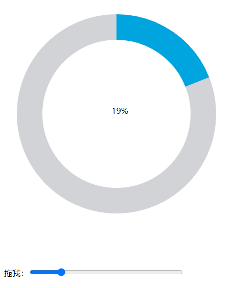
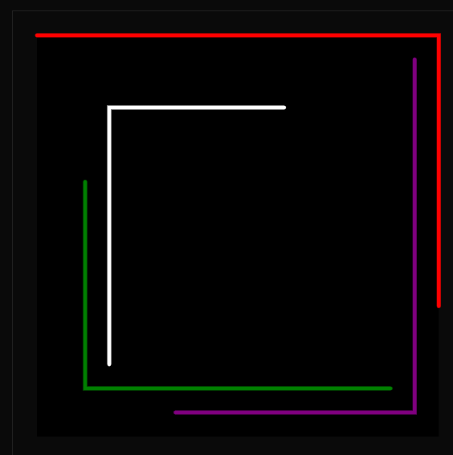
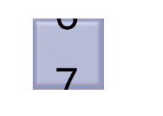
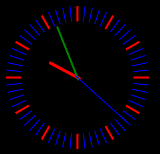
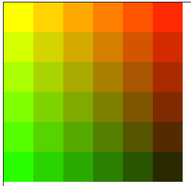

###svg

1. 能够实现基本图形的绘制

2. 能够实现动画效果

    

### canvas

1. 能够实现基本图形的绘制
 	2. 能够实现简单的动画效果

### datav

1. 大致了解组件的创建与配置（index.js与package.json）
2. 看了datav阿里云现有组件的配置以及数据源配置部分
3. 稍微了解蓝图编辑器的使用

tween.js

#### 阿里rap2接口

* 开发环境、生产环境接口
* 接口状态管理（是否接口，未接入原因...）      涉及更改数据库
* 权限管理 ？
* 文档导出（优化）
* 仓库接口状况（echart）
* mock.js库  数据随机生成！
  *  [Mock.js](http://mockjs.com/)

