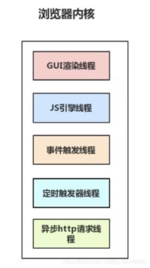
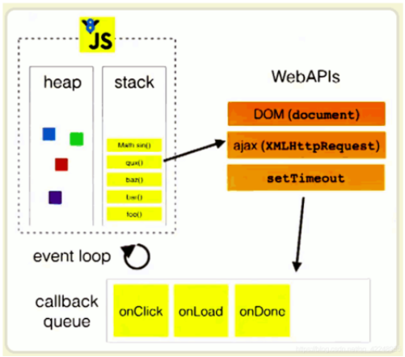
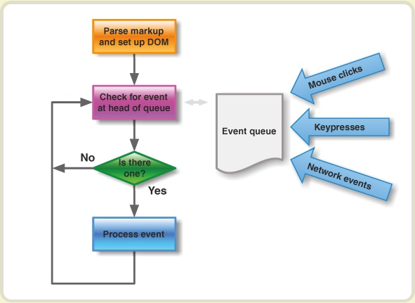

## 查的一些相关的

[TOC]


#### 1. 回调函数

* js回调函数主要是**解决js线程抢占的问题**，在主函数中加入回调函数还有其它代码，就是为了让它们规规矩矩的按顺序执行。
* 函数A作为参数(函数引用)传递到另一个函数B中，并且这个函数B执行函数A。我们就说函数A叫做**回调函数**。如果没有名称(函数表达式)，就叫做匿名回调函数。
* 回调函数是**先去设计函数的调用场景**，然后到了需要调用的时候再去定义它
* 回调函数不是由该函数的实现方直接调用，而是在特定的事件或条件发生时由另外的一方调用的，用于对该事件或条件进行响应

```js
	    function SortNumber( obj, func )                	// 定义通用排序函数
	    {
	        // 参数验证，如果第一个参数不是数组或第二个参数不是函数则抛出异常
	        if( !(obj instanceof Array) || !(func instanceof Function)) 
	        {
	            var e = new Error();                    	// 生成错误信息
	            e.number = 100000;                     	// 定义错误号
	            e.message = "参数无效";                 	// 错误描述
	            throw e;                                		// 抛出异常 
	        }
	        for( n in obj )                             		// 开始排序
	        {
	            for( m in obj )
	            {
	                if( func( obj[n], obj[m] ) )        	// 使用回调函数排序，规则由用户设定
	                {
	                    var tmp = obj[n];               		// 创建临时变量
	                    obj[n] = obj[m];		// 交换数据
	                    obj[m] = tmp;
	                }
	            }
	        }
	        return obj;                                 		// 返回排序后的数组
	    }
```

###### 一个例子

```js
		function parent(callback){
           // alert("我是parent函数a！"); 
            let p='我是parent里的内容'
            callback(p);	
        }
        parent(function(res){
            alert(res);
        });

		1.把函数作为参数传过去 2.传过去之后反过来回调这个函数
```


###### 回调函数（不传参）

```js
//一般我们使用函数，在顺序上是先定义函数，在去调用它。
//回调函数是先去设计函数的调用场景，然后到了需要调用的时候再去定义它。
function a(callback){
    alert("我是parent函数a！"); 
    callback();		//先设计调用场景
}
function b(){
    alert("我是回调函数");
}		
a(b);

//如果你直接在函数a里调用的话，那么这个函数就被限制死了。但是使用函数做参数就有下面的好处：当你a(b)的时候函数b就成了回调函数，而你还可以a(c)这个时候，函数c就成了回调函数。如果你写成了function a(){...;b();}就失去了变量的灵活性。
```

```js
//回调函数为普通函数
//方式一：(推荐使用)
function parent(callback){
    alert("我是parent函数a！"); 
    callback();		
}
function child(){
    alert("我是回调函数");
}		
parent(child);

//方式二：
function parent(callback){
    alert("我是parent函数a！"); 
    eval(callback)	
}
function child(){
    alert("我是回调函数");
}		
parent("child()");

//回调函数为匿名函数
function parent(callback){
    alert("我是parent函数a！"); 
   	callback();	
}
parent(function(){
    alert("我是回调函数");
});
```

###### 回调函数（传参）

```js
//方式一：推荐使用
function parent(callback){
    eval(callback)
}
function child(para){
    alert(para);
}
parent('child("我是传入的参数")')

//方式二：推荐使用
function parent(callback){
    callback();
}
function child(para){
    alert(para);
}
parent(function(){
    child("我是传入的参数");
})

//方式三：
function parent(callback,para){
    callback(para);
}
function child(para){
    alert(para);
}
parent(child,"我是传入的参数");

//方式四：
function parent(callback,para){
    callback(para)
}
function child(para){
    alert(para);
}
parent(funtion(para){
       	child(para);
       },"我是传入的参数")
```

###### 为回调函数绑定this

* 当回调函数是一个this对象的方法时，我们必须改变执行回调函数的方法来保证this对象的上下文。否则如果回调函数被传递给一个全局函数，this对象要么指向全局window对象（在浏览器中）。要么指向包含方法的对象。 

```js
var obj = {
  nm:'obj'
}
function foo(fn,fnObj){
  fn.apply(fnObj);
}
function bar(){
  console.log(this.nm)
};
foo(bar,obj);
```

###### 回调函数的优点和使用场景

```js
优点
1. 避免重复代码。

2. 可以将通用的逻辑抽象。

3. 增强代码可维护性和可读性。

4. 分离专职的函数。

使用场景
1. 异步调用（例如读取文件，进行HTTP请求，等等）。

2. 事件监听处理。

3. setTimeout和setInterval

4. 通用功能，简化逻辑
```

#### 2. 浏览器内核 ----[网上资料](https://segmentfault.com/a/1190000013083967)

* 浏览器内核，即 渲染进程。该进程下有多个线程。其中有JS引擎线程。JS引擎是单线程的
* js的宿主环境（比如浏览器，Node）
* JS是单线程的，**单线程**是指在**事件队列**中，每次只执行一个事件，如果设计成多线程模式，DOM之间会存在资源竞争。
* 浏览器内核的线程，由**多个线程**组成**浏览器的渲染进程**，共同渲染出页面。



- GUI（图形用户界面）渲染线程

​    渲染界面：解析HTMl，CSS，构建DOM树，Render树，布局和绘制。重绘或有回流时执行。 

- JS引擎线程

​    处理JS的脚本，处理任务队列里的任务。(UI渲染线程与JS引擎是互斥的)

- 事件触发线程

​    控制时间循环，当JS引擎线程处理如setTimeout，或浏览器内核的其他线程,如鼠标点击、AJAX异步请求时，将对应任务添加到事件线程中。当事件被触发将其添加到待处理队列列尾，当JS引擎空闲时处理。

- 定时触发器线程

​     setInterval与setTimeout所在线程，当计时完成被触发，事件被添加到事件队列等待JS执行。W3C的HTML规定，setTimeout低于4ms的时间间隔算为4ms。

- 异步HTTP请求线程

​    在XMLHttpRequest连接后新启动的一个线程，如果检测到请求的状态变更，且设有回调函数，将其添加到事件队列，等待JS处理。

###### 2.1 JS如何在单线程实现异步调用

* JS执行异步任务，以setTimeout为例，具体是浏览器的定时触发线程执行而不是JS线程执行，其执行结果将返回到任务队列中，其实就是返回回调函数，当JS的执行完主任务里的任务时，将执行任务队列的任务。**执行异步任务，同时也就是执行回调函数，如此循环（event loop）。**

```js
//我的理解
就是setTimeout在定时触发线程里，定的时间到的时候，将任务添加到任务队列的末尾（返回回调函数，就是加入任务队列）。
```



###### 2.2 异步事件

* 基础的异步有setTimeout和setInterval函数，
* 常见异步事件比如：鼠标点击、键盘回车、网络请求等这些与浏览器紧密联系的操作，比如一些延迟交互特效等等，还有就是ajax。
* 异步执行的运行机制如下。（同步执行也是如此，因为它可以被视为没有异步任务的异步执行。）

```js
（1）所有同步任务都在主线程上执行，形成一个执行栈（execution context stack）。

（2）主线程之外，还存在一个"任务队列"（task queue）。只要异步任务有了运行结果，就在"任务队列"之中放置一个事件。

（3）一旦"执行栈"中的所有同步任务执行完毕，系统就会读取"任务队列"，看看里面有哪些事件。那些对应的异步任务，于是结束等待状态，进入执行栈，开始执行。

（4）主线程不断重复上面的第三步
```



###### 2.3 ajax

* 当js的执行线程发出了ajax请求后，会继续往下执行js脚本。

  当有响应返回时，注册在xhr对象上的监听事件中的回调处理函数被放进了任务队列中。

  等当脚本全部执行完了之后，放在事件队列里的回调处理函数才会执行。

  每次发送ajax，浏览器都会新开一个线程处理，这些线程之间会共享数据。

  所以当我们想并发发三个ajax请求的时候，在处理回调函数中如果想操作同一个变量，我们并不知道哪个请求会先返回，那么最好借助promise对象来决定回调函数的顺序。

* 

###### 2.4 js下载

* js在浏览器中需要被下载、解释并执行这三步
* 在html body标签中的script都是阻塞的
* 因为浏览器在遇到 < body>才会开始呈现内容，所以js脚本最好不放在< head>标签中，因为js的下载，解释和执行都会阻塞住html的解析，页面可能在一开始出现一片空白

#### 3. 事件和回调函数

* **"任务队列"**是一个事件的队列（也可以理解成消息的队列），IO设备完成一项任务，就在"任务队列"中添加一个事件，表示相关的异步任务可以进入"执行栈"了。主线程读取"任务队列"，就是读取里面有哪些事件。
* "任务队列"中的事件，除了IO设备的事件以外，还包括一些用户产生的事件（比如鼠标点击、页面滚动等等）。只要指定过回调函数，这些事件发生时就会进入"任务队列"，等待主线程读取。
* 所谓"回调函数"（callback），就是那些会被主线程挂起来的代码。异步任务必须指定回调函数，当主线程开始执行异步任务，就是执行对应的回调函数。
* "任务队列"是一个先进先出的数据结构，排在前面的事件，优先被主线程读取。主线程的读取过程基本上是自动的，只要执行栈一清空，"任务队列"上第一位的事件就自动进入主线程。但是，由于存在后文提到的"定时器"功能，主线程首先要检查一下执行时间，某些事件只有到了规定的时间，才能返回主线程。
* 主线程从"任务队列"中读取事件，这个过程是循环不断的，所以整个的这种运行机制又称为**Event Loop（事件循环）**。

#### 4. 闭包 --- [挺好的解释](https://blog.csdn.net/educast/article/details/69567650)

###### 闭包的用途

一个是前面提到的可以读取函数内部的变量，另一个就是让这些变量的值始终保持在内存中。

```js
function f1(){
　　　　var n=999;
　　　　nAdd=function(){n+=1}

　　　　function f2(){
　　　　　　alert(n);
　　　　}
    
　　　　return f2;
　　}

　　var result=f1();
　　result(); // 999

　　nAdd();
　　result(); // 1000
//result实际上就是闭包f2函数。它一共运行了两次，第一次的值是999，第二次的值是1000。
//这证明了，函数f1中的局部变量n一直保存在内存中，并没有在f1调用后被自动清除。
```

###### 什么是闭包:

当内部函数 在定义它的作用域 的外部 被引用时,就创建了该内部函数的闭包 ,如果内部函数引用了位于外部函数的变量,当外部函数调用完毕后,这些变量在内存不会被 释放,因为闭包需要它们.

```js
function a() { 
 var i = 0; 
 function b() { alert(++i); } 
 return b;
}
var c = a();
c();	

```

这段代码有两个特点：

1、函数b嵌套在函数a内部；

2、函数a返回函数b。

这样在执行完var c=a()后，变量c实际上是指向了函数b，再执行c()后就会弹出一个窗口显示i的值(第一次为1)。这段代码其实就创建了一个闭包，为什么？因为函数a外的变量c引用了函数a内的函数b

　***当函数a的内部函数b被函数a外的一个变量引用的时候，就创建了一个闭包。***

尽管最开始的构造函数调用已经结束，临时变量的名称也都消失了，但在目 标对象的方法内却始终能引用到该变量的值，而且该值只能通这种方法来访问。即使再次调用相同的构造函数，但只会生成新对象和方法，新的临时变量只是对应新 的值，和上次那次调用的是各自独立的。

* 如果a返回的不是函数b，情况就完全不同了。因为a执行完后，b没有被返回给a的外界，只是被a所引用，而此时a也只会被b引 用，因此函数a和b互相引用但又不被外界打扰(被外界引用)，函数a和b就会被GC回收。(关于Javascript的垃圾回收机制将在后面详细介绍)

#### 5. slice()方法

* [JavaScript 字符串方法](https://www.w3school.com.cn/js/js_string_methods.asp)

#### 6. this指向问题    

* [箭头函数中的this指向问题详解](https://blog.csdn.net/lhjuejiang/article/details/80456240)

```js
setTimeout(function(){
    console.log(this);		//window
})
setTimeout(()=>{
    console.log(this);		//window
})

const obj = {
    aaa(){
        setTimeout(function(){			// 别人的解释：call方法 ，然后传了个window
            console.log(this);		//window，？？？ 这种的都是window？        	
        })
        setTimeout(()=>{
            console.log(this);		//obj对象
        }) 
    }
}
obj.aaa();
//问：箭头函数中的this是如何查找的
//答：向外层作用域中，一层层查找this，直到有this定义

//好像是回调函数都是指向window （除了箭头函数写法和call方法的改this指向） 好像是
```

* 箭头函数里面根本没有自己的`this`，而是引用外层的`this`。
* 箭头函数没有自己的`this`，所以当然也就不能用`call()`、`apply()`、`bind()`这些方法去改变`this`的指向。
* 箭头函数可以让`this`指向固定化，这种特性很有利于封装回调函数。（指向定义时，不是运行时）
* 箭头函数导致`this`总是指向函数定义**生效**时所在的对象

```js
       var obj = {
        age :18,
        getAge : function(){
            console.log(this.age);		//1
            function foo(){
                setTimeout(() => {
                    console.log('id:', this);			//window
                }, 100);
            }
            foo();		//定义生效时    --自己的理解	
           }
        };
        obj.getAge();	
```


