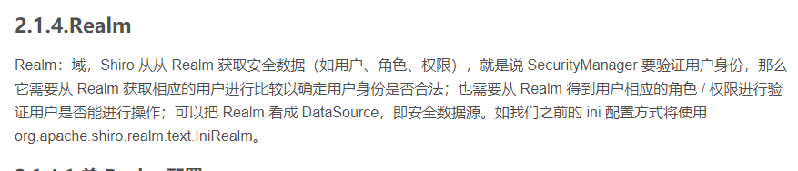
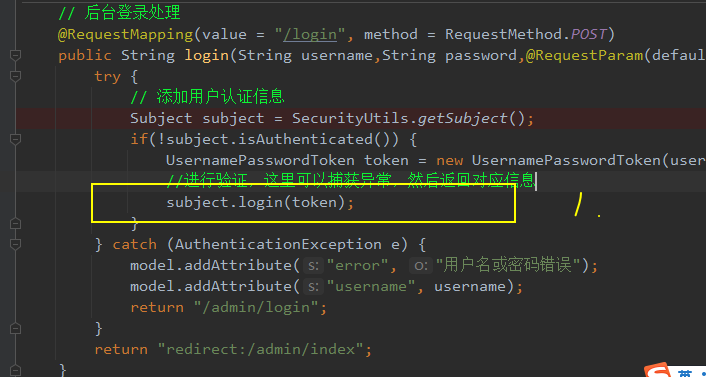
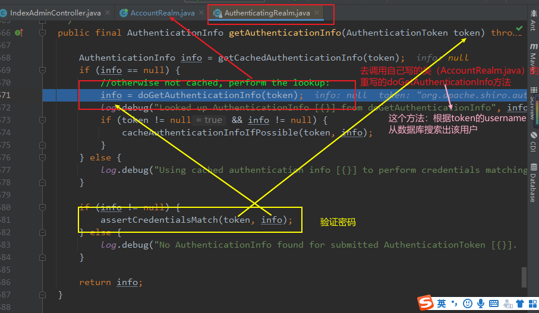
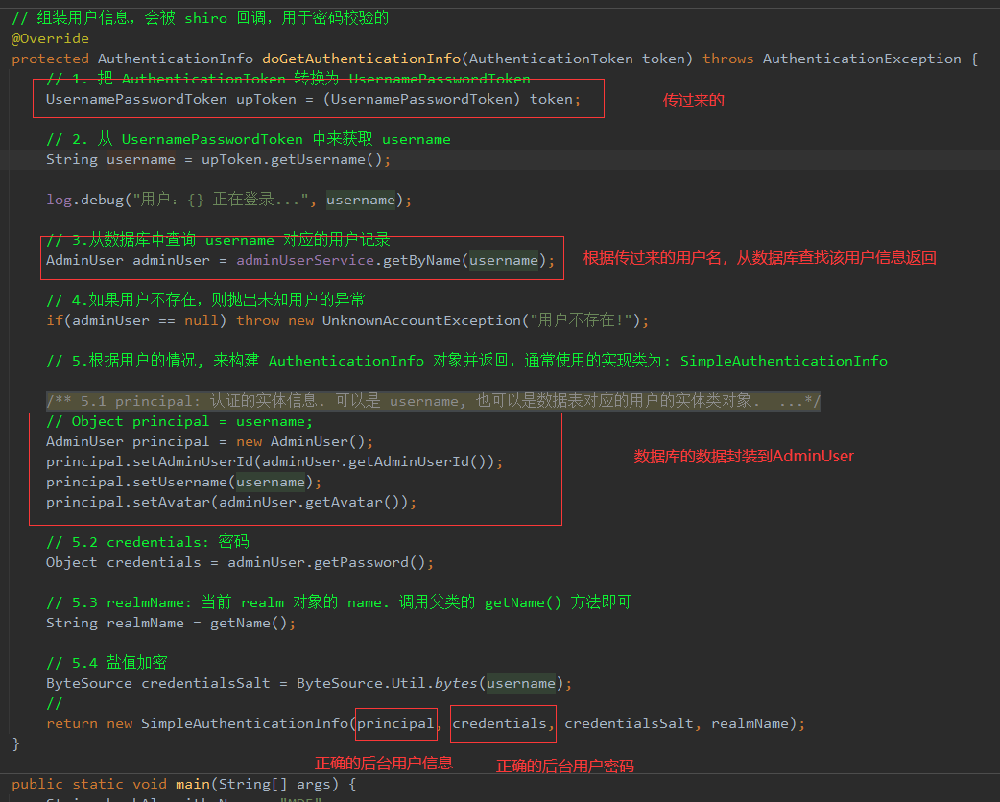
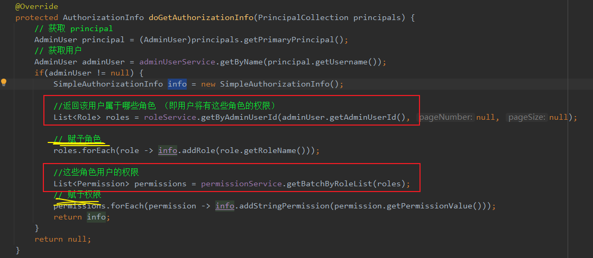
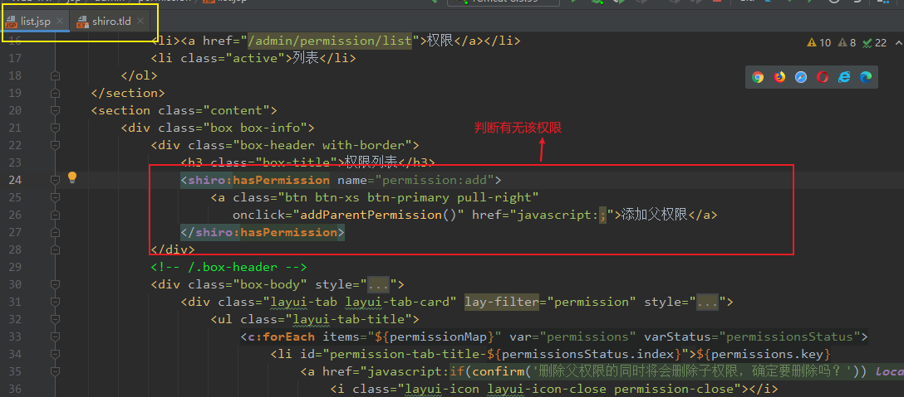
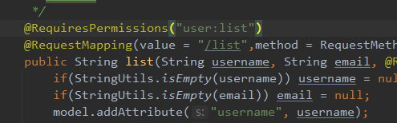

# shiro

### 后台用户登录验证

1. 登录

2. subject.login(token) 则去AuthentivatingRealm.java验证

3. 上面红色部分去AccountRealm.java验证（cn.roothub.config.realm.AccountRealm）

4. 执行完成后返回正确的用户信息，返回第三步里AuthentcatingRealm.java的方法

   ​		info为正确信息，token为用户输入的用户名、密码

   ​		assertCredentialsMatch(info,token)		进行验证

5. 备注：AuthentcatingRealm.java 是shiro自带的，AccountRealm.java为自己重写的

### 后台用户权限授予

### 后台用户权限显示

设置需要权限否则拒绝。

# 番茄视频论坛网

### 摘要

随着互联网的蓬勃发展，互联网为我们提供的不再仅仅是一个信息源，更是一个可以相互交流的空间。人们不再像报纸杂志的读者、广播电台的听众、电视的观众那样只是被动地读、听、看，而是可以主动参与讨论，在了解他人的观点和看法的同时，表达自己的观点。随着流媒体技术和宽带网络的发展，网民对网络信息表达的要求越来越高，人们不再满足于传统的文字形式的观看，越来越多的网站加入了图片、声音、视频图像等形式的交流。
本网站就是为用户提供一个交流平台，用户可以在这里以文字、图片、视频等形式进行分享和交流。本网站采用B/S架构，采用JAVA作为后台开发语言，采用SSM框架。底层数据库为Mysql，系统采用MVC模式设计，理念开发。用户可以浏览帖子及其相关内容，注册登录后，可以在视频区发布帖子、评论、观看视频和视频投稿。管理员主要是对版块、帖子、评论、用户、权限的管理以及视频的审核。

按照网站的性质以及服务对象来划分，分为以下几种类型：小型局域网论坛、专业论坛、商业论坛、新闻媒体论坛、校园论坛、业余论坛。小型局域网论坛一般是由个人或小型集体建立，为小范围信息交流服务；专业论坛一般是由各个著名的大公司组建，人们可以利用其交流自己对商品的看法；商业论坛是由ISP建立的论坛站点，这类论坛站点各种信息比较多；新闻媒体是由新闻媒体网站设立的，为广大网友提供对新闻信息进行评论、发表意见和观点的场所；校园论坛作为主要的集中地，在论坛领域具有举足轻重的地位；业余论坛般由论坛爱好者个人利用一些免费空间办的论坛，目的是为广大网友提供一个在某些专业上的交流场所。

在网络技术逐渐渗入社会生活各个层面的今天，网络版软件中存在着两种不同的趋势，一种是客户端-服务器（Client/Server）架构，简称C/S架构，这类软件具有结构严谨，运行效率高，服务器端压力小，安全性好等优点，被广泛运用于局域网中。而另一种，为浏览器-服务器（Browser/Server）架构，简称B/S架构。其客户端采用了功能强大的浏览器软件作为界面，不需要安装专门的软件。其优点在于软件开发效率高，客户端不受操作平台的限制、也不受地域的限制，可以方便的在不同平台下工作。本毕业设计为视频论坛分享网站，主要面对全国各地广大的用户，用户不需要下载专门的软件即可使用，因此采用交互性、共享性强的浏览器-服务器架构。

互联网正在融入我们的生活，影响和改变着我们的生活。网络提供给我们的不止是一个获取信息的来源，而且还是一个可以互相交流的空间。xxx正是一种供人们进行交流的网络空间，它不受时间和空间的约束，xxx用户可以发表自己的观点，大家一起探讨某个问题。

​	按照网站的性质以及服务对象来划分，分为以下几种类型：小型局域网论坛、专业论坛、商业论坛、新闻媒体论坛、校园论坛、业余论坛。业余论坛一般由论坛爱好者个人利用一些免费空间建立的论坛，目的是为广大网友提供一个在某些专业上的交流场所。目前的论坛多为文字、图片形式的分享交流，而随着互联网发展，视频分享越来越流行，用户在论坛分享交流时，仅仅图片与文字的交流稍有匮乏，尽管用户可以在专门的视频网站观看视频，但是两个网站即意味着用户群体的不同，不能更好的查看同一用户的分享信息，且较为不方便。因此对于更多人来说，更倾向于在同一网站下进行观看。视频论坛网或可成为未来论坛的主流趋势。

随着互联网普及和发展，各式各样的网站也随之而生，例如：论坛网站、新闻网站、音乐网站、视频网站。在我国网络视频已经成为继音乐、即时通信之后的第三大互联网应用。很多人关注互联网的时间超过了电视机，人们可以通过专门的论坛来获取自己想要的信息，而大多数人在碎片化的娱乐时里间都会选择刷视频。因此设计一个观看视频并且可以分享交流的网站是非常有必要的。

Spring是一个开源框架，Spring是于2003 年兴起的一个轻量级的Java 开发框架，由Rod Johnson 在其著作Expert One-On-One J2EE Development and Design中阐述的部分理念和原型衍生而来。它是为了解决企业应用开发的复杂性而创建的。Spring使用基本的JavaBean来完成以前只可能由EJB完成的事情。然而，Spring的用途不仅限于服务器端的开发。从简单性、可测试性和松耦合的角度而言，任何Java应用都可以从Spring中受益。 简单来说，Spring是一个轻量级的控制反转（IoC）和面向切面（AOP）的容器框架。

MVC 分别代表的是 模型 model 视图 view 控制器controller，model 模型主要代表的是我们的 service 层 dao 层 和我们的 实体类 它们设计主要的业务处理。view 主要代表的是用户直观看见交互的页面如 html,jsp... controller 主要指的是我们的web 负责处理请求与响应。

- 依赖管理: maven`对项目的第三方构件（jar包）进行统一管理`。向工程中加入jar包不要手工从其它地方拷贝，通过maven定义jar包的坐标，自动从maven仓库中去下载到工程中。
- 项目构建: maven提供一套对项目生命周期管理的标准，开发人员、和测试人员统一使用maven进行项目构建。项目生命周期管理：`编译、测试、打包、部署、运行。`
- maven`对工程分模块构建`，提高开发效率。

node  版块信息表   

​		tab_id 如果没有父版块，通过tab_id找相关版块。

node_tab   版块下的节点

tab    所有版块的节点