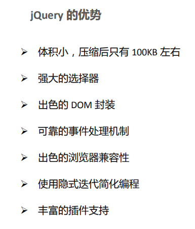
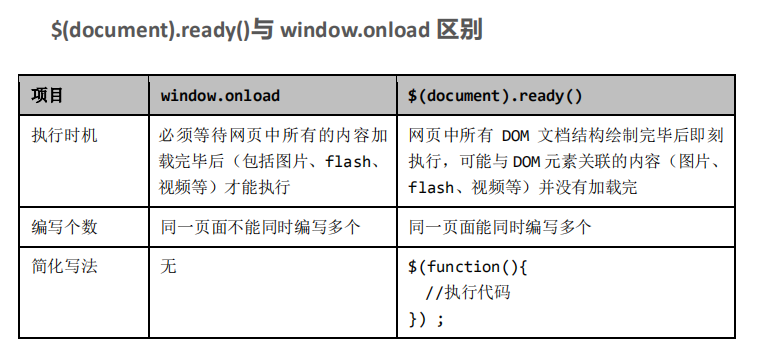
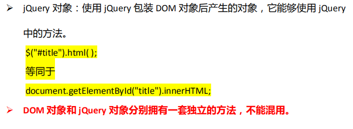
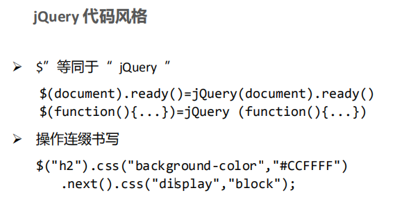
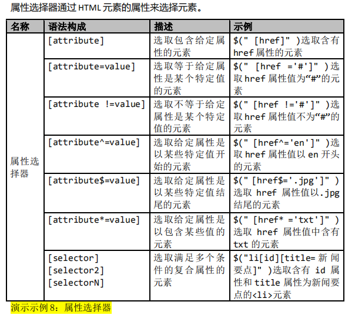
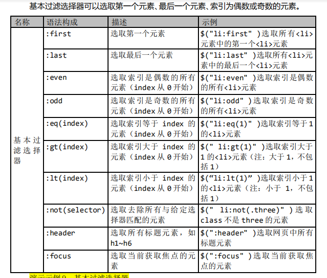
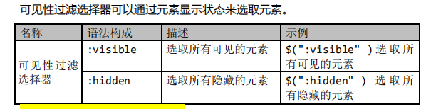
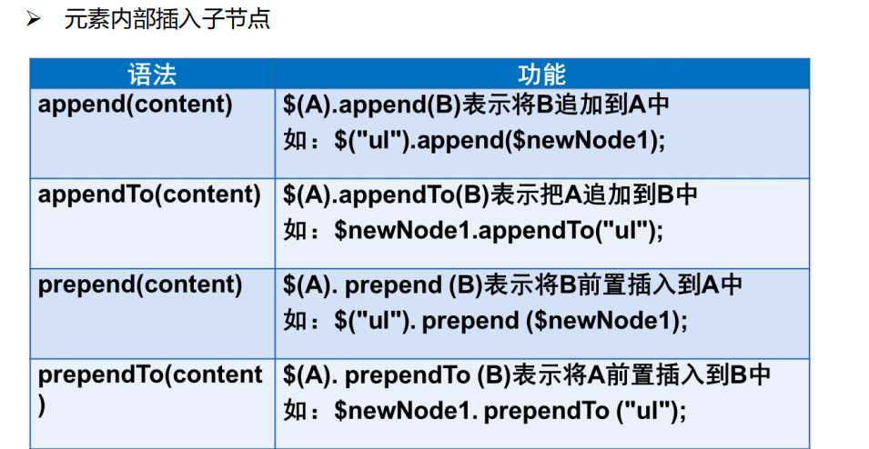
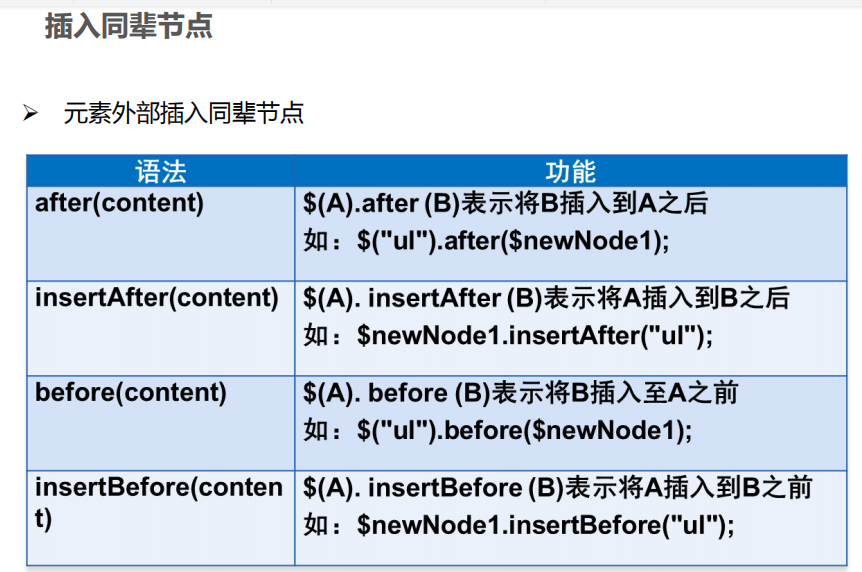
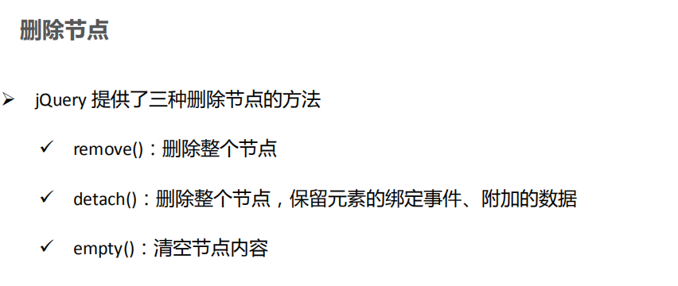

# Jquery

## Jquery概述

* **jQuery** **能做的** **JavaScript** **也都能做，但使用** **jQuery** **能大幅提高开发效率。**

  ​		访问和操作 DOM 元素

  ​		控制页面样式

  ​		对页面事件进行处理

  ​		扩展新的 jQuery 插件

  ​		与 Ajax 技术完美结合



## JQuery语法













## 节点操作

* 创建节点

```js
$('.class')			//通过选择器获取节点
$('div')			
$(html)				//使用HTML字符串创建节点
	var newNode=$("<div>内容</div>");
```

* 插入节点

```js
//插入节点
$(".s").append(newNode);	//将newNode追加到 .s
newNode.appendTo(".s");		//将newNode追加到 .s
```





* 删除节点



* 元素遍历