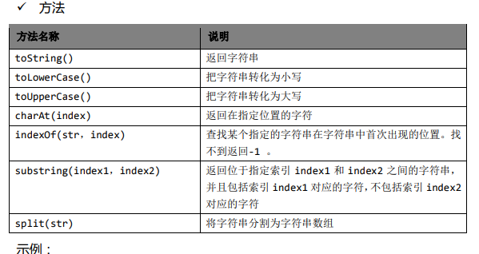

# JavaScript----脚本语言
### JavaScript的作用
```
js运行在客户端的脚本语言，不需要编译。

1.表单动态校验（密码强度检测）（js产生最初的目的）	----原来需要传到服务器，服务器验证

2.网页特效

3.服务器端开发（Node.js)

4.桌面程序（Electron）

5.APP(Cordova)

6.控制硬件-物联网（Ruff）

7.游戏开发（cocos2d-js）
```
### 浏览器JS简介
* 浏览器分成两部分:渲染引擎和JS引擎

* 渲染引擎：用来解析HTML和CS，俗称内核。

* JS引擎：也称JS解释器。---逐行解释执行。

### JS的组成：ECMAScript、DOM、BOM
* ECMAScript：js语法	---可以认为js由ECMAScript扩展来

* DOM：页面文档对象模型
 处理可扩展标记语言的`标准编程接口`,通过DOM提供的接口，可以对页面上的各种元素进行操作（大小位置颜色等）

* BOM：浏览器对象模型
 可以与浏览器窗口进行互动的对象结构。通过BOM可以操作浏览器窗口，比如弹出框、控制浏览器跳转、获取分辨率。

### 数据类型
* 简单数据类型：Number、Boolean、String、Undefined（声明，没给值）、Null（声明，给空值）
复杂数据类型：object
```
isNaN() ---判断是否为非数字类型

str.length 	---通过length属性获取长度

字符串和其他类型拼接，最终结果是字符串 

var str=undefined;	---str+'pink'  //undefinedpink  ---str+1   //NaN
var str=null;	---str+'pink'  //nullpink  ---str+1   //1
alert(null==undefined)		//true

var num=10; 
console.log(typeof(num));   -----typeof检测数据类型

typeof(NaN)			//number
```

* 数据类型转换
   1. 转换为字符串 
```
toString()		---console.log(num.toString());
String()		---console.log(String(num));
加号拼接		---console.log(num+'')				---常用，隐式转换
```
   2. 转换为数字
```
parseInt(string)	---parseInt('120px')  结果为120  --parseInt('p120px')  结果为NaN
parseFloat(string)
Number(string)	
js隐式转换（-*/）  		---  '12'- 0
(重点前两种)
```
   3. 转换为Boolean型  		---boolean(string)
	代表空、否定的值会被转为false，有：''、0、NaN、null、undefined



### 运算符

```
0.1+0.2=0.300000004；
浮点数计算会有误差，所以也不能直接判断 0.3 = = 0.1+0.2
```
*  逻辑中断，逻辑与，逻辑或（当有多个表达式（值）时，左边的表达式可以确定结果，不再继续右边的值）==重要==
```
表达式1 && 表达式2：
	表达式1为真，则返回表达式2		---123 && 456   （结果 456）
	表达式1为假，则返回表达式1		---0 && 456  （结果为 0）

表达式1 || 表达式2：
	表达式1为假，返回表达式2		---0 || 456  （结果为 456）
	表达式1为真，返回表达式1        ---123 || 456   （结果为 123）

```

* 三元表达式 ? :   （条件表达式？表达式1：表达式2）
	var result = num > 5 ? '是的': '不是的'；

* switch
```
switch(num){
	case 1:	console.log(1);				---case '1'....	
			break;
}

num与case匹配结果的时候是 全等 = = = （值和类型一致）

匹配到时，没有break，则会继续执行下一个case，直到有break或结束
```

### 数组
* 创建数组

  ```js
  var arr = new Array(size);
  var arr = new Array(5);
  var arr = new Array("1","12","32");
  var arr = [];			---var arr = [1,2,'3'];
  ```

  

* 数组长度arr.length;		---数组长度可更改arr.length=5;
	另一种修改数组长度的方法：直接追加    arr1=['1','red']		
			---arr1[2]='lin'; arr1[3]='xx';
	
* push pop方法

* join方法     -----把数组的所有元素放入一个字符串，通过分隔符分割。

* sort方法    -排序

### 函数
* arguments可以获得实参的个数和值
	function fn(){
		console.log(arguments.length);
		console.log(arguments[0]);
	}

* 另一种函数声明
	var fn = function(canshu){
		
	}
调用方式都为fn('你好');

### 作用域
* 全局作用域、局部作用域
* 全局变量、局部变量
 `函数内的全局变量`：在函数内部没有声明，直接赋值，也属于全局变量 --- `arg = 30`;


```
函数的形参是局部变量

全局变量只有浏览器关闭的时候才会销毁，比较占内存资源
局部变量，程序（函数）执行完毕就会销毁，比较节约内存资源

```

### 预解析（重要）
* js引擎运行js代码时分两步：预解析和代码执行
```
1. 预解析：js引擎会把js所有的var还有function提升到当前作用域的最前面（注：当前作用域）
2.代码执行，按书写顺序从上到下执行


1.预解析分为变量预解析（变量提升）和函数预解析（函数提升）
	（1）变量提升：把所有的变量声明提升到当前作用域的最前面，不提升赋值操作
	（2）函数提升：把所有的函数声明提升到当前作用域的最前面，不调用函数。

案例1：
fn1();
var fn1=function(){
	console.log(1);
}
-----------变量提升fn1，但是没赋值，所以fn1();找不到 报错

案例2：
fn2();
function fn2(){
	console.log(2);
}
-----------函数提升fn2，因此执行fn2();调用时能找到所以正常执行。

```

* 预解析案例
```
var num=10;
fun();
function fun(){
	console.log(num);
	var num=20;
}

-----相当于

var num;
function fun(){
	var num;	
	console.log(num);			---因此结果为undefined， 因为num定义了未赋值
	num=20;
}
num=10;
fun();

```
* var a=b=c=9;   ---(相当于var a=9,b=9,c=9)，所以在函数里的bc是全局变量

### 对象

#### 内置对象

* **Math对象**

```js
ceil()		对数进行上舍入
floor()		对数进行下舍入
round()		把数四舍五入为最接近的数
Random()	返回 0~1 之间的随机数,方法返回值不包括 0 和 1。
```

* **Date 对象**

```js
var today=new Date();

getDate()		//返回几日	1-31
getDay()		//返回星期几	0-6		0表示周日
getMonth()		//返回几月 0-11		一般加1
getFullYear()	//返回年
getTime()		//返回自某一时刻（1970 年 1 月 1 日）以来的毫秒数
```


* 创建对象的三种方式
```
1. 字面量{}
	var obj={};
	var obj2={
		uname:'张三',
		age: 18,
		sayHi:function(){
			
		}
	}

	-----两种调用对象的属性 obj2.uname;  obj2['uname'];
	-----调用对象方法  obj.sayHi();

2. new Object创建
	var obj=new Object();
	obj.uname='张三';
	obj.age=18;
	obj.sayHi=function(){
		
	}

3. 构造函数创建对象
	function 构造函数名(){
		this.属性=值;
		this.方法=function(){

		}
	}
	new 构造函数名();

例：
	function Star(uname,age,sex){
		this.name=uname;
		this.age=age;
	}
	var ob1=new Star('lin',18,'nv');
	
```
* 遍历对象属性 for...in
```
for(变量 in 对象)

for(var key in obj)			---k是属性
{
	console.log(obj[key]);
}
```

* js中的对象分三种：自定义对象、内置对象、浏览器对象
```
	内置对象例:math date string array 
		一般new创建？
		var date= new Date();
```

* 查文档 MDN/W3C
	MDN：https://developer.mozilla.org/zh-CN/

