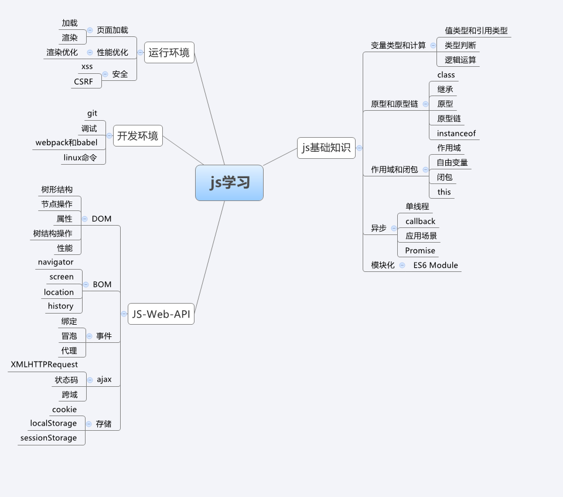
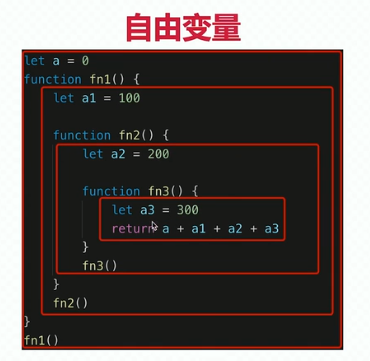
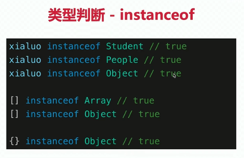
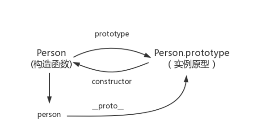
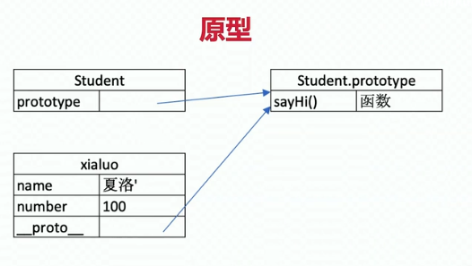
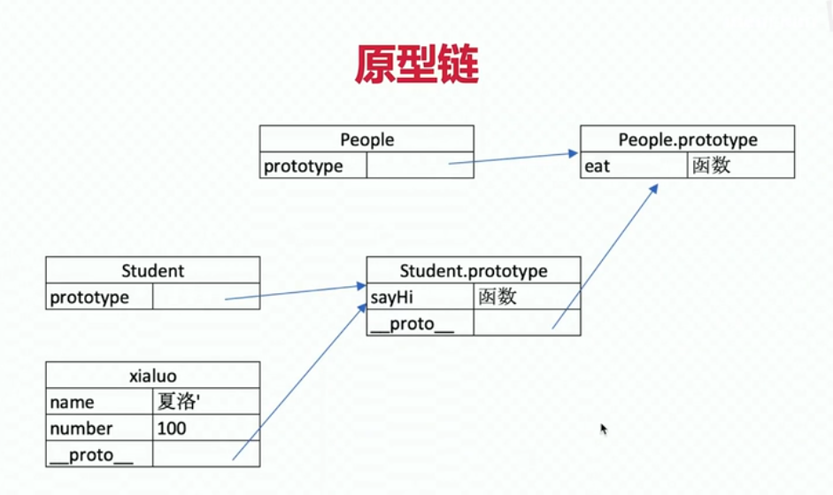
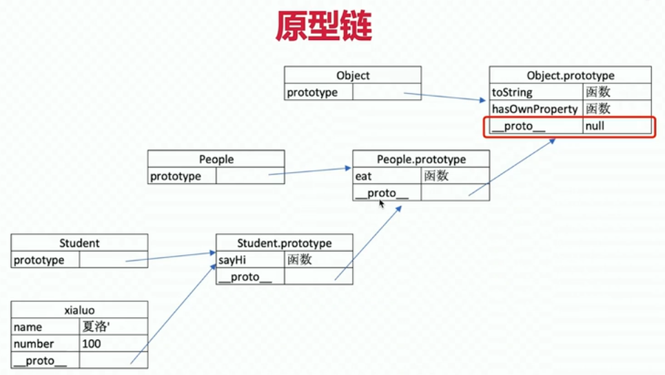
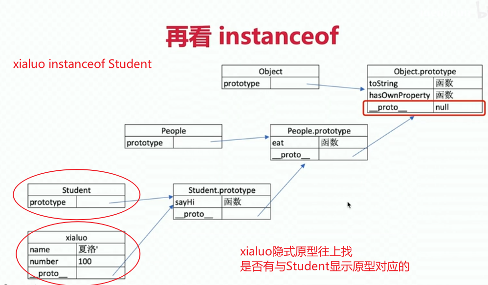
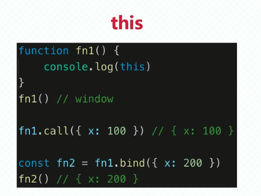

## JavaScript
​	JavaScript的执行分为：**解释**和**执行**两个阶段。

**解释阶段：**

- 词法分析

- 语法分析

- 作用域规则确定

**执行阶段**：

- 创建执行上下文
- 执行函数代码
- 垃圾回收

**执行上下文在运行时确定，随时可能改变；作用域在定义时就确定，并且不会改变**。[作用域与执行上下文](https://blog.csdn.net/howgod/article/details/88565793)



## 部分一：基础

### 一、 变量

​	当使用var声明一个变量时，创建的这个属性是不可配置的，也就是说无法通过delete运算符删除

```
var name=1   ->不可删除
sex=”girl“     ->可删除
this.age=22   ->可删除
```

预解析

1. 变量提升，把变量声明提升到当前作用域的最上面，不包括变量的赋值
2. 函数提升，把函数声明提升到当前作用域最上面，不包括函数调用
3. ES6新增块级作用域：let、const 没有变量提升，即不允许先使用再声明；禁止重复声明

### 二、 作用域与作用域链

#### 2.1 作用域：

​	函数的作用域在函数定义的时候就决定了

​	这是因为函数有一个内部属性 **[[scope]]**，当函数创建的时候，就会保存**所有父变量对象**到其中，你可以理解 [[scope]] 就是所有**父变量对象的层级链**，但是注意：[[scope]] 并不代表完整的作用域链！

​	**上级作用域**：函数在哪里定义，他的上一级作用域就是哪。

#### 2.2 作用域链：

​	当查找变量的时候，会先从当前上下文的变量对象中查找，如果没有找到，就会从**父级(词法层面上的父级)**执行上下文的变量对象中查找，一直找到全局上下文的变量对象，也就是全局对象。这样由多个执行上下文的变量对象构成的链表就叫做作用域链。[【例子】](https://blog.csdn.net/yueguanghaidao/article/details/9568071)

**在作用域的多层嵌套中查找自由变量的过程是作用域链的访问机制。而层层嵌套的作用域，通过访问自由变量形成的关系叫做作用域链。**

```js
//例：
name="lwy";
        
function t(){
    var name="tlwy";
    function s(){
        var name="slwy";
        console.log(name);
    }
    function ss(){
        console.log(ss.prototype);
        console.log(name);
    }
    s();
    ss();
}
t();

执行ss()时，作用域链是： ss()->t()->window,所以name是”tlwy"
```

#### 2.3 自由变量及其取值



​	**自由变量**：当前作用域没有定义的变量。

​	**自由变量取值：**向父级作用域寻找。

​			取自由变量x的值时——要到**创建fn函数**的那个作用域中取，**无论**fn函数将在哪里调用。**作用域中取值,这里强调的是“创建”，而不是“调用”**，切记切记——其实这就是所谓的"静态作用域"

```js
var x = 10
function fn() {
  console.log(x)
}
function show(f) {
  var x = 20
  (function() {
    f() //10，而不是20			是“创建”，而不是“调用”
  })()
}
show(fn)
```


### 三、 函数

#### 3.1 arguments

通过arguments可以获取函数调用的时候的实参, (实参个数不确定的时候)

#### 3.2 匿名函数

将匿名函数赋值给一个变量， 这样就可以通过变量进行调用

#### 3.3 函数的定义(创建)

* 方法1：函数声明（使用function关键字）

```js
function fdemo1(param){
    alert("I'm fdemo1");
}
```

* 方法2：表达式

```js
var fdemo2 = function(param){
    alert("I'm fdemo2");
}
```

* 方法3：函数构造器

```js
var fdemo3 = new Function('param',"alert('I'm fdemo2');");
```


### 四、 类、对象、函数啥的

#### 4.1 类的创建

[类创建的几种方式](https://blog.csdn.net/zjy_android_blog/article/details/80868371)
1.工厂模式2. 构造函数模式3. 原型模式4. 组合使用构造函数模式和原型模式

**构造函数方式**确实挺好用的，但是它也有它的**缺点**：就是**每个方法**都要在每个实例上重新创建一遍，方法指的就是我们在对象里面定义的函数。**如果方法的数量很多，就会占用很多不必要的内存**。于是出现了下面这种实现方式：**原型模式**。

1. 工厂模式

```js
function person(name,){
    var obj = {};
    obj.name = name;
    obj.do = function(){
        console.log(this.name)
    };
    return obj;
}
function dog(name){
    var obj = {};
    obj.name = name;
    obj.do = function(){
	console.log('旺旺~~')
    };
    return obj;
}
 
var zhouyu = person('周瑜');
var dog = dog('dog');
zhouyu.do();  // 周瑜
dog.do();     // 旺旺~~
console.log(zhouyu.__proto__.constructor);   // ƒ Object() { [native code] }
console.log(dog.__proto__.constructor);      // ƒ Object() { [native code] }

//使用工厂方式创建的类的实例对象，构造器都是 Object()  。
```

2. 构造函数模式

```js
function Person(name){
    this.name = name;
    this.do = function(){
    	console.log(this.name)
    };
}
function Dog(name){
    this.name = name;
    this.do = function(){
	console.log('旺旺~~')
    };
}
var zhouyu = new Person('周瑜');  
var dog = new Dog('Dog');// 使用new,就代表把Person当作构造函数,并把生成的实例传给Person的this;不使用new,就把Person当作一个普通函数,这是和工厂方式区别的地方
zhouyu.do();  // 周瑜
dog.do();     // 旺旺~~
console.log(zhouyu);  // Person {name: "周瑜", do: ƒ}
console.log(dog);     // Dog {name: "Dog", do: ƒ}


//使用构造函数方式创建的类的实例对象，构造器是他们的构造函数（Person和Dog）

构造函数方式确实挺好用的，但是它也有它的缺点：就是每个方法都要在每个实例上重新创建一遍，方法指的就是我们在对象里面定义的函数。如果方法的数量很多，就会占用很多不必要的内存。于是出现了下面这种实现方式：原型模式。
```

3. 原型模式

```js
function Person(){}
Person.prototype.name = '周瑜';
Person.prototype.do = function(){
    console.log(this.name);
};
var zhouyu = new Person();
zhouyu.do();


// 使用原型创建对象的方式，可以让所有对象实例共享它所包含的属性和方法。

这里需要说明一点：当我们创建一个函数在浏览器中被解析时，解析器会向函数中添加一个属性prototype，也就是原型对象，包含了构造器。如果函数作为普通函数调用，prototype没有任何作用；当函数以构造函数形式调用时，它所创建的对象都会有一个隐含属性指向该构造函数的原型对象，就是上图中的隐含属性__proto__，指向原型对象，我们可以通过它访问原型对象。
```

4. 组合使用构造函数模式和原型模式

```js
function Person(name,job){
    this.name =name;
    this.job = job;
}
Person.prototype = {
    constructor:Person, //指定构造器为Person
    do: function(){
        console.log(this.name);
    }
}
var zhouyu = new Person('周瑜','军师');
zhouyu.do();
console.log(zhouyu);


//这里需要注意的一点是组合模式创建的实例对象，构造器是Object，需要在原型Person.prototype中指定为Person
```


* 一个简单的类

```js
var Person = function(name, age){
    this.name = name;
    this.age = age;
 
    this.sayName = function(){
        console.log(this.name);
    };
}  

function myClass() {
     this.id = 5;
     this.name = 'myclass';
     this.getName = function() {
          return this.name;
     }
}
var my = new myClass();
alert(my.id);
alert(my.getName());
```

* 一个复杂的类

```js
var Person = function(name, age){ 
    this.name = name;
    
    this.sayName = function(){
        console.log(this.name);
    };
    
    //静态私有属性(只能用于内部调用)
    var home = "China";
    //静态私有方法(只能用于内部调用)
    function sayHome(){
        console.log(home);
    }
    
    //构造器
    this.setAge = function(age){
        console.log(age + 12);
    };
    this.setAge(age);
}
//静态方法（只能被类来访问）
Person.sayAge = function(){
    console.log("your age is 12");
}
//静态属性（只能被类来访问）
Person.drink = "water";
//静态共有方法（类和实例都可以访问）
Person.prototype.sayWord = function(){
    console.log("ys is a boy");
}
```

* class创建类

```js
class Student{
    constructor(name,num){
        this.name=name
    }
    sayHi(){
        
    }
}
```

#### 4.2 对象创建的几种方式

1. 简单对象的创建   使用对象字面量的方式{}

```js
var Cat  = {
    name:"kity",
    eat(){
        
    }
};

 Cat.age=2;//添加属性并赋值
 Cat.sayHello=function(){
  alert("hello "+Cat.name+",今年"+Cat["age"]+"岁了");
     //可以使用“.”的方式访问属性，也可以使用HashMap的方式访问
 }
 Cat.sayHello();
```

2. 用function(函数)来模拟class (无参构造函数)

```js
1 创建一个对象，相当于new一个类的实例

function Person(){
 
}
var personOne=new Person();//定义一个function，如果有new关键字去"实例化",那么该function可以看作是一个类
personOne.name="dylan";
personOne.hobby="coding";
personOne.work=function(){
alert(personOne.name+" is coding now...");
}
 
personOne.work();


2 可以使用有参构造函数来实现，这样定义更方便，扩展性更强（推荐使用）

function Pet(name,age,hobby){
   this.name=name;//this作用域：当前对象
   this.age=age;
   this.hobby=hobby;
   this.eat=function(){
      alert("我叫"+this.name+",我喜欢"+this.hobby+",也是个吃货");
   }
}
var maidou =new Pet("麦兜",5,"睡觉");//实例化/创建对象
 
 maidou.eat();//调用eat方法(函数)
```

3. 使用工厂方式来创建（Object关键字）

```js
var wcDog =new Object();
 wcDog.name="旺财";
 wcDog.age=3;
 wcDog.work=function(){
   alert("我是"+wcDog.name+",汪汪汪......");
 }
 
 wcDog.work();
```

4. 使用原型对象的方式  prototype关键字

```js
function Dog(){
 
 }
 Dog.prototype.name="旺财";
 Dog.prototype.eat=function(){
 alert(this.name+"是个吃货");
 }
 var wangcai =new Dog();
 wangcai.eat();
```

5. 混合模式(原型和构造函数)

```js
function Car(name,price){
  this.name=name;
  this.price=price; 
}
 Car.prototype.sell=function(){
   alert("我是"+this.name+"，我现在卖"+this.price+"万元");
  }
 
var camry =new Car("凯美瑞",27);
camry.sell(); 
```


 (1)用关键字var创建对象：

​	var obj = new Object(); //空对象 

​	var obj = {}; //空对象

​	var obj = {key0:val0, key1:val1, ...}; 

(2)用关键字function创建对象：(这样创建的对象可以当成类使用因为它相当于拥有了构造函数) 

​	function obj() { } //空对象 

​	function obj(arg0,arg1,...) {...} 

(3)对象体内定义属性和方法：

​	this.key = value;

​	this.func = function(arg0,arg1,...) {...} 

(4)对象体外定义属性和方法： 

​	obj.key = value; 

​	obj.func = function(arg0,arg1,...) {...}

#### 4.3 继承的几种方式

[继承的几种方式](https://blog.csdn.net/wyw223/article/details/86567897)

[js继承2](https://juejin.cn/post/6914216540468576263)

1. 原型链继承		

   ​			----核心： 将父类的实例作为子类的原型		Cat.prototype = new Animal();

```js
// 定义一个动物类
function Animal (name) {
  this.name = name || 'Animal';
  this.sleep = function(){
    console.log(this.name + '正在睡觉！');
  }
}
Animal.prototype.eat = function(food) {
  console.log(this.name + '正在吃：' + food);
};


function Cat(){ 
}
Cat.prototype = new Animal();				//原型链继承
Cat.prototype.name = 'cat';

//　Test Code
var cat = new Cat();
console.log(cat.name);
console.log(cat.eat('fish'));
console.log(cat.sleep());
console.log(cat instanceof Animal); //true 
console.log(cat instanceof Cat); //true


1.来自原型对象的所有属性被所有实例共享
2.创建子类实例时，无法向父类构造函数传参
```

2. 构造函数继承

   ​		----使用父类的构造函数来增强子类实例，等于是复制父类的实例属性给子类（没用到原型）

```js
function SuperType() {
    this.colors = ["red", "blue", "green"];
}

function SubType() {
    //继承SuperType
    SuperType.call(this);
}

var instance1 = new SubType();
instance1.colors.push("black");
alert(instance1.colors); //"red,blue,green,black"
var instance2 = new SubType();
alert(instance2.colors); //"red,blue,green" 

特点：
	解决了1中，子类实例共享父类引用属性的问题
	创建子类实例时，可以向父类传递参数
	可以实现多继承（call多个父类对象）
缺点：
	实例并不是父类的实例，只是子类的实例
	只能继承父类的实例属性和方法，不能继承原型属性/方法
	无法实现函数复用，每个子类都有父类实例函数的副本，影响性能
```

3. 组合继承	* 

   ​		----将原型链和借用构造函数的技术组合到一块。使用原型链实现对原型属性和方法的继承，而通过构造函数来实现对实例属性的继承。

```js
function SuperType(name) {
    this.name = name;
    this.colors = ["red", "blue", "green"];
}

SuperType.prototype.sayName = function() {
    alert(this.name);
}

function SubType(name, age) {
    // 继承属性
    SuperType.call(this, name);
    this.age = age;
}

// 继承方法
SubType.prototype = new SuperType();
SubType.prototype.constructor = SubType;
SubType.prototype.sayAge = function() {
    alert(this.age);
};

var instance1 = new SubType("Nicholas", 29);
instance1.colors.push("black");
alert(instance1.colors); //"red,blue,green,black"
instance1.sayName(); //"Nicholas";
instance1.sayAge(); //29
var instance2 = new SubType("Greg", 27);
alert(instance2.colors); //"red,blue,green"
instance2.sayName(); //"Greg";
instance2.sayAge(); //27 


```

4. 寄生组合式继承

   ​		----组合继承是JS中最常用的继承模式，但其实它也有不足。

```js
   function object(o) {
       function F(){}
       F.prototype = o;
       return new F();
   }
   
   function inheritPrototype(superType, subType) {
       var prototype = object(superType.prototype);
       prototype.constructor = subType;
       subType.prototype = prototype;
   }
   
   function SuperType(name) {
       this.name = name;
       this.colors = ["red", "blue", "green"];
   }
   
   SuperType.prototype.sayName = function() {
       alert(this.name);
   };
   
   function SubType(name, age) {
       SuperType.call(this, name);
       this.age = age;
   }
   
   inheritPrototype(SuperType, SubType);   // 这一句，替代了组合继承中的SubType.prototype = new SuperType()
   
   SubType.prototype.sayAge = function() {
       alert(this.age);
   };
   
```

5. class关键字继承(ES6)

```js
class People{
    constructor(name){
        this.name=name;
    }
    eat(){
        console.log(`${this.name} eat something`);
    }
}

//子类
class Student extends People{
	constructor(name,num){
        super(name)
        this.num=num;
    }
    sayHi(){
        console.log(`姓名 ${this.name} , 学号 ${this.num}`)
    }
}
```


####4.4 普通函数和构造函数区别

 1、**构造函数也是一个普通函数**，创建方式和普通函数一样，但构造函数习惯上首字母大写

 2、构造函数和普通函数的区别在于：**调用方式不一样**

 3、**普通函数**的调用方式：直接调用 person();

 4、**构造函数**的调用方式：需要使用new关键字来调用 new Person();

 5、**构造函数**的执行流程

​    A、立刻在堆内存中创建一个新的对象

​    B、将新建的对象设置为函数中的this

​    C、逐个执行函数中的代码

​    D、将新建的对象作为返回值

- （1）.像普通函数执行一样，形成一个私有的作用域（栈内存），完成形参赋值和变量提升
- （2）【构造函数独有】在JS代码自上而下执行之前，首先在当前形成的私有栈中创建一个对象（创建一个堆内存：暂时不存储任何的东西），并且让函数中的执行主体（this）指向这个新的堆内存
- （3）代码自上而下执行
- （4）【构造函数独有】代码执行完毕，把之前创建的堆内存地址返回（浏览器默认返回）

#### .5 函数与对象

​		**函数本身也是一个对象。**

​		==JS中的对象强调的是一种复合类型==。js中对象就是神一般的存在，==什么都是对象==（包括函数），函数是用来实现具体功能的代码，对象是有属性和方法的一个东西，在对象中的函数就变成了方法。

​		可以给函数对象本身定义一些方法和属性，借助于函数的prototype对象，可以很方便地修改和扩充Function类型的定义。

​		Function是所有函数对象的基础，而Object则是所有对象（包括函数对象）的基础。

​		在JavaScript中，==**任何一个对象都是 Object的实例**==，因此，可以修改Object这个类型来让所有的对象具有一些通用的属性和方法，修改Object类型是通过prototype来完成 的：


### 五、 数据类型

基本类型：Number,String,Boolean,Null,Undefined 

引用类型：Array,Function（函数）,（堆）对象

#### 5.1 基本类型和引用类型的区别

（1）引用类型值保存在堆里，基本类型是存放在栈里 

（2）引用类型值可添加属性和方法，而基本类型值则不可以    

#### 5.2判断类型方式

typeof typeof对于原始类型来说，除了null都可以显示正确类型

instanceof typeof对于对象来说，除了函数都会显示object

Object.prototype.toString.call()   

#### 5.3 栈和堆的区别  

（1）栈由编译器自动分配释放空间，堆一般由程序员分配释放 

（2）栈存放在一级缓存中，调用完毕立即释放；堆则是在二级缓存中，生命周期由虚拟机的垃圾回收算法来决定

​		[对象数组的区别](https://blog.csdn.net/weixin_41807530/article/details/80829275)

#### 5.4 数组的方法

* 以下原数组改变：
  * push：末尾添加	pop：末尾删除	shift：首部删除	unshift：首部添加 
  * reverse：将数组倒序
  * sort：对数组进行排序
  * splice(index,howmany,num1,num2)：删除元素并添加元素。从index开始，删除howmany个元素,将num1...从index位置依次插入
* 以下原数组不变，返回新数组
  * concat(arr1,arr2...)：数组合并，生成一个新数组，原数组不变
  * slice(start,end)：截取数组，包括start，不包括end， -1 表示倒数第一个
* 其他
  * join: 数组以指定字符连接形成一个字符串，返回字符串。
  * forEach(function)：用于调用数组的每个元素。原数组不变，返回值undefined。
  * map(function)：原数组每一项执行函数后，返回一个新数组，原数组不变。
  * filter(function)：过滤数组中，符合条件的元素，返回一个新数组，原数组不变。
  * reduce(function)：接收一个函数作为累加器，数组中的每个值开始缩减，最终计算为一个值，原数组不变。
  * includes：判断一个数组是否包含一个指定的值。包含为true，反之为false。
  * indexOf：检测当前值在数组中第一次出现的位置索引，未找到返回-1。（可选从哪个位置开始搜索）
  * every：对数组中的每一项进行判断。都符合返回true，否则返回fasle。
  * some：对数组中的每一项进行判断。有一项符合就返回true，都不符合返回false。
* [数组的方法](https://blog.csdn.net/SpringRolls/article/details/106171713)

## 部分二：原型和原型链

* 如何准确判断一个变量是不是数组？
* 手写一个简易的jQuery，考虑插件和扩展性
* class的原型本质，怎么理解？

### 一、 class

[js 总结ES6中Class以及继承](https://blog.csdn.net/qq_37473645/article/details/89716231)

* constructor
* 属性
* 方法

```js
class Student {
    constructor(name,num){
        this.name=name;
        this.num=num;
        this.male='女';
    }
    sayHi(){
        console.log(`姓名 ${this.name} , 学号 ${this.num}`)
    }
}

//通过类 new 对象/实例
const xix=new Student('林',01);			//new一个对象的时候会去执行constructor
console.log(xix.name);
```


### 二、 继 承

* extend
* super
* 扩展或重写方法

```js
//父类
class People{
    constructor(name){
        this.name=name;
    }
    eat(){
        console.log(`${this.name} eat something`);
    }
}

//子类
class Student extends People{
	constructor(name,num){
        super(name)
        this.num=num;
    }
    sayHi(){
        console.log(`姓名 ${this.name} , 学号 ${this.num}`)
    }
}

typeof Student    //'function'
//class实际上是函数，可见是语法糖
```


### 三、 instanceof



```js
// 判断 f 是否是 Foo 类的实例 , 并且是否是其父类型的实例
function Aoo(){} 
function Foo(){} 
//JavaScript 原型继承
Foo.prototype = new Aoo();
 
var foo = new Foo(); 
console.log(foo instanceof Foo) // true 
console.log(foo instanceof Aoo) // true

foo.__proto__(链) === Foo.prototype
```

`f instanceof Foo` 的判断逻辑是：

- f 的 `__proto__`一层一层往上，是否对应到 `Foo.prototype`
- 再往上，看是否对应着`Aoo.prototype`
- 再试着判断 `f instanceof Object`

[深入剖析 instanceof 运算符](https://juejin.cn/post/6844903934377590791)

### 四、 原型

​	**原型的概念**：每一个javascript对象(除null外)创建的时候，就会与之关联另一个对象，这个对象就是我们所说的原型，每一个对象都会从原型中“继承”属性。

```js
//__proto__隐式原型		prototype显示原型
console.log(xialuo.__proto__)
console.log(Student.prototype)
console.log(xialuo__proto__ === Student.prototype) 	//true		
//说明两个引用类型引用的是同一个内存地址 
```

#### 1. 原型

每个函数都有一个prototype属性，这个属性指向函数的**原型对象**。

这是每个对象(除null外)都会有的属性，叫做__proto__，这个属性会指向该对象的原型。

每个原型都有一个constructor属性，指向该关联的构造函数。





#### 2. 原型关系

* 每个**class、函数Function**都有显示原型prototype

* 每个**实例对象**都有隐式原型_proto__

* 实例的_proto__指向对应class的prototype

#### 3. 基于原型的执行规则

1.  获取属性xialuo.name或执行方法xialuo.sayhi()时
2.  先在自身属性和方法寻找
3.  如果找不到则自动去_proto__中查找

### 五、 原型链

```js
//__proto__隐式原型		prototype显示原型
console.log(Student.prototype.__proto__)
console.log(People.prototype)
console.log(People.prototype === Student.prototype.__proto__) 	//true	

People.isPrototypeOf(Student)    //true    判断是子类是否为某一个的父类
```





### 六、 instanceof 与 原型链




```js
People.isPrototypeOf(Student)    //true    判断是子类是否为某一个的父类

console.log(Student instanceof Person)	//false
console.log(Student.prototype instanceof Person)	//true


function An() {}
function Bottle() {}
An.prototype = Bottle.prototype = {};

let an = new An();
console.log(an instanceof Bottle); // true
//这是因为 instanceof 关心的并不是构造函数，而是原型链。

//instanceof 原理

function instance_of(L, R) {//L 表左表达式，R 表示右表达式，即L为变量，R为类型
// 取 R 的显示原型
var prototype = R.prototype
// 取 L 的隐式原型
L = L.__proto__

    while (true) { 
         if (L === null) {
           return false
         }
         // 这里重点：当 prototype 严格等于 L 时，返回 true
         if (prototype === L) {
           return true
         } 

         L = L.__proto__
    } 
}

```

### 七、 问题与解答

#### 1. class的原型本质

* 原型和原型链的图示
* 属性和方法的执行规则（通过隐式原型，通过链的方式去寻找方法）

#### 2. 判断一个变量是不是数组

*  a instanceof Array

#### 3. 手写一个简易的jQuery 

## 部分三：作用域与闭包

* this的不同应用场景，如何取值？
* 手写bind函数
* 实际开发中闭包的应用场景，举例说明

### 一、 作用域

==详情见部分一，作用域。==

### 二、 闭包

**闭包（closure）**是指有权访问另一个函数作用域中变量的函数。或者说**闭包就是能够读取其他函数内部变量的函数**

作用域应用的特殊情况，有两种表现：

* 函数作为参数被传递
* 函数作为返回值被返回

```js
//自由变量，函数定义的上一级作用域寻找值
        
        //函数作为返回值
        function create(){
            const a=100
            return function(){
                console.log(a)
            }
        }
        const fn = create()
        const a = 200
        fn()      //100 
        //函数执行在全局作用域，函数定义在create函数作用域。。在create找，所以log 100


         //函数作为参数
        function print(fn){
            let a = 200
            fn()
        } 
        let a = 100
        function fn(){
            console.log(a);
        }
        print(fn)     //100
        //函数执行在print函数作用域，函数定义在全局作用域。。在全局找，所以log 100


```

==总结：所有的自由变量的查找，是在函数定义的地方，向上级作用域查找。不是在执行的地方！！！==

### 三、 this

使用场景：

* 作为普通函数
* 使用call apply bind
* 作为对象方法被调用
* 在class方法中调用
* 箭头函数

**this**取什么值是在**函数执行时确定**的，而不是在函数定义的时候确定的



## 扩展

### 一、  浅克隆和深克隆

（1）浅克隆（只复制内存地址）: 只是拷贝了基本类型的数据，而引用类型数据，复制后也是会发生引用，我们把这种拷贝叫做“（浅复制）浅拷贝”，换句话说，浅复制仅仅是指向被复制的内存地址，如果原地址中对象被改变了，那么浅复制出来的对象也会相应改变。
（2）深克隆： 创建一个新对象，属性中引用的其他对象也会被克隆，不再指向原有对象地址。 JSON.parse、JSON.stringify() 		（一、递归    二、JSON）

​	[JS浅克隆与深克隆](https://blog.csdn.net/sinat_17775997/article/details/70482279)

```js
//递归
function deepClone(arr){
    if(typeof(arr) != "object"){
        return arr;
    }
    let result = {}
    for(let i in arr){
        result[i] = deepClone(arr[i])
    }
    return result
}

//JSON
var s=JSON.parse(JSON.stringify(arr));
```

### 二、 闭包

**闭包（closure）**是指有权访问另一个函数作用域中变量的函数。或者说**闭包就是能够读取其他函数内部变量的函数**

### 三、  js对数据常用处理方式  [常用处理方式](https://blog.csdn.net/qq_21386275/article/details/80940070)

**1、字符串转换成对象**

```js
var obj = JSON.parse(data);						//字符串转对象   解析
console.log(JSON.stringify(data.data));			//对象转字符串   序列化
```

**2、js 判断一个 object 对象是否为空**

```js
if (JSON.stringify(data) === '{}') {
    return false // 如果为空,返回false，数组可以用同样的判断方式
}
if (Object.keys(object).length === 0) {
    return false // 如果为空,返回false，Object.keys(object)会返回一个空数组[]
}
```

**3、读取对象或这数组中的元素**

```js
var test = [{"a":"a"},{"b","b"}];
console.log(test[1].b);
console.log(test[1].['b']);//不能用test.1.b
```

**4、将数组中字符串转换成整型**

```js
var arr = ["1","2","3"];
arr = arr.map(function (data) {
    return +data;
});//此时arr变成[1,2,3]
```

**5、判断对象或数组中元素是否存在**

```js
typeof data.archiveRecordPage !== undefined		
//如果typeof后边是表达式，就要用括号括起来，否则不用括起来。
hasOwnProperty也可以对象某对象是否存在
```

**6、将时间戳转换为时间格式**

```js
formatDate(timestamp) {
    var date = new Date(timestamp);//时间戳为10位需*1000，时间戳为13位的话不需乘1000
    var Y = date.getFullYear() + '-';
    var M = (date.getMonth()+1 < 10 ? '0'+(date.getMonth()+1) : date.getMonth()+1) + '-';
    var D = (date.getDate() < 10 ? '0'+(date.getDate()) : date.getDate()) + ' ';
    var h = (date.getHours() < 10 ? '0'+(date.getHours()) : date.getHours()) + ':';
    var m = (date.getMinutes() < 10 ? '0'+(date.getMinutes()) : date.getMinutes()) + ':';
    var s = (date.getSeconds() < 10 ? '0'+(date.getSeconds()) : date.getSeconds());
    return Y+M+D+h+m+s;
}
```

**7、js判断数组中对象里的某一个值是否存在**

```js
function isInArray(arr,value){
    for(var i = 0; i < arr.length; i++){
        if(value === arr[i]['id']){
            return true;
        }
    }
    return false;
}
var arr = [{id: "ccjl1"},{id: "ccjl2"},{id: "ccjl3"}];
var test = isInArray(arr,'ccjl1');
console.log(test);
```

**8、数组去重**

```js
1、利用ES6 set去重

2、利用for嵌套for，然后splice去重（ES5中最常用）

3、利用indexOf去重

4、利用sort()
```


## 看的

[6道js数据基础面试题](https://blog.csdn.net/weixin_34130389/article/details/88020644)