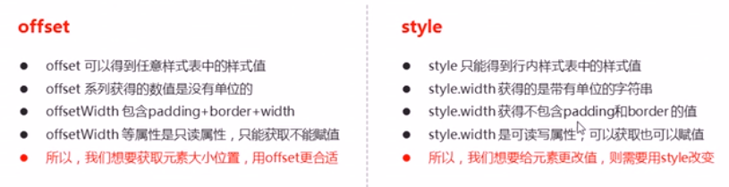
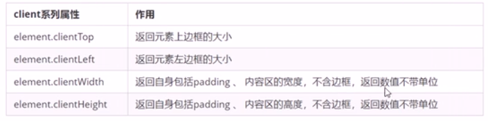

# JavaScript（PC端网页特效）
#### offset 偏移量（动态的获得该元素的位置和大小等）
* offsetLeft和offsetTop
	距离带有定位的父元素的左侧（上侧）的偏移大小
		----若父级都没有定位，则是到body的距离

* offsetWidth和offsetHeight
	获取该元素的宽度和高度

* offsetParent
	返回带有定位的父亲，没有带有定位的父亲则返回body
* offset和style的区别


#### client 客户端（获取元素可视区的相关信息）

* 与offset区别
```
offsetWidth和offsetHeight		---返回自身包含padding、边框、内容区大小
clientWidth和clientHeight		---返回自身包括padding、内容区大小

两者都不带单位
```

#### 立即执行函数
* 不需要调用，立马能自己执行的函数

* 写法
   1. (function(){})();
   2. (function(){}());
   3. 可以传递参数(function(a,b){})(1,2);

* 最大的作用就是 独立创立了一个作用域