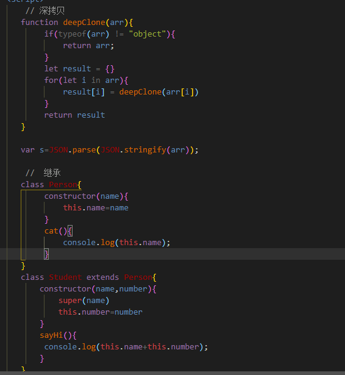
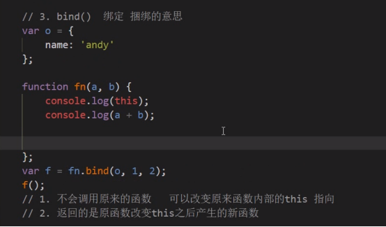
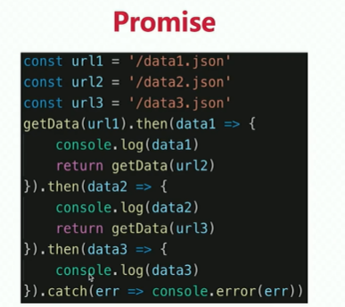
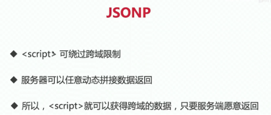

 ## JS问题

#### 1.数据类型

基本类型：Number,String,Boolean,Null,Undefined 

引用类型：Array,Function（堆）  

**1.1 基本类型和引用类型的区别**  

（1）引用类型值保存在堆里，基本类型是存放在栈里 

（2）引用类型值可添加属性和方法，而基本类型值则不可以    

**1.2 判断类型方式** 

typeof typeof对于原始类型来说，除了null都可以显示正确类型

instanceof typeof对于对象来说，除了函数都会显示object

Object.prototype.toString.call()   

**1.3 栈和堆的区别**  

（1）栈由编译器自动分配释放空间，堆一般由程序员分配释放 



|      |                                                              |
| ---- | ------------------------------------------------------------ |
|      |  |

（2）栈存放在一级缓存中，调用完毕立即释放；堆则是在二级缓存中，生命周期由虚拟机的垃圾回收算法来决定


**延伸：**

**（1）对象和数组的区别**

① 数组是有序数据的集合，而对象是无序数据的集合。

② 数组的数据没有名称，只有下标，而对象的数据需要指定名称。

③ 对象没有长度。所以对象没有for 循环

④ 对象键值唯一，数组可以重复

 

[**https://blog.csdn.net/weixin_41807530/article/details/80829275**](https://blog.csdn.net/weixin_41807530/article/details/80829275)

 

**1.5 typeof和instance of 检测数据类型有什么区别？**

https://www.cnblogs.com/chorkiu/p/10369653.html

（1）相同点： 都常用来判断一个变量是否为空，或者是什么类型的。
（2）不同点： 

①typeof 返回值是一个字符串，用来说明变量的数据类型 

②instanceof 用于判断一个变量是否属于某个对象{日期、正则、等}的实例.（new Date() instanceof Date;//true）

**1.6 == 和 ===区别是什么？**

（1）=：赋值

（2）==：返回一个布尔值；相等返回true，不相等返回false；

允许不同数据类型之间的比较； 

如果是不同类型的数据进行，会默认进行数据类型之间的转换； 

如果是对象数据类型的比较，比较的是空间地址
（3）===：只要数据类型不一样，就返回false；


**1.7 ※ 谈一谈深克隆和浅克隆？※** 

https://blog.csdn.net/sinat_17775997/article/details/70482279

（1）浅克隆（只复制内存地址）: 只是拷贝了基本类型的数据，而引用类型数据，复制后也是会发生引用，我们把这种拷贝叫做“（浅复制）浅拷贝”，换	句话说，浅复制仅仅是指向被复制的内存地址，如果原地址中对象被改变了，那么浅复制出来的对象也会相应改变。
（2）深克隆： 创建一个新对象，属性中引用的其他对象也会被克隆，不再指向原有对象地址。 JSON.parse、JSON.stringify()

 

 

 

面试题：

 

**2.7 js继承方式有哪些？**

 

原型链继承 核心： 将父类的实例作为子类的原型

构造继承 核心：使用父类的构造函数来增强子类实例，等于是复制父类的实例属性给子类

实例继承 核心：为父类实例添加新特性，作为子类实例返回

拷贝继承

组合继承 核心：通过调用父类构造，继承父类的属性并保留传参的优点，然后通过将父类实例作为子类原型，实现 函数复用

寄生组合继承 核心：通过寄生方式，砍掉父类的实例属性，这样，在调用两次父类的构造的时候，就不会初始化两次实 例方法/属性，避免的组合继承的缺点

**(二)** **lass和继承**

 

**(三)** **原型**

#### **2.** **原型**

（1）所有的函数数据类型都天生自带一个prototype属性，该属性的属性值是一个对象 

（2）prototype的属性值中天生自带一个constructor属性，其constructor属性值指向当前原型所属的类 

（3）所有的对象数据类型（class），都天生自带一个_proto_属性，该属性的属性值指向当前实例所属类的原型

 

#### **3.** **你是如何理解原型和原型链的？※**

把所有的对象共用的属性全部放在堆内存的一个对象（共用属性组成的对象），然后让每一个对象的 __proto__存储这个「共用属性组成的对象」的地址。而这个共用属性就是原型，原型出现的目的就是为了减少不必要的内存消耗。而原型链就是对象通过__proto__向当前实例所属类的原型上查找属性或方法的机制，如果找到Object的原型上还是没有找到想要的属性或者是方法则查找结束，最终会返回undefined

 

 

 

 

 

 

#### **4.** **如何判断一个变量是对象还是数组（prototype.toString.call()）。**

(1) 千万不要使用typeof来判断对象和数组，因为这种类型都会返回object。

typeOf（）是判断基本类型的Boolean,Number,symbol, undefined, String。 对于引用类型：除function，都返回object null返回object。

**(2)** **installOf()** 用来判断A是否是B的实例，installof检查的是原型。

(3) toString() 是Object的原型方法，对于 Object 对象，直接调用 toString() 就能返回 [Object Object] 。而对于其他对象，则需要通过 call / apply 来调用才能返回正确的类型信息。

(4) hasOwnProperty()方法返回一个布尔值，指示对象自身属性中是否具有指定的属性，该方法会忽略掉那些从原型链上继承到的属性。

(5) isProperty()方法测试一个对象是否存在另一个对象的原型链上。


|      |                                                              |
| ---- | ------------------------------------------------------------ |
|      |  |

 


 

 

 

(四) **作用域/自由变量、闭包、this**

#### **5.** **作用域※**

[**https://www.bilibili.com/video/BV1cv411r7HQ?p=16**](https://www.bilibili.com/video/BV1cv411r7HQ?p=16)

**(1)** **全局作用域**

浏览器打开一个页面时，浏览器会给JS代码提供一个全局的运行环境，那么这个环境就是全局作用域 

一个页面只有一个全局作用域，全局作用域下有一个window对象，window是全局作用域下的最大的一个内置对象（全局作用域下定义的变量和函数都会存储在window下） 如果是全局变量，都会给window新增一个键值对；属性名就是变量名，属性值就是变量所存储的值 如果变量只被var过，那么存储值是undefined 在私有作用域中是可以获取到全局变量的，但是在全局作用域中不能获取私有变量

**(2)** **私有作用域**

函数执行会形成一个新的私有的作用域（执行多次，形成多个私有作用域） 私有作用域在全局作用域中形成，具有包含的关系；

在私有作用域下定义的变量都是私有变量 

形参也是私有变量 

函数体中通过function定义的函数也是私有的，在全局作用域不能使用；

**(3)** **块级作用域**

es6中新引入的一种作用域 在js中常见到的if{}、for{}、while{}、try{}、catch{}、switch case{}都是块级作用域 var obj = {} //对象的大括号不是块级作用域 块级作用域中的同一变量不能被重复声明（块级下var和function不能重名，否则会报错） 作用域链

**(4)** **上级作用域 ※**

函数在哪里定义，他的上一级作用域就是哪，和函数在哪个作用域下执行没有关系 

**(5)** **作用域链：**

当获取变量所对应的值时，首先看变量是否是私有变量，如果不是私有变量，要继续向上一级作用域中查找，如果上一级也没有，那么会继续向上一级查找，直到找到全局作用域为止；如果全局作用域也没有，则会报错；这样一级一级向上查找，就会形成作用域链 

当前作用域没有的，则会继续向上一级作用域查找 

当前函数的上一级作用域跟函数在哪个作用域下执行没有关系，只跟函数在哪定义有关（重点）

**(6)** **自由变量**


|      |                                                              |
| ---- | ------------------------------------------------------------ |
|      |  |

 


 

#### **6.** **你怎样看待闭包？※**

[**https://www.bilibili.com/video/BV1cv411r7HQ?p=20**](https://www.bilibili.com/video/BV1cv411r7HQ?p=20)

个人感觉，简单来说闭包就是在函数里面声明函数，本质上说就是在函数内部和函数外部搭建起一座桥梁，①使得子函数可以访问父函数中所有的局部变量，但是反之不可以，这只是闭包的作用之一，②另一个作用，则是保护变量不受外界污染，使其一直存在内存中，在工作中我们还是少使用闭包的好，因为闭包太消耗内存，不到万不得已的时候尽量不使用。

**闭包** ：闭包就是能够读取其他函数内部变量的函数   

**闭包优点** 

l 将变量长期保存，不被垃圾回收机制回收 

l 避免全局变量的污染 

l 安全性提高   

**闭包缺点**：容易造成内存泄漏 （该销毁的不能销毁）

**闭包应用场景**  

l 封装私有变量 

l 通过闭包实现setTimeout传参 

l 作为回调函数绑定到事件


|      |                                                              |
| ---- | ------------------------------------------------------------ |
|      |  |

结果都是100


|      |                                                              |
| ---- | ------------------------------------------------------------ |
|      |  |

 


 

#### **7.** **this指向※**

解析器在调用函数每次都会向函数内部传递进一个隐含的参数，这个隐含的参数就是this，this指向的是一个对象，这个对象我们称为函数执行的上下文对象

1.以函数的形式调用时，this永远都是window

2.以方法的形式调用时，this就是调用方法的那个对象

l 全局作用域下的this指向window；

l 自执行函数中的this永远指向window；

l 定时器(setTimeOut、)中函数的this指向window；

l 如果给元素的事件行为绑定函数，那么函数中的this指向当前被绑定的那个元素；

l 函数中的this，要看函数执行前有没有“ . ” , 有“ . ”的话，点前面是谁，this就指向谁，如果没有点，指向window；

l 构造函数（对象、Class）中的this指向当前的实例；

l call、apply、bind可以改变函数的this指向；

l 箭头函数中没有this，如果输出this，就会输出箭头函数定义时所在的作用域中的this；

[**https://www.bilibili.com/video/BV1cv411r7HQ?p=19**](https://www.bilibili.com/video/BV1cv411r7HQ?p=19)

 


|      |                                                              |
| ---- | ------------------------------------------------------------ |
|      |  |

 


#### **8.** **call() 、bind() 、apply() 的区别？※**

* 上下文调用模式：
  * 上下文调用模式也叫**方法借用模式**，分为**apply与call**
  * **call方法**:可以调用一个函数，并且可以指定这个函数的this指向 --[call、apply例子](https://blog.csdn.net/qq_36647038/article/details/82719046)（1）

```js
1. 所有的函数都可以使用call进行调用
2. 参数1：指定函数的this，如果不传，则this指向window
3. 其余参数：和函数的参数列表一模一样。
	 call方法也可以和()一样，进行函数调用，call方法的第一个参数可以指定函数内部的this指向。
fn.call(thisArg, arg1, arg2, arg2);


var arrF = {
  0:"嘻嘻",
  1:"哈哈",
  2:"呵呵",
  length:3
}
//伪数组借用数组的方法			--伪数组没有数组的方法push、pop，可以通过call借用
Array.prototype.push.call(arrF, "哼");

//将伪数组转换成真数组。。。
var arr = Array.prototype.slice.call(arrLike);
```

  * **apply方法：**作用和 call()方法类似，只有一个区别，就是apply()方法接受的是一个包含多个参数的数组。而call()方法接受的是若干个参数的列表

```js
1. apply()的妙用，求一个数组中的最大值
    var arr =[3,10,2,7,-4,56,88];
    var Arrmax = Math.max.apply(null,arr);
    console.log(Arrmax); //88
2. 可以用apply和call 实现继承,这种继承的方法叫 借用构造函数
	function Person() {
        this.name ="kong";
        this.age = 18;
    }
    function Student() {
        Person.apply(this);
    }
    var stu = new Student();

    console.log(stu);

```

* **注意：（很重要）**
  1.  apply()和call()方法第一个参数为null时，都表示为函数调用模式，也就是this指向window
  2.  apply()方法的第二个参数是一个数组，在调用的时候，会把数组中的每一个元素拿出来，挨个传递给函数

**call和apply的使用场景：**

- 如果参数比较少，使用call会更加简洁

- 如果参数存放在数组中，使用apply会更方便

  

```js
//一个例子
	   function Person (){
            this.name="sugus";          
            this.age="21";
            console.log(this.sex);      //女
            console.log(this.name);     //sugus     并不是"改了", 虽然this的指向改为obj，this.name="sugus"又赋值了
        }
        let obj={
            sex:"女",
            name:"改了"
        }
        Person.apply(obj);
// Person()继承了obj的属性，并且obj代替了Person()的this对象


		function Studnet(){
            this.sex="男";
            Person.apply(this);			//继承了Person的属性，Person的this指向为Student
            console.log(this.age);
       	}
        var s=new Studnet();
```


**bind:**[**https://www.bilibili.com/video/BV1Kt411w7MP?p=57**](https://www.bilibili.com/video/BV1Kt411w7MP?p=57)

（1）call() 和apply()的第一个参数相同，就是指定的对象。这个对象就是该函数的执行上下文。
（2）call()和apply()的区别就在于，两者之间的参数。
①call()在第一个参数之后的后续所有参数就是传入该函数的值。
②apply() 只有两个参数，第一个是对象，第二个是数组，这个数组中的值就传入该函数的参数。 、

（3）bind() 方法和前两者不同在于： bind() 方法会返回执行上下文被改变的函数而不会立即执行，而前两者是 直接执行该函数。他的参数和call()相同。


https://www.bilibili.com/video/BV1YW411T7GX?p=79

call()和apply()

①这两个方法都是函数对象的方法，需要通过函数对象来调用，当对函数调用call()和apply()都会调用函数执行；

②在调用call()和apply()可以【将一个对象指定为第一个参数】，

此时这个对象将会成为函数执行时的 this；


|      |                                                              |
| ---- | ------------------------------------------------------------ |
|      |  |

\- call()方法可以 将实参在对象之后依次传递，call(第一参数，

实参1，实参2，..

)


\- apply()方法需要将实参封装到一个数组中统一传递：apply(第一参数,[实参数组])

\* 	- this的情况：

\* 		1.以函数形式调用时，this永远都是window

\* 		2.以方法的形式调用时，this是 调用方法的对象

\* 		3.以构造函数的形式调用时，this是 新创建的那个对象

\* 		4.使用call和apply调用时，this是 指定的那个对象

​	


[**https://www.bilibili.com/video/BV1YW411T7GX?p=80**](https://www.bilibili.com/video/BV1YW411T7GX?p=80)


**(五)** **异步和单线程**

[**https://www.bilibili.com/video/BV1cv411r7HQ?p=25**](https://www.bilibili.com/video/BV1cv411r7HQ?p=25)

 

 

 

 

 

 

 

 

 

 


|      |                                                              |
| ---- | ------------------------------------------------------------ |
|      |  |

 


 

 

 

**1.** **Ajax的四个步骤**

1.创建ajax实例
2.执行open 确定要访问的链接 以及同步异步
3.监听请求状态
4.发送请求

**2.** **ajax中get和post请求的区别**

（1）get

l get 一般用于获取数据；

l get请求如果需要传递参数，那么会默认将参数拼接到url的后面；然后发送给服务器；

l get请求传递参数大小是有限制的；是浏览器的地址栏有大小限制；

l get安全性较低；

l get 一般会走缓存，为了防止走缓存，给url后面每次拼的参数不同；放在?后面，一般用个时间戳；

（2）post

l post 一般用于发送数据；

l post传递参数，需要把参数放进请求体中，发送给服务器；

l post请求参数放进了请求体中，对大小没有要求；

l post安全性比较高；

l post请求不会走缓存；

 

**3.** **ajax的状态码**

| 2开头                                                        | 200 : 代表请求成功； |
| ------------------------------------------------------------ | -------------------- |
| 3开头                                                        | 301 : 永久重定向；   |
| 302: 临时转移                                                |                      |
| 304 : 读取缓存 [表示浏览器端有缓存，并且服务端未更新，不再向服务端请求资源] |                      |
| 307:临时重定向                                               |                      |
| 以4开头的都是客户端的问题；                                  | 400 :数据/格式错误   |
| 401: 权限不够；（身份不合格，访问网站的时候，登录和不登录是不一样的） |                      |
| 404 : 路径错误，找不到文件                                   |                      |
| 以5开头都是服务端的问题                                      | 500 : 服务器的问题   |
| 503: 超负荷；                                                |                      |

 

**4.** **JS中同步和异步,以及js的事件流**

l 同步：在同一时间内做一件事情，同步会阻塞代码执行
异步：在同一时间内做多个事情，异步不会阻塞代码执行

l JS是单线程的，每次只能做一件事情，

l JS运行在浏览器中，浏览器是多线程的，可以在同一时间执行多个任务。

**5.** **JS中常见的异步任务****

**定时器、ajax、事件绑定、回调函数、async await、promise

**6.** **setTimeout 和 setInterval的机制**


|      |                                                              |
| ---- | ------------------------------------------------------------ |
|      |  |

因为js是单线程的。浏览器遇到setTimeout 和 setInterval会先执行完当前的代码块，在此之前会把定时器推入浏览器的待执行时间队列里面，等到浏览器执行完当前代码之后会看下事件队列里有没有任务，有的话才执行定时器里的代码


1 3 5 / 4(立马执行) 2

**7.** **Promise处理异步 ※**

l 他是ES6中新增加的一个类（new Promise）,目的是为了管理JS中的异步编程的，所以把他称为“Promise设计模式” 

l new Promise 经历三个状态：padding(准备状态：初始化成功、开始执行异步的任务)、fullfilled(成功状态)、rejected(失败状态)== Promise本身是同步编程的，他可以管理异步操作的（重点），new Promise的时候，会把传递的函数立即执行 

l Promise函数天生有两个参数，resolve(当异步操作执行成功，执行resolve方法),rejected(当异步操作失败，执行reject方法) then()方法中有两个函数，第一个传递的函数是resolve,第二个传递的函数是reject ajax中false代表同步，true代表异步，如果使用异步，不等ajax彻底完成

\8. 

|      |                                                              |
| ---- | ------------------------------------------------------------ |
|      |  |

**异步回调（如何解决回调地狱）**


promise、generator、async/await

**（1）**promise：

1.是一个对象，用来传递异步操作的信息。代表着某个未来才会知道结果的时间，并为这个事件提供统一的api，供进异步处理

2.有了这个对象，就可以让异步操作以同步的操作的流程来表达出来，避免层层嵌套的回调地狱

3.promise代表一个异步状态，有三个状态：pending（进行中），Resolve(以完成），Reject（失败）

4.一旦状态改变，就不会在变。任何时候都可以得到结果。从进行中变为以完成或者失败

promise.all() 里面状态都改变，那就会输出，得到一个数组

promise.race() 里面只有一个状态变为rejected或者fulfilled即输出

promis.finally()不管指定不管Promise对象最后状态如何，都会执行的操作（本质上还是then方法的特例）



https://www.bilibili.com/video/BV1cv411r7HQ?p=26


 


|      |                                                              |
| ---- | ------------------------------------------------------------ |
|      |  |

 


#### **9.** **js中跨域方法**

同源策略（协议（http/https）+端口号+域名要相同）
https://www.bilibili.com/video/BV1cv411r7HQ?p=39
1、jsonp跨域(只能解决get） 

原理：动态创建一个script标签。利用script标签的src属性不受同源策略限制，因为所有的src属性和href属性都不受同源策略的限制，可以请求第三方服务器资源内容

	

步骤： 


1) .去创建一个script标签 

2) .script的src属性设置接口地址 

3) .接口参数，必须要带一个自定义函数名，要不然后台无法返回数据 

4) 

|      |                                                              |
| ---- | ------------------------------------------------------------ |
|      |  |

.通过定义函数名去接受返回的数据


|      |                                                              |
| ---- | ------------------------------------------------------------ |
|      |  |

 


 

 

 


|      |                                                              |
| ---- | ------------------------------------------------------------ |
|      |  |

 


 

 

 

 

 

 

**10.** **es6的新特性都有哪些？**

**11.** **let定义块级作用域变量**

l 没有变量的提升，必须先声明后使用 

l let声明的变量，不能与前面的let，var，conset声明的变量重名

**12.** **const 定义只读变量** 

l const声明变量的同时必须赋值，

l const声明的变量必须初始化，一旦初始化完毕就不允许修改

l const声明变量也是一个块级作用域变量 

l const声明的变量没有“变量的提升”，必须先声明后使用

l const声明的变量不能与前面的let， var ， const声明的变量重

l const定义的对象\数组中的属性值可以修改,基础数据类型不可以

2.3.3  ES6可以给形参函数设置默认值

2.3.4  在数组之前加上三个点（...）展开运算符

**13.** **数组的解构赋值、对象的解构赋值**

[**https://blog.csdn.net/weixin_44486539/article/details/96279709**](https://blog.csdn.net/weixin_44486539/article/details/96279709)

**14.** **箭头函数的特点**

l 箭头函数相当于**匿名函数**，是不能作为构造函数的，不能被new 箭头函数

l 没有arguments实参集合,取而代之用...剩余运算符解决 

l 箭头函数没有自己的this。他的this是继承当前上下文中的this 

l 箭头函数**没有函数原型** 

l 箭头函数不能当做Generator函数，不能使用yield关键字

l 不能使用call、apply、bind改变箭头函数中this指向 Set数据结构，数组去重

**15.** **常见的设计模式有哪些？**

1、js工厂模式

2、js构造函数模式

3、js原型模式

4、构造函数+原型的js混合模式

5、构造函数+原型的动态原型模式

6、观察者模式

7、发布订阅模式

#### **(六)** **事件**


|      |                                                              |
| ---- | ------------------------------------------------------------ |
|      |  |

 


 

 

**1.** **事件绑定**

 

**2.** **事件冒泡**

 

**3.** **事件如何先捕获后冒泡？**

在DOM标准事件模型中，是先捕获后冒泡。但是如果要实现先冒泡后捕获的效果， 对于同一个事件，监听捕获和冒泡，分别对应相应的处理函数，监听到捕获事件，先暂缓执行，直到冒泡事件被捕获后再执行捕获事件。
哪些事件不支持冒泡事件：

鼠标事件：mouserleave mouseenter 

焦点事件：blur focus 

UI事件：scroll resize

**4.** **事件代理**

 

**(七)** **页面加载过程**


|      |                                                              |
| ---- | ------------------------------------------------------------ |
|      |  |

 


|      |                                                              |
| ---- | ------------------------------------------------------------ |
|      |  |


 

 

**1.** **从输入url地址到页面相应都发生了什么？**

1、浏览器的地址栏输入URL并按下回车。

2、浏览器查找当前URL是否存在缓存，并比较缓存是否过期。

3、DNS解析URL对应的IP。

4、根据IP建立TCP连接（三次握手）。

5、HTTP发起请求。

6、服务器处理请求，浏览器接收HTTP响应。

7、渲染页面，构建DOM树。

8、关闭TCP连接（四次挥手）

 

 

 

 


|      |                                                              |
| ---- | ------------------------------------------------------------ |
|      |  |

 


 

 

 

 

**2.** **浏览器渲染的主要流程是什么?**

[**https://www.bilibili.com/video/BV1cv411r7HQ?p=58**](https://www.bilibili.com/video/BV1cv411r7HQ?p=58)

[**https://www.bilibili.com/video/BV1cv411r7HQ?p=59**](https://www.bilibili.com/video/BV1cv411r7HQ?p=59)

将html代码按照深度优先遍历来生成DOM树。 css文件下载完后也会进行渲染，生成相应的CSSOM。 当所有的css文件下载完且所有的CSSOM构建结束后，就会和DOM一起生成Render Tree。 接下来，浏览器就会进入Layout环节，将所有的节点位置计算出来。 最后，通过Painting环节将所有的节点内容呈现到屏幕上。


Script js放在后面，css放在前面


|      |                                                              |
| ---- | ------------------------------------------------------------ |
|      |  |

 


 

 


**2.14** 

 

 

 

 

 

#### **3.** **前端有哪些页面优化方法?**

[**https://www.bilibili.com/video/BV1cv411r7HQ?p=61**](https://www.bilibili.com/video/BV1cv411r7HQ?p=61)

 

 

 

| 减少 HTTP请求数                                          |                                                              |
| -------------------------------------------------------- | ------------------------------------------------------------ |
| 从设计实现层面简化页面                                   |                                                              |
| 合理设置 HTTP缓存                                        |  |
| 资源合并与压缩                                           |                                                              |
| 合并 CSS图片，减少请求数的又一个好办法。（雪碧图）       |                                                              |
| 将外部脚本置底（将脚本内容在页面信息内容加载后再加载）   |                                                              |
| 多图片网页使用图片懒加载。                               |  |
| 在js中尽量减少闭包的使用                                 |                                                              |
| 尽量合并css和js文件                                      |  |
| 尽量使用字体图标或者SVG图标，来代替传统的PNG等格式的图片 |                                                              |
| 减少对DOM的操作                                          | 多个DOM操作-起插入到DOM结构                                  |
| 在JS中避免“嵌套循环”和 “死循环”                          |                                                              |
| 尽可能使用事件委托（事件代理）来处理事件绑定的操作       |                                                              |


 

 


|      |                                                              |
| ---- | ------------------------------------------------------------ |
|      |  |

 


 

 

 

**4.** **防抖 debounce**

函数防抖（debounce）：当持续触发事件时，一定时间段内没有再触发事件，事件处理函数才会执行一次，如果设定的时间到来之前，又一次触发了事件，就重新开始延时。

https://www.bilibili.com/video/BV1cv411r7HQ?p=63

 

 

 

**5.** **节流 throttle**

[**https://www.bilibili.com/video/BV1cv411r7HQ?p=64**](https://www.bilibili.com/video/BV1cv411r7HQ?p=64)

 


|      |                                                              |
| ---- | ------------------------------------------------------------ |
|      |  |

 


#### **(八)** **缓存**

**session、cookie、localStorage的区别**

https://www.bilibili.com/video/BV1cv411r7HQ?p=43

（1）相同点 都是保存在浏览器端，且同源的。

（2）不同点

l cookie数据始终在同源的http请求中携带，即cookie在浏览器和服务器间来回传递。

l 而sessionStorage和localStorage不会自动把数据发给服务器，仅在本地保存。

l cookie数据还有路径（path）的概念，可以限制cookie只属于某个路径下。

**l** **存储大小限制**也不同，cookie数据不能超过4k，同时因为每次http请求都会携带cookie，所以cookie只适合保存很小的数据。
sessionStorage和localStorage 虽然也有存储大小的限制，但比cookie大得多，可以达到5M或更大。 

**l** **数据有效期不同**

①sessionStorage：仅在当前浏览器窗口关闭前有效，自然也就不可能持久保持；
②localStorage：始终有效，窗口或浏览器关闭也一直保存，因此用作持久数据；
③cookie只在设置的cookie过期时间之前一直有效，即使窗口或浏览器关闭。

**l** **作用域不同，**

①sessionStorage不在不同的浏览器窗口中共享，即使是同一个页面；
②localStorage 在所有同源窗口中都是共享的；cookie也是在所有同源窗口中都是共享的。

 


 

 

 

 

**2、document.domain 基础域名相同 子域名不同****
**
3、window.name 利用在一个浏览器窗口内，载入所有的域名都是共享一个window.name

4、服务器设置对CORS的支持 原理：服务器设置Access-Control-Allow-Origin HTTP响应头之后，浏览器将会允许跨域请求

5、利用h5新特性window.postMessage()


 

#### **2.16 数组去重的方法****
**ES6的set对象 先将原数组排序，在与相邻的进行比较，如果不同则存入新数组

function unique(arr){

  var arr2 = arr.sort();

  var res = [arr2[0]];

  for(var i=1;i<arr2.length;i++){

​    if(arr2[i] !== res[res.length-1]){

​    res.push(arr2[i]);

  }

}

return res;

}

利用下标查询

 function unique(arr){

  var newArr = [arr[0]];

  for(var i=1;i<arr.length;i++){

​    if(newArr.indexOf(arr[i]) == -1){

​    newArr.push(arr[i]);

  }

}

return newArr;

}

 

**16.** **19.移动端的兼容问题**

给移动端添加点击事件会有300S的延迟 如果用点击事件，需要引一个fastclick.js文件，解决300s的延迟 一般在移动端用ontouchstart、ontouchmove、ontouchend
移动端点透问题,touchstart 早于 touchend 早于click,click的触发是有延迟的，这个时间大概在300ms左右，也就是说我们tap触发之后蒙层隐藏， 此时 click还没有触发，300ms之后由于蒙层隐藏，我们的click触发到了下面的a链接上 尽量都使用touch事件来替换click事件。例如用touchend事件(推荐)。 用fastclick，[github.com/ftlabs/fast…](https://link.zhihu.com/?target=https://github.com/ftlabs/fastclick) 用preventDefault阻止a标签的click 消除 IE10 里面的那个叉号 input:-ms-clear{display:none;}
设置缓存 手机页面通常在第一次加载后会进行缓存，然后每次刷新会使用缓存而不是去重新向服务器发送请求。如果不希望使用缓存可以设置no-cache。

圆角BUG 某些Android手机圆角失效 background-clip: padding-box; 防止手机中网页放大和缩小 这点是最基本的，做为手机网站开发者来说应该都知道的，就是设置meta中的viewport

设置用户截止缩放，一般写视口的时候就已经写好了。

 


**22.TCP的三次握手和四次挥手****
**三次握手


第一次握手：客户端发送一个SYN码给服务器，要求建立数据连接；
第二次握手： 服务器SYN和自己处理一个SYN（标志）；叫SYN+ACK（确认包）；发送给客户端，可以建立连接
第三次握手： 客户端再次发送ACK向服务器，服务器验证ACK没有问题，则建立起连接；
四次挥手


第一次挥手： 客户端发送FIN(结束)报文，通知服务器数据已经传输完毕；
第二次挥手: 服务器接收到之后，通知客户端我收到了SYN,发送ACK(确认)给客户端，数据还没有传输完成
第三次挥手： 服务器已经传输完毕，再次发送FIN通知客户端，数据已经传输完毕
第四次挥手： 客户端再次发送ACK,进入TIME_WAIT状态；服务器和客户端关闭连接；
**23.为什么建立连接是三次握手，而断开连接是四次挥手呢?****
**建立连接的时候， 服务器在LISTEN状态下，收到建立连接请求的SYN报文后，把ACK和SYN放在一个报文里发送给客户端。 而关闭连接时，服务器收到对方的FIN报文时，仅仅表示对方不再发送数据了但是还能接收数据，而自己也未必全部数据都发送给对方了，所以己方可以立即关闭，也可以发送一些数据给对方后，再发送FIN报文给对方来表示同意现在关闭连接，因此，己方ACK和FIN一般都会分开发送，从而导致多了一次。


**24.DOM diff原理**

如果元素类型发生变化，直接替换
如果是文本，则比较文本里面的内容，是否有差异，如果是元素就需要比较当前元素的属性是否相等,会先比较key， 在比较类型 为什么 react中循环 建议不要使用索引 ,如果纯为了展示 那可以使用索引


**
****2.27 map和forEach的区别****
**相同点

都是循环遍历数组中的每一项 forEach和map方法里每次执行匿名函数都支持3个参数，参数分别是item（当前每一项）、index（索引值）、arr（原数组），需要用哪个的时候就写哪个 匿名函数中的this都是指向window 只能遍历数组

不同点

map方法返回一个新的数组，数组中的元素为原始数组调用函数处理后的值。(原数组进行处理之后对应的一个新的数组。) map()方法不会改变原始数组 map()方法不会对空数组进行检测 forEach()方法用于调用数组的每个元素，将元素传给回调函数.(没有return，返回值是undefined）
注意：forEach对于空数组是不会调用回调函数的。


**2.28 async await函数**

async/await函数是异步代码的新方式

async/await是基于promise实现的

async/await使异步代码更像同步代码

await 只能在async函数中使用，不能再普通函数中使用，要成对出现

默认返回一个promise实例，不能被改变

await下面的代码是异步，后面的代码是同步的


**17.** **2.32 前端事件流**

事件流描述的是从页面中接受事件的顺序，事件 捕获阶段 处于目标阶段 事件冒泡阶段 addeventListener 最后这个布尔值参数如果是true，表示在捕获阶段调用事件处理程序；如果是false，表示在冒泡阶段调用事件处理程序。

 1、事件捕获阶段：实际目标div在捕获阶段不会接受事件，也就是在捕获阶段，事件从document到<html>再到<body>就停止了。

   2、处于目标阶段：事件在div发生并处理，但是事件处理会被看成是冒泡阶段的一部分。

   3、冒泡阶段：事件又传播回文档

  阻止冒泡事件event.stopPropagation()

​	 function stopBubble(e) {

  		if (e && e.stopPropagation) { // 如果提供了事件对象event 这说明不是IE浏览器

   		e.stopPropagation()

  		} else {

   		window.event.cancelBubble = true //IE方式阻止冒泡

  	   }

 		  }

  阻止默认行为event.preventDefault()

 function stopDefault(e) {

  if (e && e.preventDefault) {

   e.preventDefault()

  } else {

   // IE浏览器阻止函数器默认动作的行为

   window.event.returnValue = false

  }

 }

#### **18.** **splice和slice、map和forEach、 filter()、reduce()的区别**

[**https://www.bilibili.com/video/BV1YW411T7GX?p=76**](https://www.bilibili.com/video/BV1YW411T7GX?p=76)

 **1.****slice(start,end)**：方法可以从已有数组中返回选定的元素，返回一个新数组，

 包含从start到end（不包含该元素）的数组方法

​	注意：该方法不会更新原数组，而是返回一个子数组

 **2.splice()****：**该方法想或者从数组中添加或删除项目，返回被删除的项目。（该方法会改变原数组）

​	splice(index, howmany,item1,...itemx)

​		·index参数：必须，整数规定添加或删除的位置，使用负数，从数组尾部规定位置

​		·howmany参数：必须，要删除的数量，

​		·item1..itemx:可选，向数组添加新项目

**3.** **map()：**会返回一个全新的数组。使用于改变数据值的时候。会分配内存存储空间数组并返回，forEach（）不会返回数据


**4.** **forEach():** 不会返回任何有价值的东西，并且不打算改变数据，单纯的只是想用数据做一些事情，他允许callback更改原始数组的元素


|      |                                                              |
| ---- | ------------------------------------------------------------ |
|      |  |

 


5.reduce(): 方法接收一个函数作为累加器，数组中的每一个值（从左到右）开始缩减，最终计算一个值，不会改变原数组的值

**6.filter():** 方法创建一个新数组，新数组中的元素是通过检查指定数组中符合条件的所有元素。它里面通过function去做处理	

 

**(九)** **安全**

 

**1.** **XXS攻击**

https://www.bilibili.com/video/BV1cv411r7HQ?p=65

 

 

 

**2.** **XSRF攻击**

 

 

 

 

 