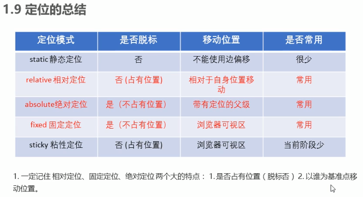

# 前端 css（定位部分）
###### 定位：将盒子定在某一个位置，所以定位也是在摆放盒子，按照定位的方式移动盒子

###### 定位=定位模式+边偏移
```
定位模式：用于指定一个元素在文档中的定位方式
边偏移：决定了该元素的最终位置


定位模式(position属性)：
	static（静态定位）
	relative（相对定位）
	absolute（绝对定位）
	fixed（固定定位）

边偏移（四个属性 top、bottom、left、right）：80px
```

* 静态定位 static（元素默认定位方式，无定位的意思）
 静态定位：按照标准流的特性摆放位置。它`没有边偏移`，因此在布局时很少用到

* 相对定位 relative（重要）
 相对定位：元素移动位置的时候，是相对于它`原来的位置`来说的
```
特点：
1.它是相对于自己原来的位置来移动的
2.原来的标准流继续占有，后面的盒子仍然以标准流的方式对待它。（不脱标，继续保留原来位置）


因此相对定位并没有脱标，它最典型的应用是给绝对定位当爹的。
```

* 绝对定位 absolute（重要） 
 绝对定位：元素在移动位置的时候，是相对于它`祖先元素`来说的
```
特点：
1.如果没有祖先元素，或者祖先元素没有定位，则以浏览器为准定位（ducument文档）。
2.如果祖先元素有定位（相对、绝对、固定定位），则以最近一级的有定位的祖先元素为参考点移动位置。
3.绝对定位不再占有原来位置（脱标）

```

* `相对定位继续占有位置，绝对定位不占位置`

* 子绝父相：子级是绝对定位，父级要用相对定位。（最常用）

```
1.子级绝对定位，不会占有位置，可以放到父盒子里面的任何一个地方，不会影响其他的兄弟盒子。

2.父盒子需要加定位限制子盒子在父盒子内显示。

3.父盒子布局时，需要占有位置，因此父亲只能是相对定位。

```

总结：==因为父级需要占有位置。因此是相对定位，子盒子不需要占有盒子，则是绝对定位==

* 固定定位 fixed（重要）
 固定定位：是元素固定于`浏览器可视区`的位置。(跟父元素没有关系、不随滚动条滚动而滚动)
 主要使用场景：可以在浏览器页面滚动时元素的位置不会改变。

 固定定位==不再占有原来位置==

* `固定定位小技巧：固定在版心右侧位置`
```
小算法：
	left:50%;
	margin-left:版心宽度的一半距离	（例如版心 800 px; 则可设为 400px 或410稍微靠右一点）

```

* 粘性定位 sticky（了解）：可以被认为相对定位和固定定位的混合。

```
1.以浏览器的可视窗口为参照点移动元素（固定定位特点）。
2.粘性定位占有原先的位置（相对定位特点）。
3.必须添加top、left、right、bottom其中一个才有效。

top：0；（占有位置，页面向上滚动时， 直到到达距离顶部0的时候成为固定定位）

跟页面滚动搭配使用，兼容性很差，IE不支持。
```




###### 定位叠放次序 z-index（设置z-index属性必须要有定位才会生效）
* 数值可以是正整数、负整数、0，默认是auto，数值越大，盒子越靠上（不能加单位）

###### `绝对定位的盒子居中`
* 加了`绝对定位`的盒子不能通过 margin：0 auto水平居中
* 想要水平居中设置（left: 50%; margin-left: -自己盒子宽度的一半）

###### 定位特殊特性（与浮动类似）
1. 行内元素添加绝对或者固定定位，可以设置高度和宽度。
2. 块级元素添加绝对或者固定定位，如果不给宽度或者高度，默认大小是内容大小 （原来是占一整行）
3. 脱标的盒子不会触发外边距塌陷
4. 绝对定位（固定定位）会完全压住盒子 （浮动元素只会压住它下面标准流的盒子 不会压住下面标准流盒子里面的文字）

###### 一个完整的网页，是`标准流、浮动、定位`一起完成布局的，每个都是自己专门的用法
|
|
|
######  display（显示隐藏）、visibility（显示隐藏）、overflow（溢出显示隐藏）
* display (`隐藏元素后，不再占有原来位置`)
```
display: none;	隐藏对象（用的最多）
display: block;	除了转换为块级元素之外，同时还有显示元素的意思
display: inline;
display: inline-block
```

* visibility 可见性（`隐藏元素后，继续占有原来位置`）
```
visibility: visible;
visibility: hidden;
```

* overflow （溢出）
```
overflow: visible; （不剪切内容也不加滚动条 ）
overflow: hidden; （溢出的部分隐藏）
overflow：scroll; (溢出的部分显示滚动条，不溢出的时候也显示滚动条)
overflow: auto; (需要的时候 即有溢出的时候 显示滚动条)

如果有定位的盒子，请慎用 overflow: hidden 因为它会隐藏多余的部分（那部分可能恰恰是我们需要的）

```

###### 显示隐藏案例
```
.mask{
	display: block;
	...
	...
}
.tudou:hover .mask{
	display: block;
}
```

