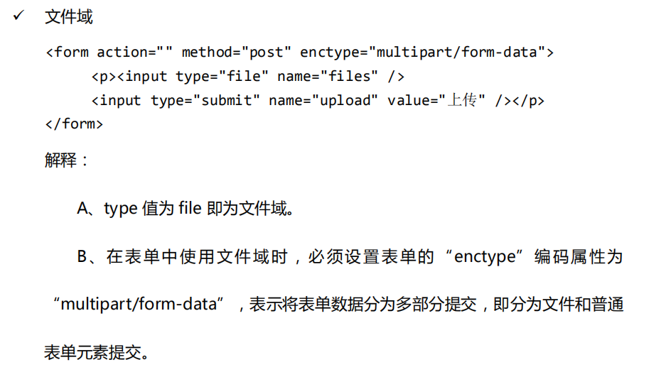
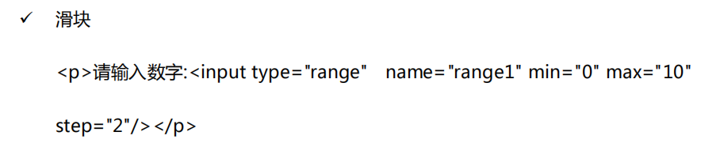
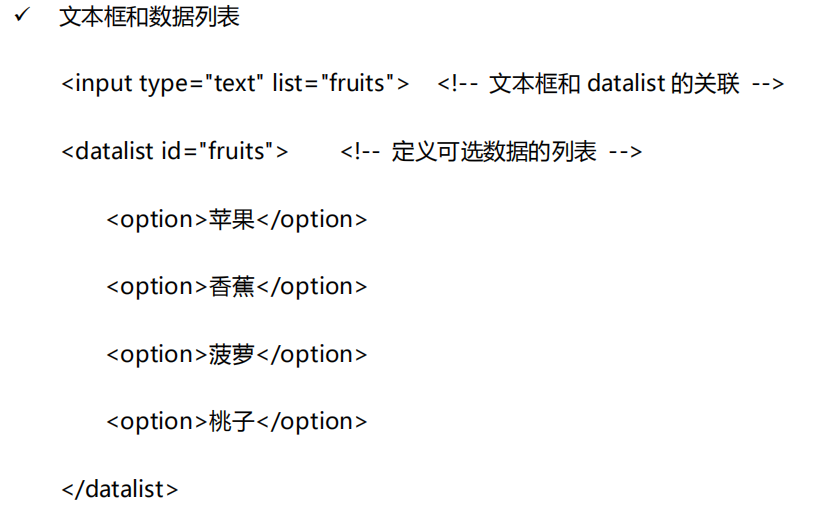
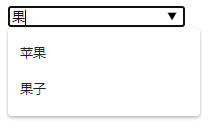
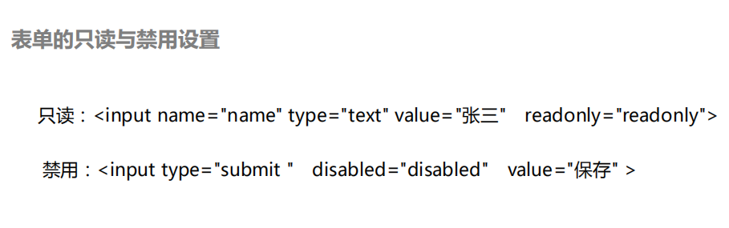
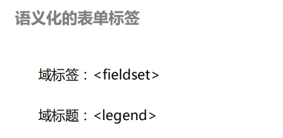

# 前端 html部分
* a标签
   1. 下载链接 （必须是exe、zip等文件）
   2. 锚点链接 （当前页面快速定位）
```
<a herf="#mylife">个人生活</a>	
...
...
...	
<h3 name="mylife">		??
<h3 id="mylife">点击个人生活将跳转到该位置</h3>
```

* 特殊字符
```
空格  &nbsp;
<  &lt;
>  &gt;
```

* form表单主要有input、select(子 option)、textarea
	input（type属性）：	radio checkbox text button
* 选中 文本与单选按钮绑定(增加用户体验 更容易点击)
```
<input type="radio" id="nv" name="sex">
<label for="nv">女</label>

或者
<label><input type="radio" name="sex">女</label>
```












