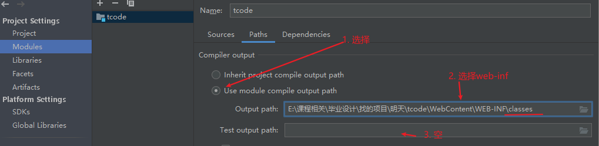

​	

# idea导入eclipse项目

## 导入项目

1. 选择项目文件夹
2. 

3. 

4. 

5. next
6. 

7. 在idea打开的项目会多出来两个项目

## 配置

8. 配置

    File - project structure...

Project Structure---Artifacts

好像选第二个 add all？

## tomcat配置

