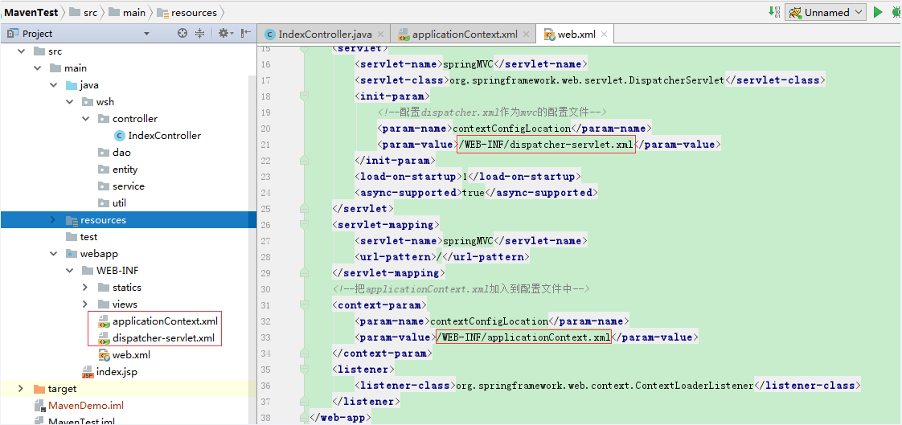
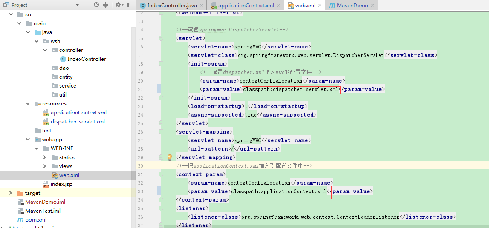
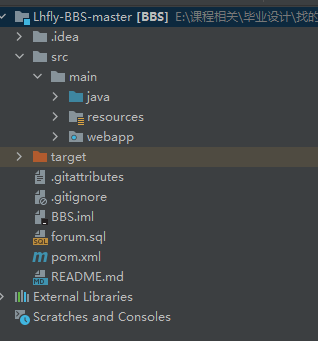
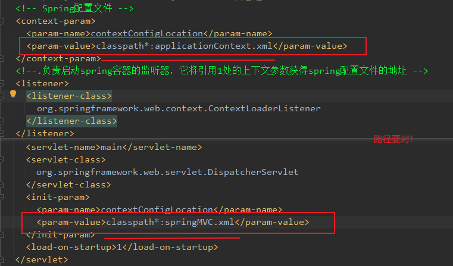
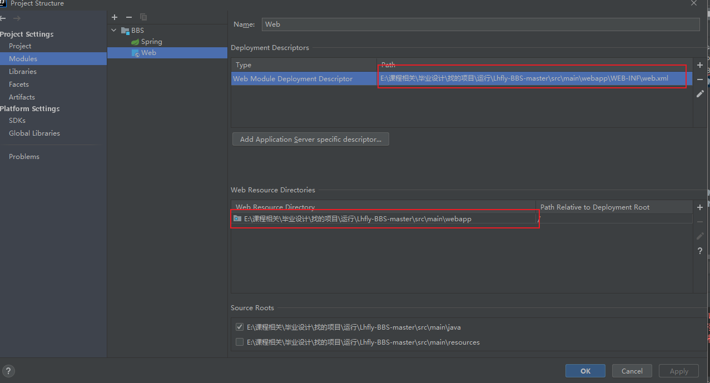

# 注意事项

#### applicationContext.xml问题

从WEB-INF移到resource底下





同时在pom里的配置：将resources目录打包到web-inf/classes目录下

```xml
<resources>
    <resource>
        <directory>src/main/resources</directory>
        <includes>
            <include>**/*.properties</include>
            <include>**/*.xml</include>
        </includes>
        <filtering>true</filtering>
    </resource>
    <resource>
        <directory>src/main/java</directory>
        <includes>
            <include>**/*.xml</include>
        </includes>
    </resource>
</resources>
```

#### 标识问题

​	resources等标识要对



#### web.xml



#### 其他核对




#### 404

之前一直404好像是 resources资源没标识，识别不到