## mvc与三层架构

* 三层架构

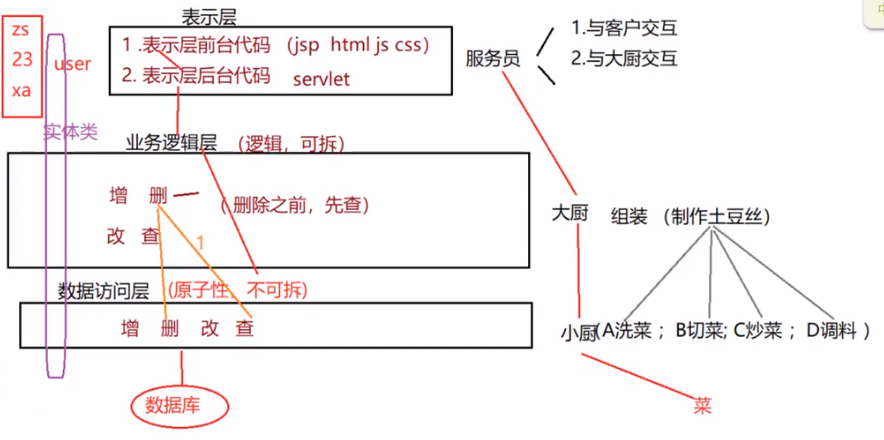

* mvc与三层架构对比

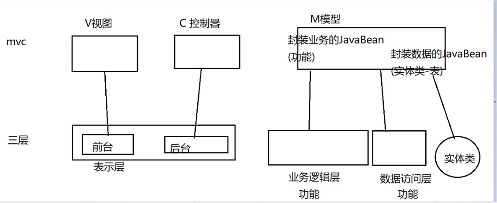

* 三层架构

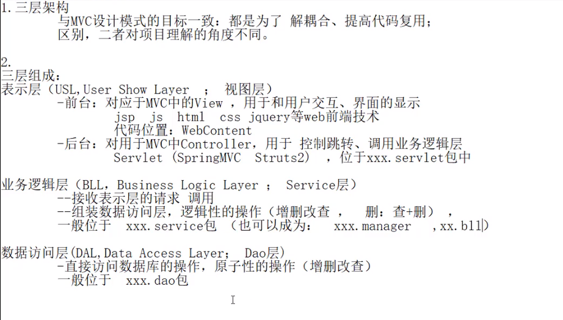

## servlet相关


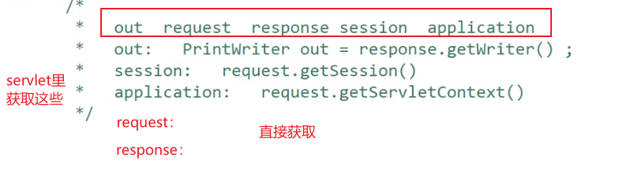

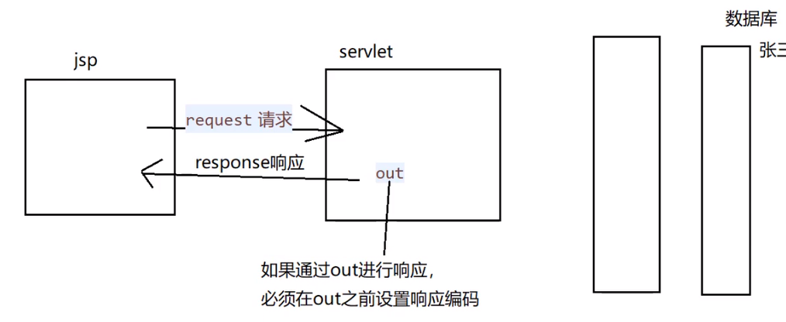


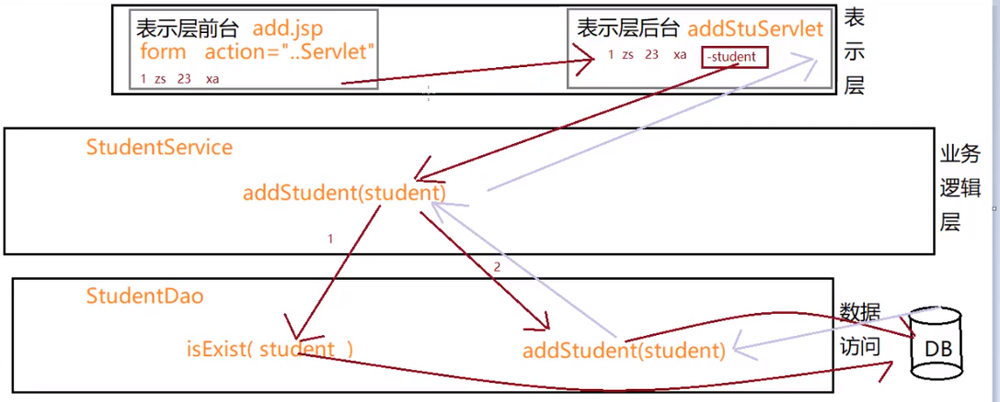

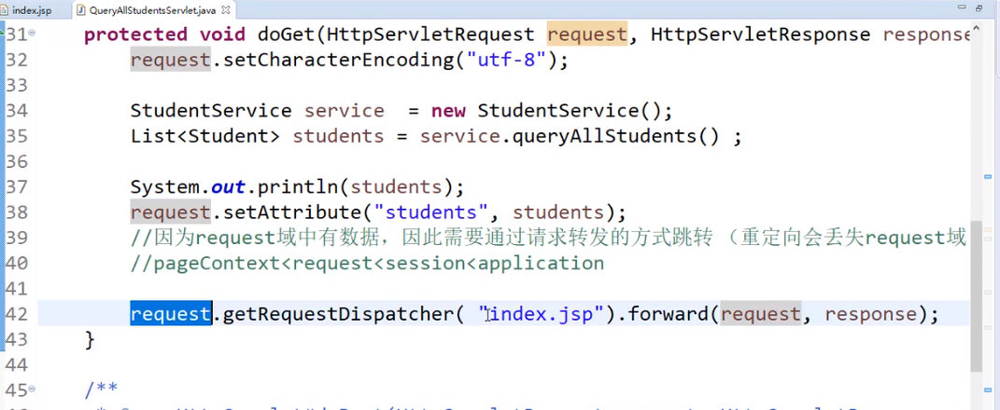

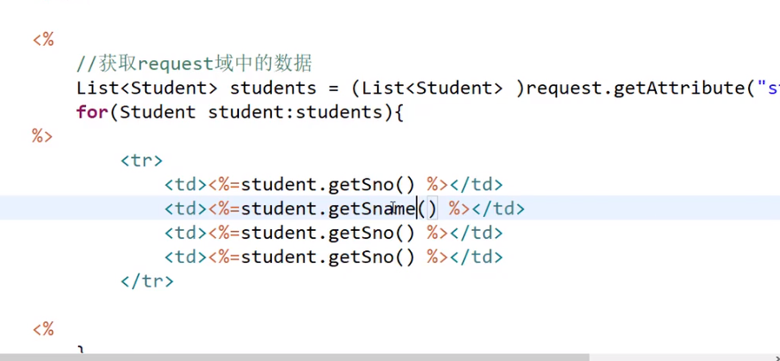

#### 需求： index.jsp显示数据库的信息 

* 直接到Servlet里 先拿数据，在转发到index.jsp

在这里可以判断对象是否为空 空的话跳转到servlet中

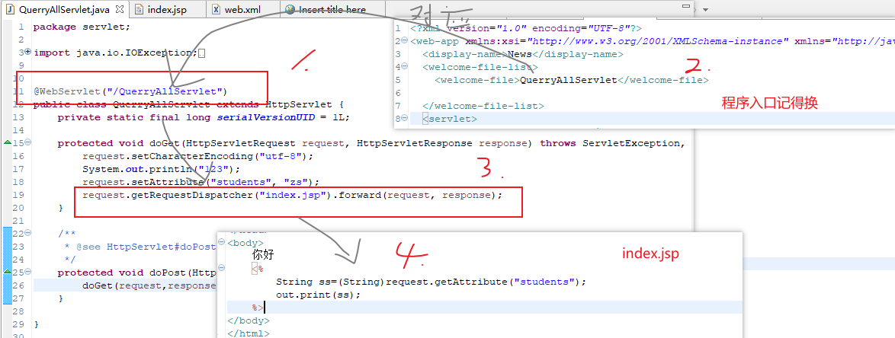

#### jsp页面发送请求到servlet的几种方式

```js
/**第一种提交方式:form表单提交
 * */
<form action="./TestServlet">
</form>

/**第二种提交方式:直接跳转
 * */
function submitForm1(){
    window.location.href="TestServlet?param=hrefMethod";
}

/**第三种提交方式：form表单函数写法
 * */
function submitForm2(){

    var form=document.forms[0];
    form.action="TestServlet?param=formMethod";
    form.submit();
}

/**第四种提交方式：a链接
 * */
<a href="TestServlet?sno=<%=stu.sno() %>">删除</a>

/**第五种提交方式：ajax
 * */
 function lixl(){
     var value = $("#text").val();
     $.ajax({
          type:"post",         
          url:"./Ajax_let",  //url:提交到那个servlet，这里写它的路径
          data:{key_a:value},
          statusCode:{
                404:function(){
                    alert("404");
                },
                500:function(){
                    alert("500");
                }
          },
            //定义参数massge是用于存放servlet响应的数据，Status为ajax执行的状态
          success:function(massge,Status){
                alert(Status);
                $("h1").text(massge);//将h1的值替换为servlet返回的值   
          }
     });
}

	//servlet返回数据到ajax
	@@WebServlet("/TestServlet")
	protected void doPost() {
        String value = request.getParameter("key_a");
        PrintWriter prin = response.getWriter();
        String massge = "Success!";
        prin.print(massge);		//返回到ajax
        response.sendRedirect("index.jsp");		//重定向跳转到页面，url为index.jsp
        request.getRequestDispatcher("index.jsp").forward(request, response);
        //转发到页面，url不变 TestServlet
    }	
```

#### 什么时候用转发什么时候用重定向

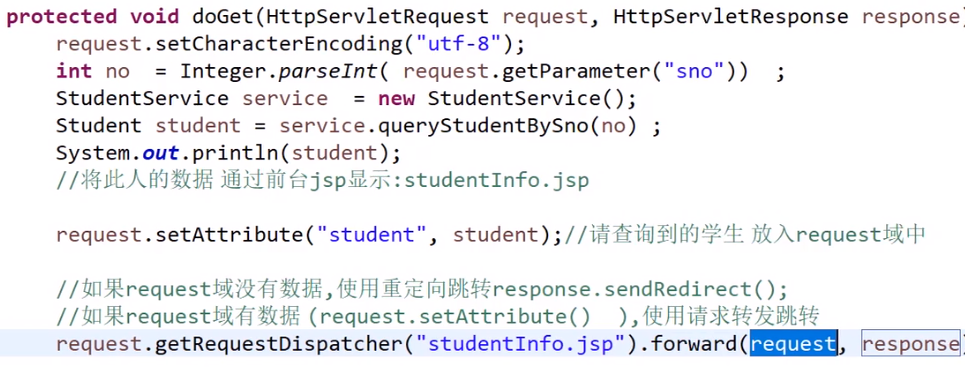

## 分页

mysql从0开始

sql server、oracle从1开始

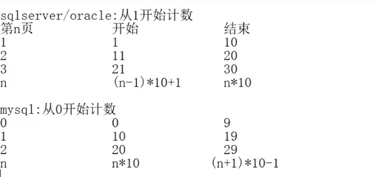

#### limit   开始，多少条 （mysql）

* mysql

  ​	第一页：select * from student limit 0,10

  ​	第二页：select * from student limit 10,10

  ​	第三页：select * from student limit 20,10

  ​	第n页： select * from student limit n*10,10

#### 通过伪列rownum （sqlserver、oracle）

* 如果根据sno排序，rownum顺序会乱

  ​	解决方案：分开始用-> 先只排序，再只查询

  ​	select rownum,t.* from (select s.* from student s order by sno asc ) t

* rownum只能查询小于的数据不能查大于的数据 ~~rownum>3~~

  ​	解决方案：把rownum当做普通列

  ​	select * from (select rownum r,t.* from (select s.* from student s order by sno asc ) t) s where r>(n-1) * 10+1 and r<=n * 10

* oracle、SQLserver （rownum伪列）

  ​	第一页：select rownum,t.* from student t

  ​	第二页：select * from student limit 10,10

  ​	第三页：select * from student limit 20,10

* 


#### 

#### 异常相关的内容

异常是指在程序运行过程中所发生的的不正常的事件，它会中断正在运行的程序

Java提供了一个“捕获”异常的的处理器对异常情况进行处理。运行程序出错的时候，编译器就会抛出异常。

**Java编程语言**使用异常处理机制为程序提供了错误处理的能力

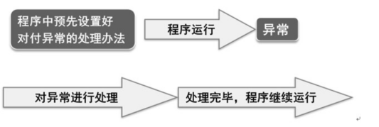


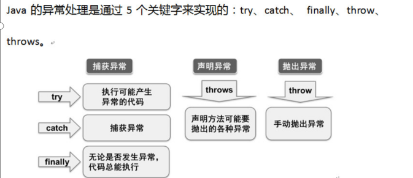

throws，声明异常，是用来声明一个方法可能抛出的所有异常信息

throw则是手动抛出异常，抛出一个具体的异常类型。

**try-catch-finally 中，如果 catch 中 return 了，finally 还会执行吗？**

答：会执行，在 return 前执行。

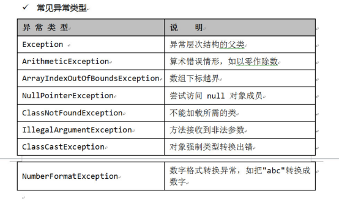