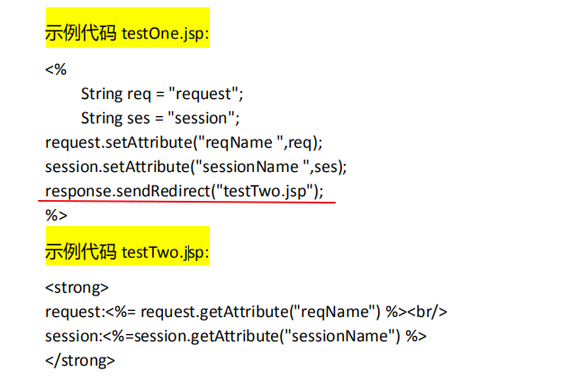

## tomcat

* 端口配置

```js
通过配置 tomcat 目录下 conf 中的 server.xml 文件修改 Tomcat 端口号

<Connector port="8080" protocol="HTTP/1.1" connectionTimeout="20000" redirectPort="8443" />

```

## web项目

`在 web-inf/web.xml 中配置默认访问启始页面。`

* page指令：通过设置内部的多个属性定义整个页面的属性

  ​	<%@ page 属性 1="属性值"  属性 2="属性值 1,属性值 2" %>

* HTML 注释在 JSP 文件被编译后保留，JSP 注释则被丢弃。重要信息的注释

不要使用 HTML 注释。


### jsp

#### 1. request


#### 2. 乱码问题

* **表单以** **POST** **方法提交**


* **表单以** **GET** **方法提交**

以 GET 方式提交的数据作为查询字符串被附加到 URL 的末端发送到服务器。


#### 3. response


* 转发和重定向

  ```js
  问题：能否在 welcome.jsp 页面获得登陆用户名？如何解决？
  解决：使用转发取代重定向实现页面跳转。
  ```

  


#### 4. session


* 使用


#### 5. include指令

* 页面重用：静态模型（html）使用的是 iframe ，jsp中使用include

  ​	<%@ include file=*"**文件路径**"* %>

#### 6. application

​	类似于系统的“全局变量”，用于在同一个服务器内的所有用于之间的数据共享，

​	对于整个 web 服务器，application 对象有且只有一个实例。


#### 7. pageContext

​	提供了在 JSP 运行时访问和其相关的环境信息的能力。通过 pageContext 对象可

​	以访问和当前 JSP 页面相关联的所有作用域，以及页面属性。


#### 8. **JSP** **内置对象的作用域**

​	我们保存在内置对象中的信息，它的作用域是不同的。

​	JSP 提供了四种作用域：page 作用域、request 作用域、session 作用域、application

作用域。

###### page作用域

指单一 JSP 页面范围，page 作用域内的对象只能在创建该对象的页面中访问。

```js
//testOne.jsp
<%
 String name = "page";
pageContext.setAttribute("name",name);
%>
testOne:<%=pageContext.getAttribute("name") %>
<%
	pageContext.include("testTwo.jsp");
%>
    
//testTwo.jsp
testTwo:<%=pageContext.getAttribute("name") %>
```


###### request作用域

​	request 作用域内的对象则是与客户端的请求绑定在一起。request 作用域内的对象在页面转发或者包含中同样有效，即**调用RequestDispatcher 的 forward()方法**转向的页面或者**调用 include()方法**包含的页面，都可以访问 request 作用域内的对象。

###### session作用域

​	JSP 容器为每一次会话创建一个 session 对象。在会话有效期内，只要将数据绑定到 session 中，则该数据可以被本次会话的其他资源访问。




###### application作用域

​	application 对象的作用域是整个 web 应用程序。当服务器启动后，就会为 web程序创建一个 application 对象，被所有用户共享，它的作用域最大。

#### 9. cookie

​	Cookie 是 Web 服务器向用户的浏览器发送的一段 ASCII 码文本。

​	主要用于：特定对象追踪，统计网页浏览次数，记录用户登录信息，推荐个性化服务等等。不要将敏感信息保存在 cookie 中。


#### 10. session cookie 比较


### 数据源配置

#### 1. JNDI


* **如何实现在 Tomcat 中发布一条信息供所有的 Web 应用程序使用？**

​               

​           

#### 2.数据库连接池


### servlet

Servlet 就是运行在服务器端的 Java 程序。


#### 1. **Servlet** **生命周期** 

* **加载和实例化**
* **初始化**
* **服务**
* **销毁**

#### 2. servlet 编译和部署


* 创建servlet

* 部署servlet

  在 web.xml 中，添加对 Servlet 的配置。

  


* 编写 JSP 访问 Servlet


```js
  /  代表根目录
 ./  代表当前路径
```


#### 3. 获得 Servlet 初始化参数


#### 4. servlet 和 jsp区别


### 过滤器 filter


