# MyBatis

#### 什么是MyBatis

* 持久层框架，支持定制化SQL、存储过程以及高级映射
* 避免了几乎所有JDBC代码和手动设置参数以及获取结果集
* 将接口和Java的POJOs（普通的Java对象）映射成数据库中的记录。

#### 使用MyBatis

* **步骤1：**手工添加依赖jar包

  * 将mybatis-x.x.x.jar放到WebContent/WEB-INF/lib底下

    加入mybatis-3.5.2.jar构建mybatis环境

    加入mysql-connector-java-8.0.11.jar构建mysql数据库环境

* **步骤2：**创建一个mybatis的全局配置文件mybatis-config.xml

  * 在src底下创建mybatis-config.xml

  ```xml-dtd
  <?xml version="1.0" encoding="UTF-8" ?>
  <!DOCTYPE configuration
    PUBLIC "-//mybatis.org//DTD Config 3.0//EN"
    "http://mybatis.org/dtd/mybatis-3-config.dtd">
  <configuration>
      <environments default="development">
          <environment id="development">
            <transactionManager type="JDBC"/>
            <!--  配置数据库源 -->
            <dataSource type="POOLED">
              <property name="driver" value="com.mysql.cj.jdbc.Driver"/>
              <property name="url" value="jdbc:mysql://localhost:3306/mn17?useUnicode=true&amp;characterEncoding=utf8&amp;serverTimezone=Asia/Shanghai" />
              <property name="username" value="root"/>
              <property name="password" value="sugus"/>
            </dataSource>
          </environment>
    	</environments>
  </configuration>
  ```

  * 数据库信息文件db.properties

  ```properties
  driver:com.mysql.cj.jdbc.Driver
  url:jdbc:mysql://127.0.0.1:3306/jja1904_3?useUnicode=true&characterEncoding=utf8&serverTimezone=Asia/Shanghai
  username:root
  password:root
  ```

  * 在配置文件中加入数据源dataSource和数据库信息文件db.properties与之关联

  ```xml-dtd
  <?xml version="1.0" encoding="UTF-8" ?>
  <!DOCTYPE configuration
    PUBLIC "-//mybatis.org//DTD Config 3.0//EN"
    "http://mybatis.org/dtd/mybatis-3-config.dtd">
  <!-- mybatis配置根节点 -->
  <configuration>
  
    <!-- 使用properties属性 将数据库配置文件引入 -->
    <properties resource="db.properties"></properties>
  
    <!--   环境配置 -->
    <environments default="development">
      <environment id="development">
        <transactionManager type="JDBC"/>
        <!--  配置数据库源 -->
        <dataSource type="POOLED">
          <property name="driver" value="${driver}"/>
          <property name="url" value="${url}"/>
          <property name="username" value="${username}"/>
          <property name="password" value="${password}"/>
        </dataSource>
      </environment>
    </environments>
    
    <!-- 配置mapper xml映射文件的地址 -->
    <mappers>
    </mappers>
    
  </configuration>
  ```

  

* **步骤3：**创建数据库、实体类、dao接口

  * 此时数据库的列名必须和实体类的属性名一致，以后不需要一致，会有解决方法

  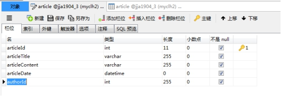

  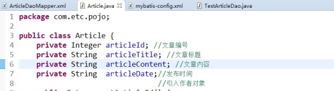

  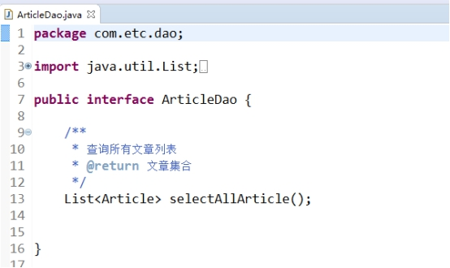

* **步骤4：**创建Dao接口的实现

  * Mapper XML映射文件ArticleDaoMapper.xml,书写对应方法的sql语句
  
  ```xml-dtd
  <?xml version="1.0" encoding="UTF-8" ?>
  <!DOCTYPE mapper
      PUBLIC "-//mybatis.org//DTD Mapper 3.0//EN"
      "http://mybatis.org/dtd/mybatis-3-mapper.dtd">
  
  <!-- namespace命名空间：通过namespace属性指定该映射文件是实现哪一个接口的，值是接口的完全限定名(包名.类名) -->
  <mapper namespace="com.etc.dao.ArticleDao">
      <!-- 
      select 查询动作	
      id属性：指定接口中要实现的方法名(需要和方法名一致)
  	resultType属性：返回值类型，如果是集合指的是集合中泛型的完全限定名
  	 -->
  	<select id="selectAllArticle" resultType="com.etc.pojo.Article">
  	   select * from article
  	</select>
  </mapper>
  ```
  
  
  
* **步骤5：**在全局配置文件 mybatis-config.xml中加入该映射文件中的配置
  
  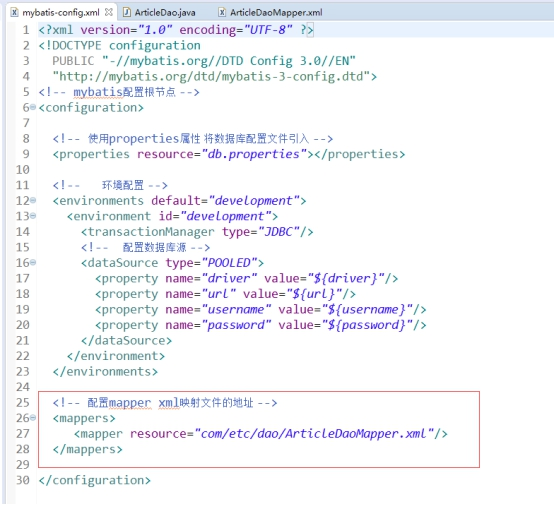

* **步骤6：**测试 (配置环境 添加jar -> Junit)

```java
public class TestArticleDao {
	
	@Test
	public void selectAllArticleTest() {
		
		try {
			//1 从 XML 中构建 SqlSessionFactory
			String resource = "mybatis-config.xml"; // 读取mybatis全局配置文件
			InputStream inputStream = Resources.getResourceAsStream(resource);
			SqlSessionFactory sqlSessionFactory = new SqlSessionFactoryBuilder().build(inputStream);
			
			//2从 SqlSessionFactory 中获取 SqlSession
			
			SqlSession session = sqlSessionFactory.openSession();
			
			//3 重点    ArticleDao dao = new ArticleDaoImpl()
			ArticleDao dao = session.getMapper(ArticleDao.class); //接口的类对象
			List<Article> list = dao.selectAllArticle();
			for (Article article : list) {
				System.out.println(article);
			}
			
			
		} catch (IOException e) {
			// TODO Auto-generated catch block
			e.printStackTrace();
		}
	}
}
```

#### mybatis配置文件

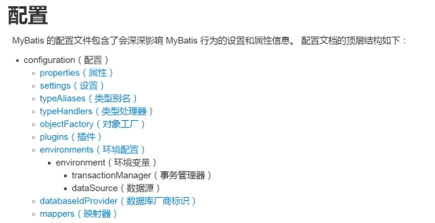

###### 1. properties(属性) 

* 通过properties引入外部资源配置文件，读取外部配置文件中的属性值。

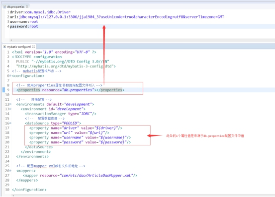

###### 2. environments(环境配置)

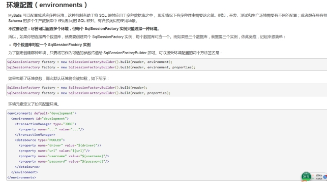

###### 3. 类型别名（typeAliases）
* 类型别名是为 Java 类型设置一个短的名字。 它只和 XML 配置有关，存在的意义仅在于用来减少类完全限定名的冗余。

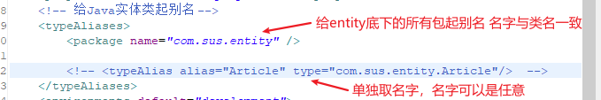

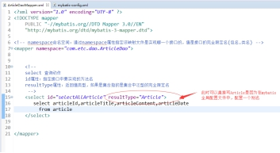

###### 4. mybatis xml 映射文件

* namespace命名空间属性

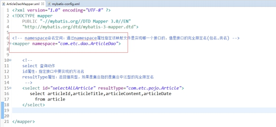

* select 映射查询语句
  1.  id属性：必需，指定接口中要实现的方法名
  2.  resultType属性：必需，返回值类型，如果是集合指的是集合中泛型的完全限定名
  3.  parameterType：可选，入参数据类型

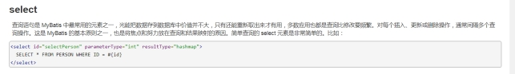

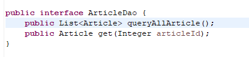

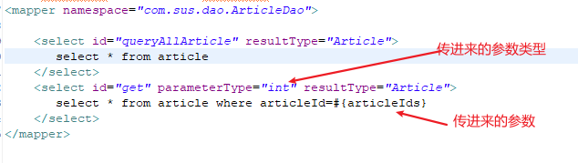

#### log4j日志记录

* **步骤1：**将log4j-1.2.17.jar添加到项目lib中


* **步骤2：**添加log4j.properties配置文件到classpath目录下

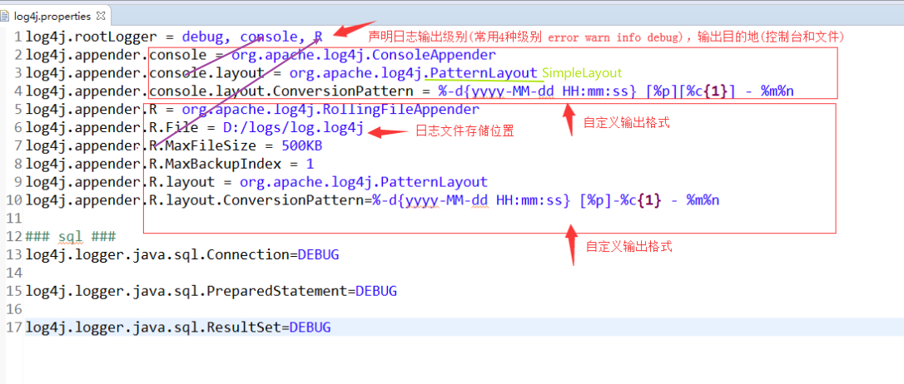

* **步骤3：日志在代码中应用**在相关类中使用Logger，需要先定义一个静态属性，然后在方法中进行日志输出

  private static Logger log=Logger.getLogger(TestArticleDao.class);

  log.info(article.getArticleId());

* **步骤4：**在mybatis的全局配置文件中通过setting元素指定日志的具体实现log4j（默认就是这个）

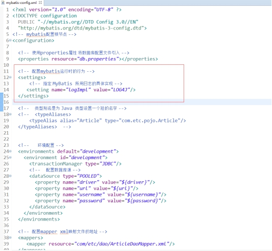

#### mybatis xml 映射文件

###### 1. select 映射查询语句

==注意==：当使用resultType做SQL语句返回结果类型处理时，对于SQL语句查询出的字段在相应的pojo（entity）中必须有和它相同的字段对应


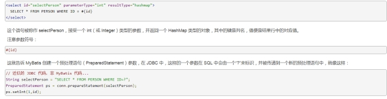

注意：JDBC 要求，如果一个列允许 null 值，并且会传递值 null 的参数，就必须要指定 JDBC Type。

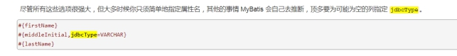

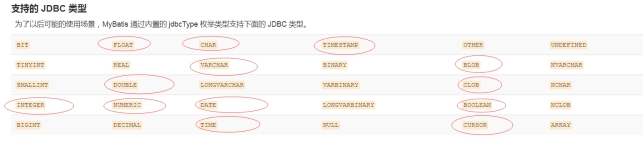

###### 2. update、insert、delete映射更新语句

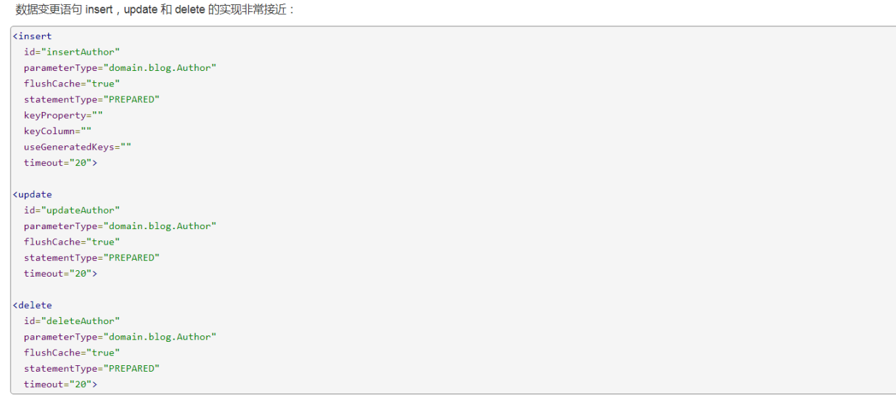

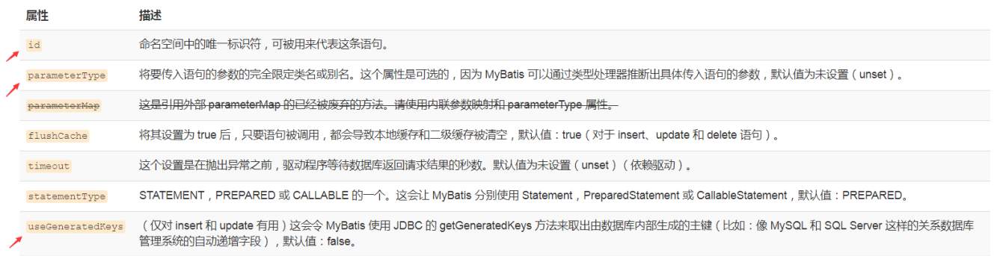

###### 3. 参数传递

* #####单个简单类型作为入参

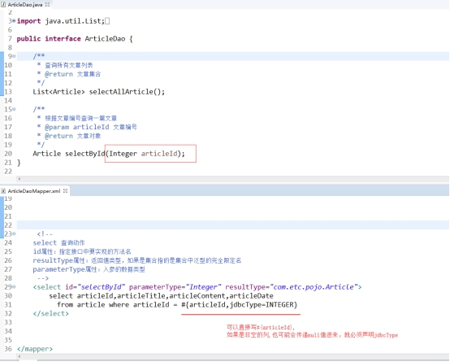

* ##### 单个对象作为入参

  对象作为入参，直接使用JavaBean对象的属性名设置。

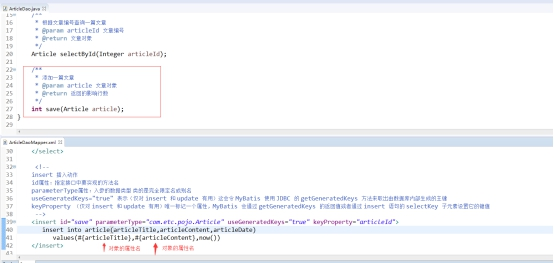

* ##### 多个参数作为入参：使用@Param()注解

  接口方法参数的定义中使用注解@Param()为入参设定一个别名，用于xml映射文件中获取。


###### 4. 一些处理

* ##### xml映射文件中使用concat()函数拼接字符串

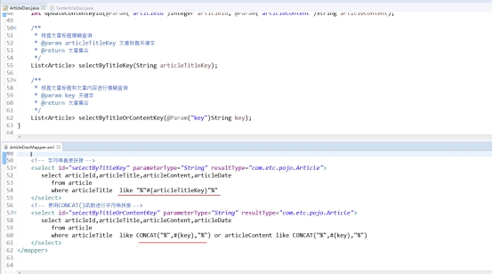

* ##### xml映射文件中处理大于号小于号的方法

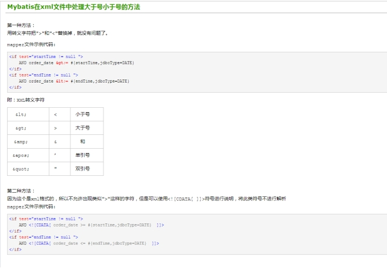

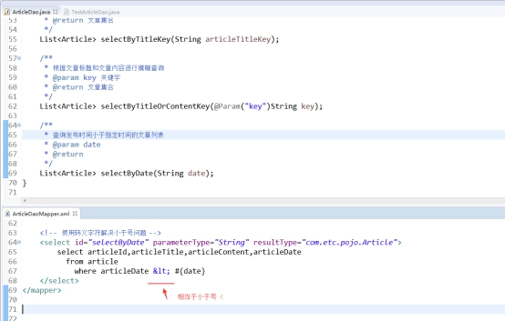

* #####  insert映射语句主键自增处理和获取自增的主键值

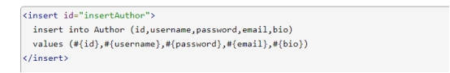

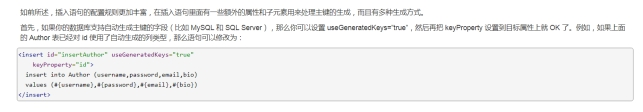

​					设置自增和获取自增的主键值

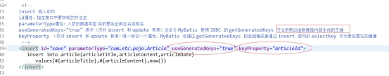

###### 5. 最后写的

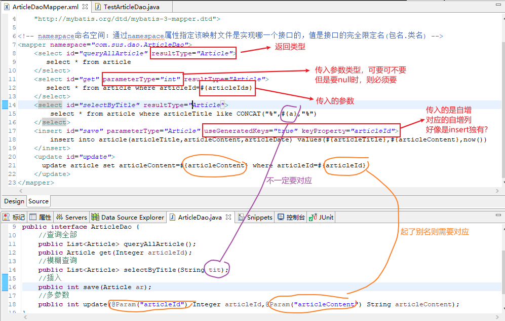

###### 6. resultMap 结果映射

* 处理结果使用resultType，这个属性要求数据库的字段名和实体类的属性必须一致（解决方法：取别名，或resultMap）
* resultMap 结果映射字段名和属性

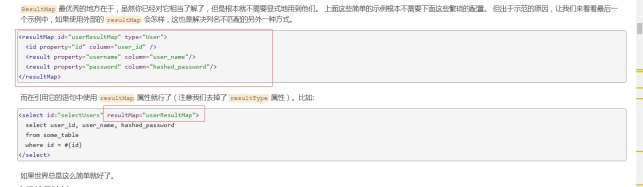

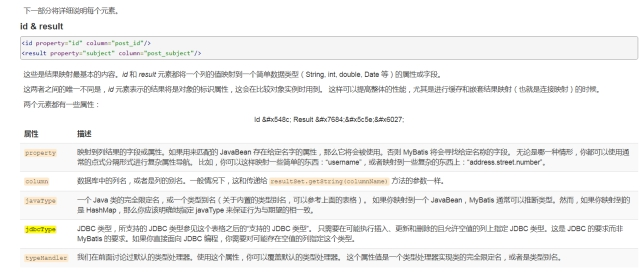

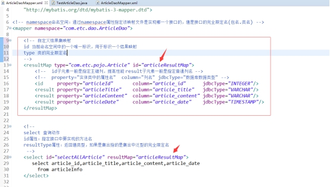

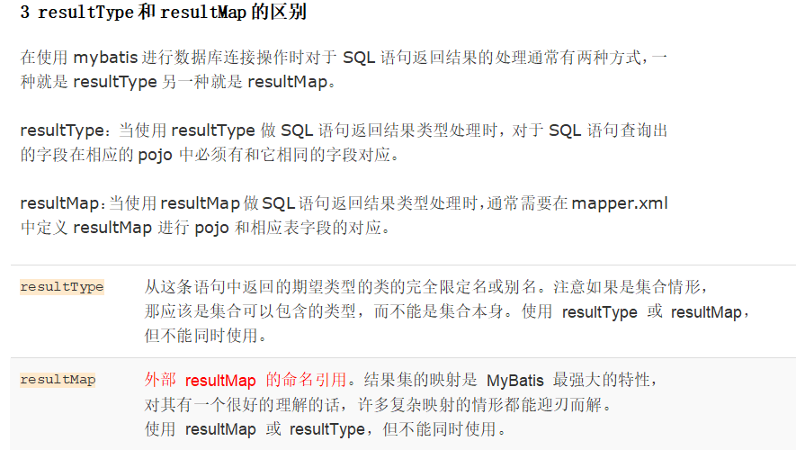