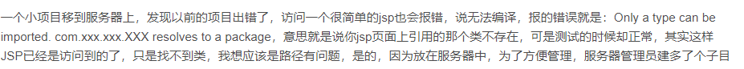

#### tomcat报错

* **Only a type can be imported. com.example.pojo.Video resolves to a package**




* **nested exception is org.xml.sax.SAXParseException  lineNumber: 61  columnNumber: 59  cvc-complex-type.2.4.c:  tx:advice**

  spring-dao.xml				---治标    E:\课程相关\毕业设计\框架项目\Roothub-2.6\target\roothub\WEB-INF\classes\spring			去掉下面那段话

```xml
	<bean id="txManager" class="org.springframework.jdbc.datasource.DataSourceTransactionManager">
		<property name="dataSource" ref="dataSource"/>
	</bean>
	<tx:advice id="txAdvice" transaction-manager="txManager">
		<tx:attributes>
			<tx:method name="ins*"/>
			<tx:method name="upd*"/>
			<tx:method name="del*"/>
			<tx:method name="*" read-only="true"/>
		</tx:attributes>
	</tx:advice>
	<aop:config>
		<aop:pointcut id="mypointcut" expression="execution(* cn.roothub.service.impl.*.*(..))"/>
		<aop:advisor advice-ref="txAdvice" pointcut-ref="mypointcut"/>
	</aop:config>
```


#### idea快捷键

Shift + Enter          换行

Ctrl + X 	删除行


Ctrl+Alt+H     查看当前方法被那些函数调用

Ctrl+Shift+E			最近更改的文件


当前行行首：Home 
当前行行尾：End 

选择行   Home    Shift+End


更改了的快捷键

Ctrl+Alt+0			复制当前行到下一行

Ctrl+Shift+Z          上次修改的位置

Ctrl+Q					注释

