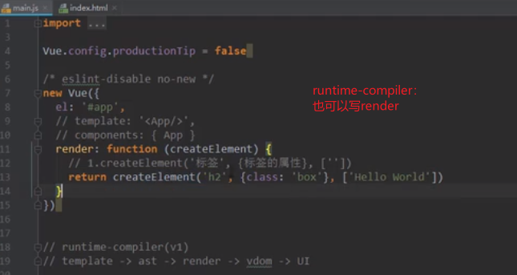

# Vue CLI

#### 一、介绍


* 基于Node、WebPack

```js
//一些命令
https://blog.csdn.net/Liumin002/article/details/104692975
```


#### 二、安装Vue脚手架

```js
npm install -g @vue/cli@3.2.1

//vue -V    	查看版本

//拉取2.x模板
npm install -g @vue/cli-init 		//安完可以用2也可以用3
vue init webpack my-project
```

####  三、Vue CLI初始化项目

* 初始化命令

```js
//Vue CLI2初始化项目
vue init webpack my-project

//Vue CLI3初始化项目
vue create my-project
```

​                          

#### 四、runtime-compiler 和 runtime-only


* runtime-compiler 写 render




* runtime-only ，main.js里用render，但是 子组件用到了template阿，那么需要经过template->ast->render->vdom->UI吗？

答：不需要。子组件的template最终编译出来的是一个普通的对象，这个普通的对象里已经将template渲染成render。---------main.js导入的App.vue是对象（已经解析过了），里面已经没有template了。


#### 五、npm run build 和 npm run dev过程图


#### 六、cli2 和 cli3 区别


#### 七、创建CLI3项目

* 创建：vue create 项目名称


* 保存的配置在c/user/administrator/.vuerc ，想删掉保存的配置的话
  * rc     -> run command		runtime config??
  * vcs      -> version control system (版本控制 svn/git)