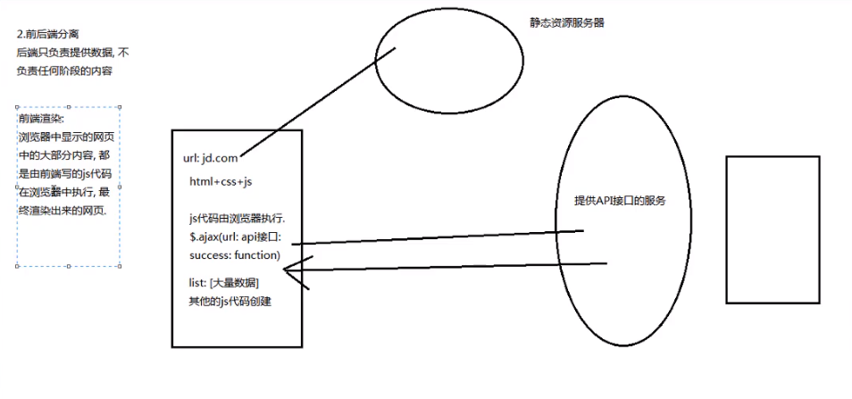
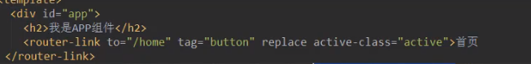
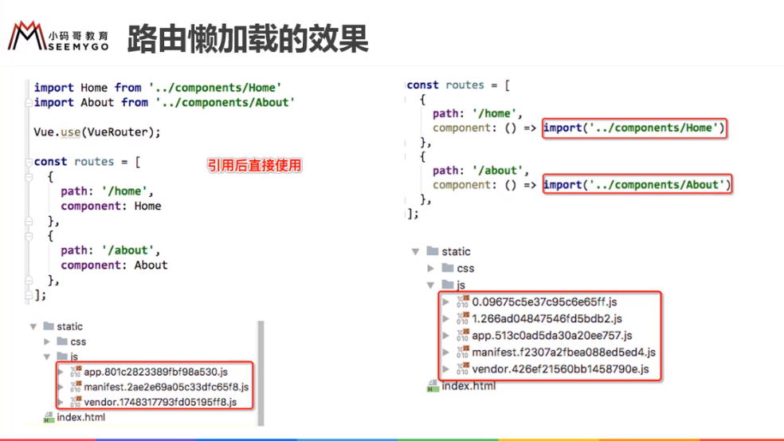
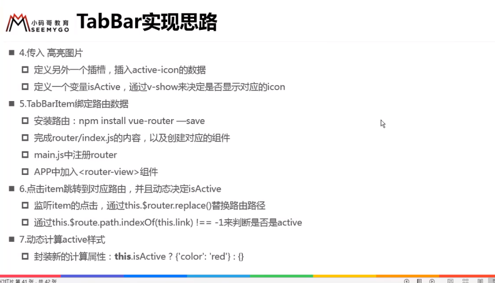

# Vue Router

## 一、介绍


* 前端渲染 - 前后端分离阶段




## 二、前端路由的方式

* 两种方式


#### location.hash

*  location.hash='aaa'   更改URL
*   host/#/home    

#### history模式

* html5的history新模式
* history.pushState（{},'','home'）   ---加入到栈结构里   1+2+3     （可以返回）
* history.replaceState({},'','home')     ---替换   1->2->3         （不能返回）
* history.back()
* history.go(-1) == history.back()


## 三、vue -router的使用


#### 1. 具体步骤


```vue
/router/index.js
//路由和组件 

//要记得导入！！！
import Home from '../components/Home'
import About from '../components/About'

const routes=[
    {
        //不是URL， 完整的URL包括 协议头://host/..
        path:'/home',
        component:Home
    },
    {
        path:'/about',
        component:about
    }
]


/App.vue
<template>
  <div id="app">
      <router-link to="/home">首页</router-link>
      <router-link to="/about">关于</router-link>
	  <router-view></router-view>	
  </div>
</template>

//router-link   ---vue-router全局注册的组件
//router-view    渲染（渲染到哪里）
```


#### 2. 需求：默认进入home页面

```js
path: '/',
redirect: '/home',
    
//router-view 默认显示 home
```


#### 3. 修改为history模式

```js
const router=new VueRouter({
    //配置路由(径？)和组件之间的应用关系
    routes,
    mode: 'history',
})
```


* cli2项目默认使用hash方式，强行用history来进行跳转会出现问题。


#### 4. router-link的其他属性补充




* 如果每个router-link都要改，很长，可以去router/index.js统一改

```js
const router=new VueRouter({
    //配置路由(径？)和组件之间的应用关系
    routes,
    mode: 'history',
    linkActiveClass: 'active',				//哪个router-link处于活动，会给它添加一个类，这个修改添加的类的类名	
})

```

#### 5. 通过代码跳转路由

* 需求

```js
<button @click="homeClick">首页</button>
<button @click="aboutClick">关于</button>

 methods:{
    homeClick(){
		//通过代码方式修改路由 vue-router
        //$router属性     
        //history.pushState()别用，绕过vue-router,只改了url上面的路径  router-view显示啥的并没有效果，没有把路径和组件对应qi.ai
        this.$router.push('/home');
        //然后再router-view显示
    },
    aboutClick(){
      	this.$router.push('/about');
        this.$router.replace('/about');
    }
  }

//需要判断下，不然会报错
if(this.$router.history.current.path!='/home'){
    this.$router.push('/home');
}
```


#### 6. 动态路由

```vue
/router/index.js

const routes=[
    {
        path:'/user/:userId',
        component:User
    }
]


/App.vue
<template>
  <div id="app">
      <router-link to="/home">首页</router-link>
      <router-link to="/about">关于</router-link>
	  <router-link to="/user/zhangsan">用户</router-link>
	  <router-view></router-view>	
  </div>
</template>


//动态获取的话
<router-link :to="'/user/'+userid">用户</router-link>
```

* 需求：想在用户界面获取URL，然后根据哪个用户显示具体信息

```vue
//User.vue
<template>
	<h2>{{userId}}</h2>
	<h2>{{$route.params.userId}}</h2>
	<!-- 这个不用this 就跟message一样 下面方法需要通过this.message获取data数据，而上面不要-->
</template>
<script>
    computed:{
        userId(){
            return this.$route.params.userId 	//this.$route哪个路由处于活跃状态就获取哪个   
            //userId对应 path:'/user/:userId',
        }
    }
    methods:{
        btnClick(){
            this.$router.replace('about')    //是router/index.js 里创建的router实例对象
        }
    }
</script>


routes[]路由数组，相当于家里的路由器，里面每一个值（route），相当于连接的每一台设备（每个人的手机、电脑、电视等）
post 不止做提交，get方式请求长度有限
```


```js
1. /router/index.js
path:'/user/:userId'

2. App.vue
<router-link :to="'/user/'+userid">用户</router-link>

3. User.vue
<h2>{{userId}}</h2>
computed:{
    userId(){
        return this.$route.params.userId 	
        }
}
```


#### 7. 打包文件解析


#### 8. 路由懒加载

 * 需求：一个路由打包一个js文件 

 * 懒加载：用到时再加载

   




用到时再加载


```js
原来
import Home from '../components/Home'

const routes=[
    {
        path:'/home',
        component:Home
    }
]

//动态导入
现在   
const Home=()=>import('../components/Home')
const routes=[
    {
        path:'/home',
        component:Home
    }
]
现在或者
const routes=[
    {
        path:'/home',
        component:()=>import('../components/Home')
    }
]
```

#### 9. 嵌套路由


```vue
// router/index.js
const routes=[
    {
        path: '',
        redirect: '/home'
    },
    {
        path: '/home',
        component: Home,
        children:[
            {//默认
                path: '',
       		    redirect: 'news'
            },
            {
                path: 'news',		
                //这个地方不能是 /news
                component:HomeNews
            },
            {
                path: 'message',
                component:HomeMessage
            }
        ]
    }
    {
        path: '/user/:userId',
        component: User
    }
]

//Home.vue  
<template>
  <div>
      <h2>我是首页</h2>
      <h5>显示列表：</h5>
      <router-link to="/home/news">新闻</router-link>
      <router-link to="/home/message">消息</router-link>
      <router-view></router-view>
  </div>
</template>


相对路径的问题, 最前面必须加/代表从项目路径开始   /home/news

还有个需求： 原来在首页 点了消息，然后切换到关于页面，切回去希望保持 点的消息 keep-alive
```

#### 10. 参数传递 


```vue
<!--params类型：看动态路由那边-->
<router-link :to="'/user/'+user">用户</router-link>


<!--query类型：-->
	//App.vue   --传参
<router-link :to="{path:'/profile',query:{name:'sugus' , age:18}}">档案</router-link>

	//App.vue   --传参二
 <button @click="profileClick">档案</button>
 <script>
   profileClick(){
      this.$router.push({
        path:'/profile',
        query:{
          name: 'sugus2',
          age:20
        }
      });
    }
 </script>
	//profile.vue  --获取
$route.query.name

URL: 
	协议://主机[:端口号]/路径?查询(query)
	https://localhost:80/home/user?name=sugus&age=18
```

* 扩展

```js
//所有组件都继承自Vue类的实例


//数据劫持


```


#### 11. 导航守卫


* 需求：每次页面跳转时，更改标题
* 生命周期
  * created：创建时回调
  * mounted：template挂载到DOM时回调
  * updated：页面刷新时回调
* 普通修改方式


* 导航守卫

```js
const routes=[{},{},
    {
        path: '/about',
        meta:{
            title:'这是一个about'
        },
        component: About
    }
]

const router=new VueRouter({
    routes,
    mode: 'history',
    linkActiveClass: 'active',
})

//前置钩子（hook）  路由跳转
router.beforeEach((to,from,next)=>{
    document.title=to.meta.title   //to是route对象
    //路由嵌套时
    document.title=to.matched[0].meta.title
    next()      //-->一定要这句话
})
```


* 补充


#### 12. keep-alive  

* 这节课讲了生命周期函数，有空去补，[看看笔记](https://blog.csdn.net/haochangdi123/article/details/78358895)

* 需求：保留组件内部的状态，而不是每次点击都重新创建
* 意思就是说：首页（首页路由） 点击新闻列表（首页的嵌套路由）  再点击用户（用户路由） 后返回首页  仍然是保持新闻列表的展示

```js
//本来每次 关于 - 首页 来回切换都会重新创建销毁

//保持活着   ---来回切换不会重新创建销毁，可以用created destroyed验证
<keep-alive> 
	<router-view></router-view>    
</keep-alive>
```

有问题：

​	   /home  /about    设置了默认路由 切回/home时，会默认为/home/news

​		所以点 message 再点about 再点回home 不会保持住message


解决方式：

​		activated：处于活跃，deactivated：处于不活跃.			---该组件被保持了状态，使用了keep-alive时，才有效

```js

去掉默认路径

data记录一个path数据

activated(){
    this.$router.push(this.path);
}
beforeRouteLeave(to,from,next){		//导航离开该组件的对应路由时调用
    this.path = this.$route.path;
    next()
}
```

？？？报错的话我认为可能是你的参数传递应该在路由启用props，通过其他组件的props接收就不会报错了我研究了一个小时？？？

* 有些不想缓存，每次都想加载


#### 13. TabBar




* 活跃状态图片应该再设置一个插槽，然后决定显示哪个，而不是活跃的时候再传入图片，更改图片。

* components一般放公共的组件，views视图页面

* this.$router.replace(this.path).catch(err => err)搞定报错

* 返回false的情况：

  1.false

  2.undefined

  3.null

  4.""  （空字符串）

  5.0或者-0

  6.NaN

######  复习 ：父传子 props

```js
1. 父组件使用子组件时传数据： 
    <tab-bar-item path="/home" activeColor="blue"><tab-bar-item>
2. 在子组件用props接收
        props:{
            path:String,
            activeColor:{
                type:String,
                default:'red'
            }
        },
```


​	

#### 14. 知识回顾


​                                              


#### 15. 路径别名

```js
resolve: {
    extensions: ['.js', '.vue', '.json'],
    alias: {
      '@': resolve('src'),
      'assets':resolve('src/assets'),
      'assets':resolve('@/assets'),
    }
  },
      
@表示src这个路径
    
   '@/components/tabbar/TabBar'
    
    
   1. import可以直接用
    import TabBar from '@/components/tabbar/TabBar'
    
   2. template 里面的src需要加 ~
    
```

#### 16. promise


* 链式调用2


简写


再简写

