# VueX


* 插件

## 1. vuex概念


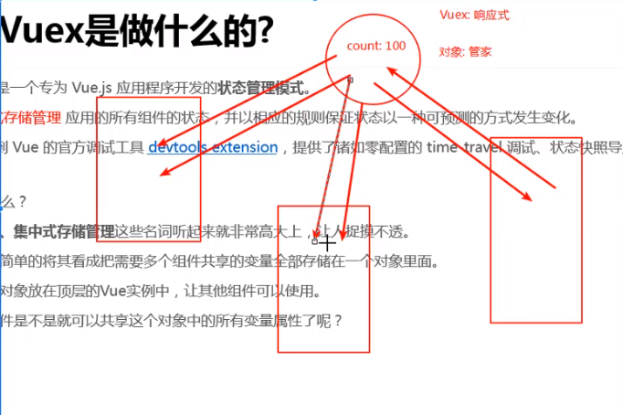

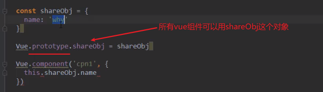

但上面这个不是响应式的 name改了之后 Vue.component里面this.shareObj.name不会跟着改

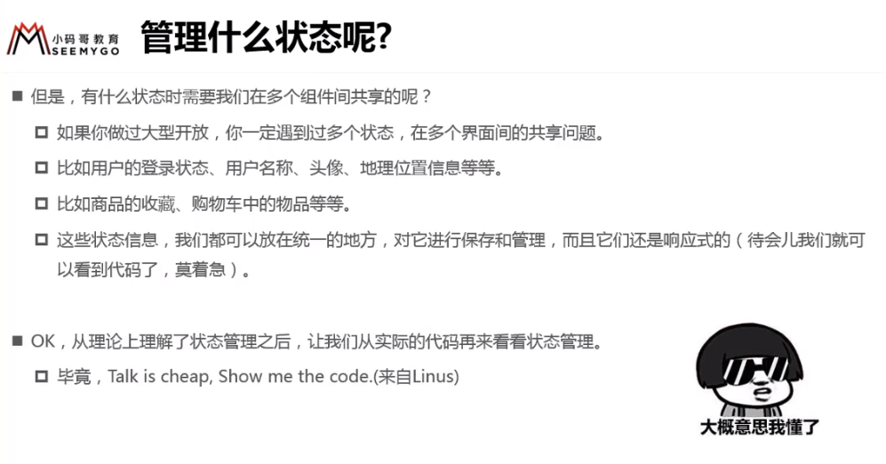

## 2. 单界面状态管理、多界面状态管理

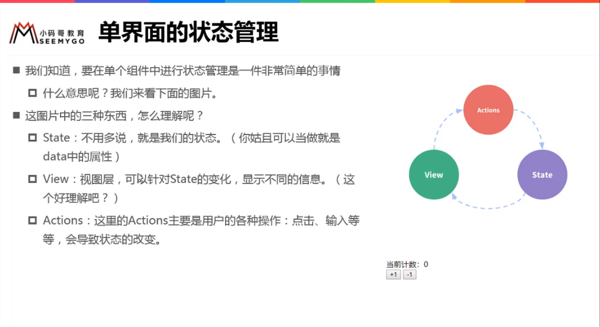


```js
题外话：
	<hello-vuex :counter='counter'/>
        前面那个counter 是子组件的属性
        加:是为了绑定后面那个counter值
    <hello-vuex counter='counter'/>
        不加：传给counter的值就是字符串“counter”
```

#### vuex基本使用

`npm install vuex --save`

```js 
//也可以写在main.js，但不好
//建文件夹 store（仓库）  --->index.js
import Vue from 'vue'
import Vuex from 'vuex'

Vue.use(Vuex)//安装

const store = new Vuex.Store({
    state:{
        
    },
    mutations:{
        
    },
    actions:{
        
    },
    getters:{
        
    },
    modules:{
        
    }
})//创建实例

export default store//导出
```

```js
//main.js
import Vue from 'vue'
import App from './App'
import store from './store'

new Vue({
    el:'#app',
    router,
    store,			//Vue.prototype.$store = store
    render:h => h(App)
})


在其他组件使用
{{$store.state.counter}}

更改：$store.state.counter++ 可以 但是不好，不这样用
//Devtools不好跟踪修改
```

* 修改状态

  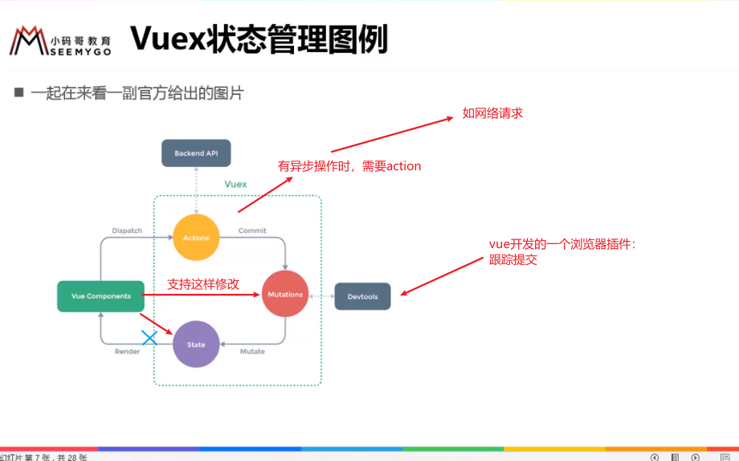

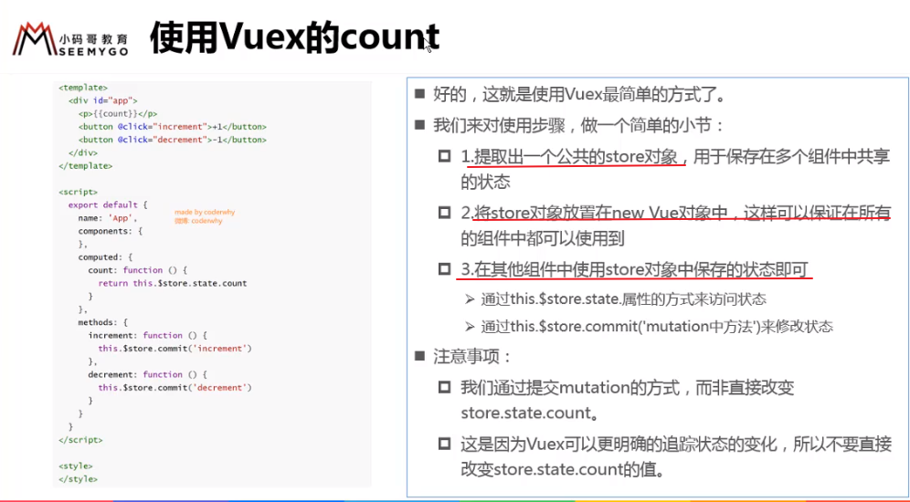

## 3.基本使用

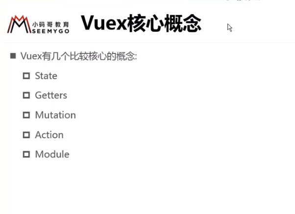

#### state:

* 基本使用
* state单一状态树

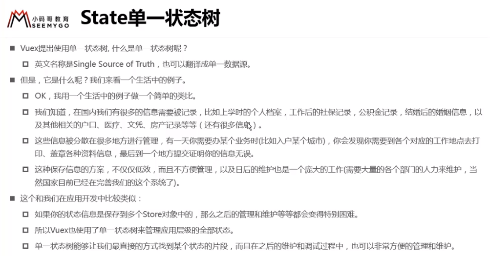

####getters:

* 类似于计算属性

```js
getters:{
    powerCounter(state){
        return state.counter*state.counter 
    }
}

{{$store.getters.powerCounter}}

//getters传值进去
返回一个函数
```


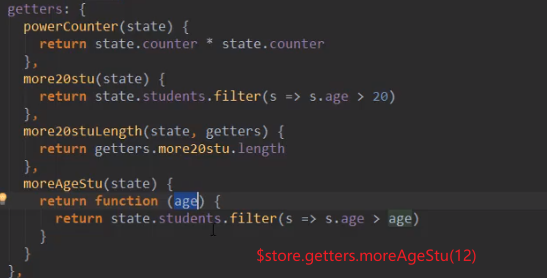

####mutations：修改状态

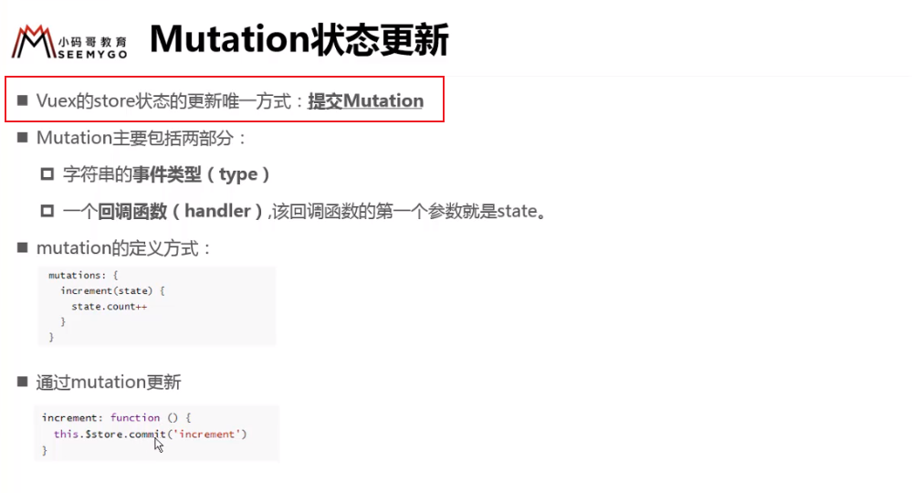

```js
//store/index.js
state:{
    counter:1000
},
 mutations:{
        increment(state){
            state.counter++
        },
        decrement(state){
            state.counter--
        }
    },
        
//App.vue
<h2>{{$store.state.counter}}</h2>
addition(){
    this.$store.commit('increment')		
}

```

* mutations传入参数

```js
//store/index.js
mutations:{
        increment(state,count){
            state.counter+=count
        }
},
    
//App.vue
    addcount(count){
        this.$store.commit('increment',count)
    }
```

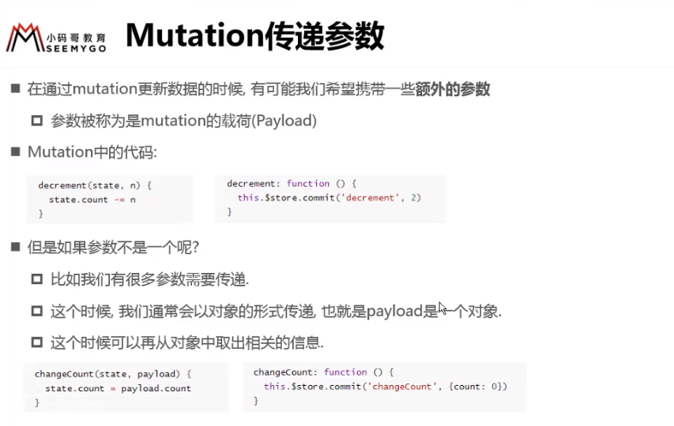

* 提交风格

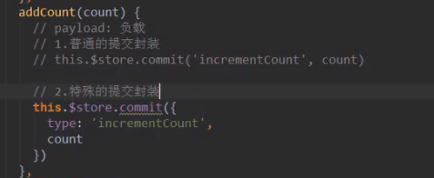

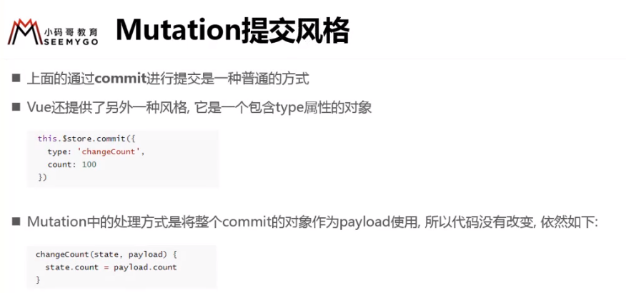

#### vuex数据响应式原理

* 在state中一开始就定义好的 会加入到响应式系统中（观察者模式）

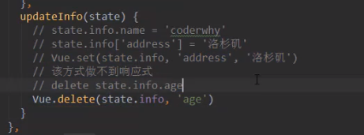

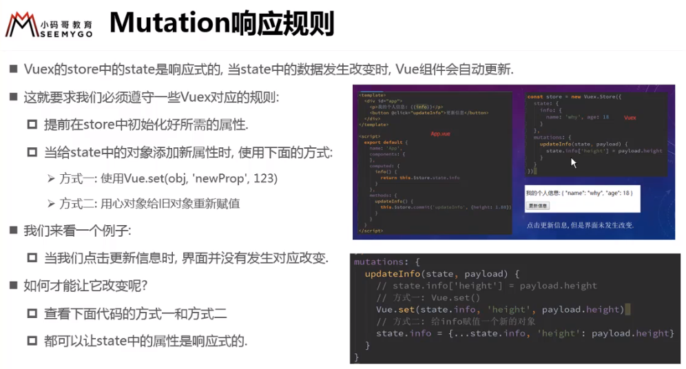

* mutation的类型常量

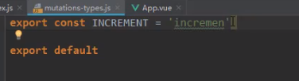

#### actions:

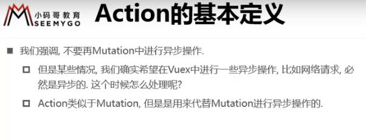

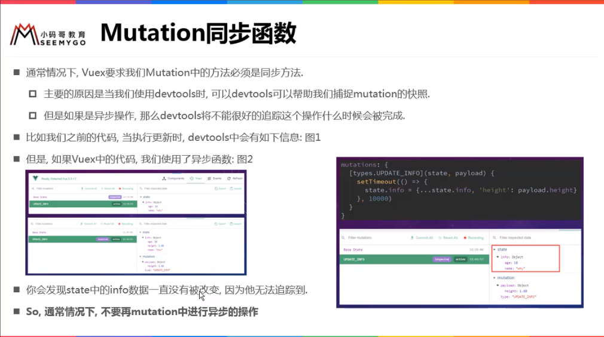

```js
//store/index.js
actions:{
    aupdateinfo(context){		//context在这里相当于store
        setTimeout(()=>{
            context.commit('updateinfo')
        },1000)
        
    }
}

//App.vue
updateinfo(){
    this.$store.dispatch('aupdateinfo')
}
```

* 回调函数，告诉更改完成

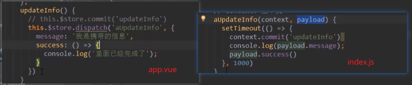

更好的方式 ， promise

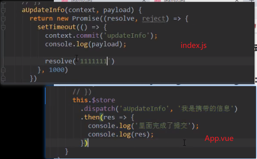


#### modules：

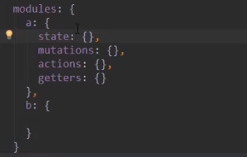

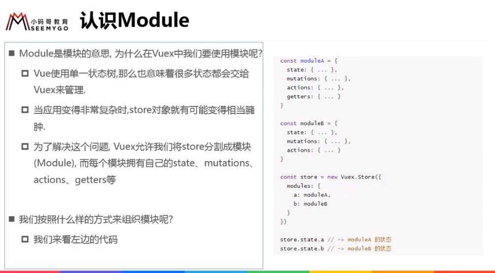

​      modules里state的内容被放进了整个state中，mutations、getters都跟之前用法一样，（可能是链式查找？）

* getters

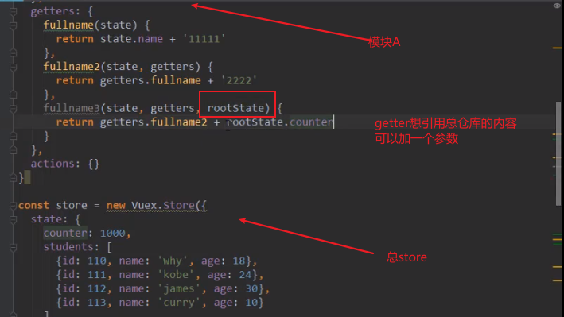

* actions

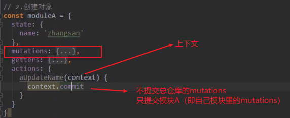

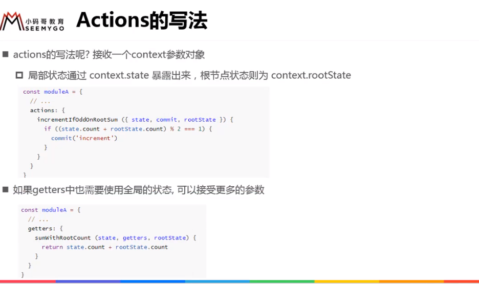