# axios


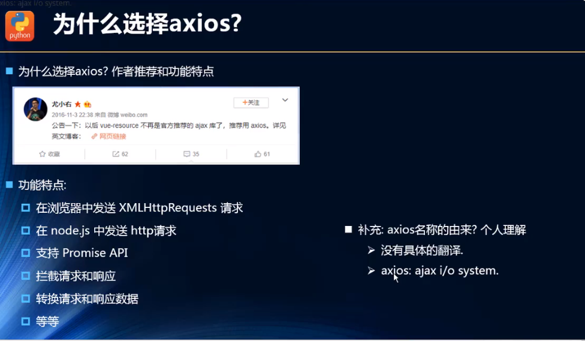

#### axios框架的基本使用

* 安装

`npm install axios --save `

* 使用

```js
http://123.207.32.32:8000/home/multidata

import axios from 'axios'
axios(config)
```

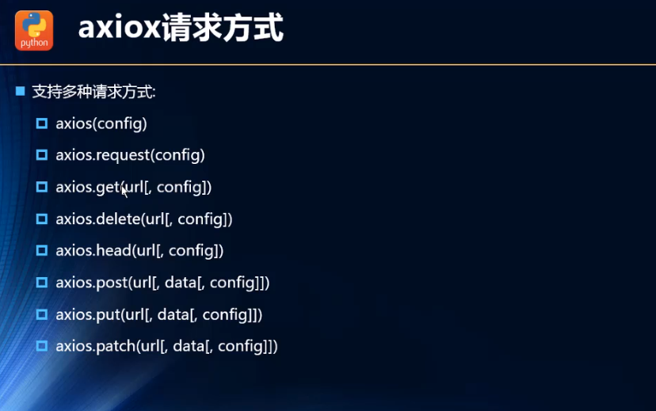

* 具体使用

```js
import axios from 'axios'
axios({
    url:'http://123.207.32.32:8000/home/multidata',
    method:'get'			//不写默认就是get
}).then(res=>{
    console.log(res)
})
```

```js
//去查资料
1. 用socket加多线程简单写一个本地的服务器。。然后访问本地地址就行???
2. 后端可以配置http跨域????
3. 建议学习python，使用flask框架十多行代码就能实现一个简单的web接口？
```

#### axios发送并发请求

```js
axios.all([axios({
    url:''
}),axios({
    url:'',
    params:{
        type:'sell',
        page:5
    }
})]).then(results=>{
    results[0]			
   	results[1]
})
```

* axios.all([])返回的结果是一个数组，使用axios.spread 可将数组[res1,res2]展开为 res1，res2

```js
axios.all([axios({
    url:''
}),axios({
    url:'',
    params:{
        type:'sell',
        page:5
    }
})]).then(axios.spread((res1,res2)=>{
    res1,
    res2
}))
```

#### axios 配置信息相关

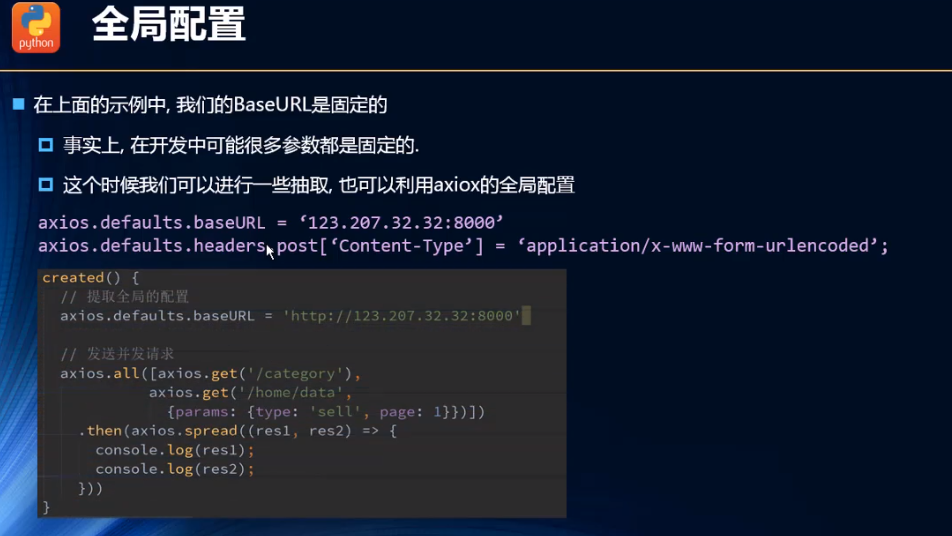

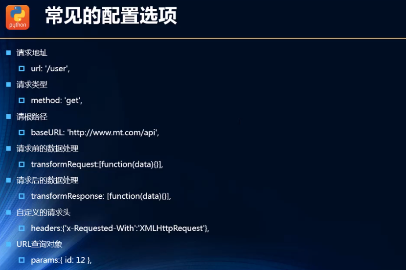

#### axios实例和模块封装

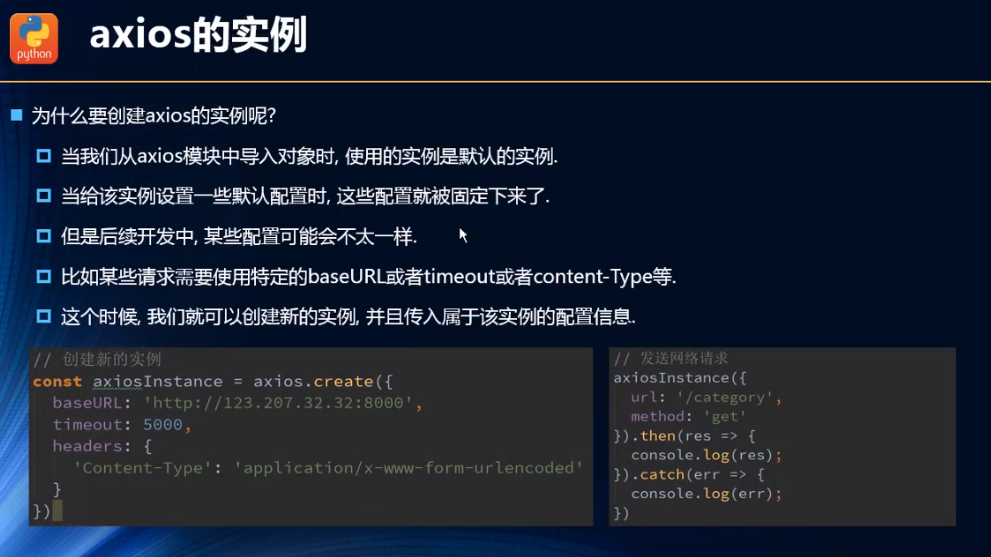

* 创建实例

```js
//一般不会用全局，因为可能有多个请求不一样
const instance1 = axios.create({
    baseURL:'http://123.207.32.32:8000',
    timeout:5000
})
instance1({
    url:'home/multidata'
}).then(res=>{
    
})
instance1({
    url:'home/data',
    params:{
        type:'pop',
        page:1
    }
}).then(res=>{
    
})

const instance2 = axios.create({
    baseURL:'http://111.222.222.32:8000',
    timeout:5000
})
....
```

* 不在每一个文件都写网络请求，封装

```js
//建一个network文件夹
//request.js
import axios from 'axios'
export function request(config){
    //1.创建实例
    const instance1 = axios.create({
        baseURL:'http://123.207.32.32:8000',
        timeout:5000
	})
    //2.发送真正的网络请求
   	instance1(config)
    
}


```

* 方法一

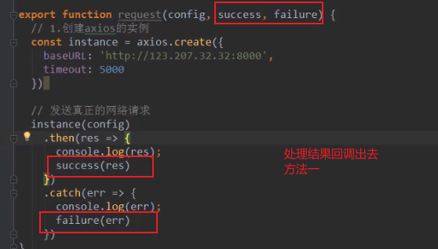


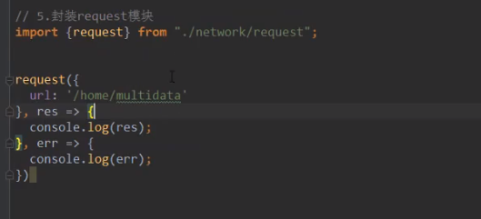

* 方法二

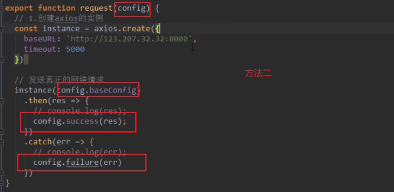

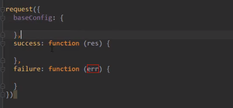

* 方法三

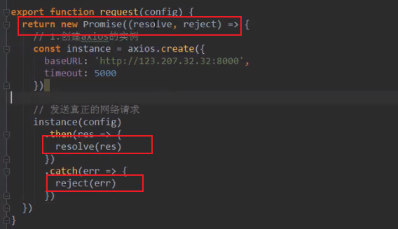

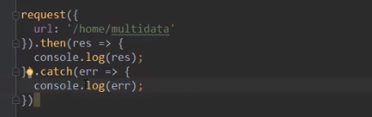

* 方法四 - 最终方案

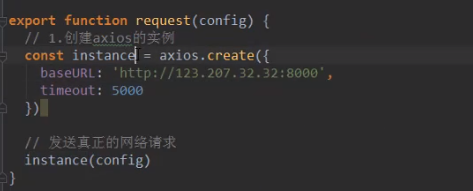


1.把函数作为参数传过去 2.传过去之后反过来回调这个函数

#### axios拦截器

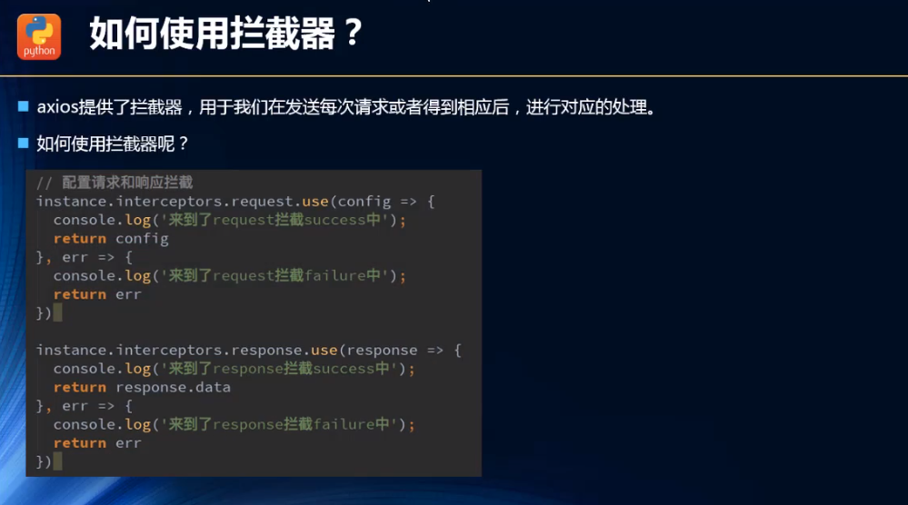

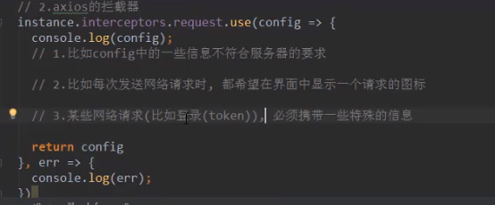