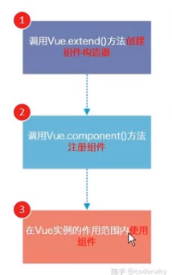
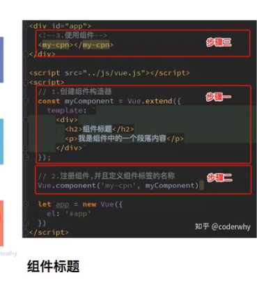
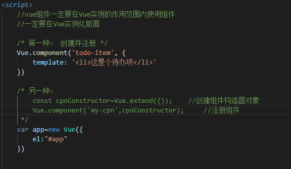
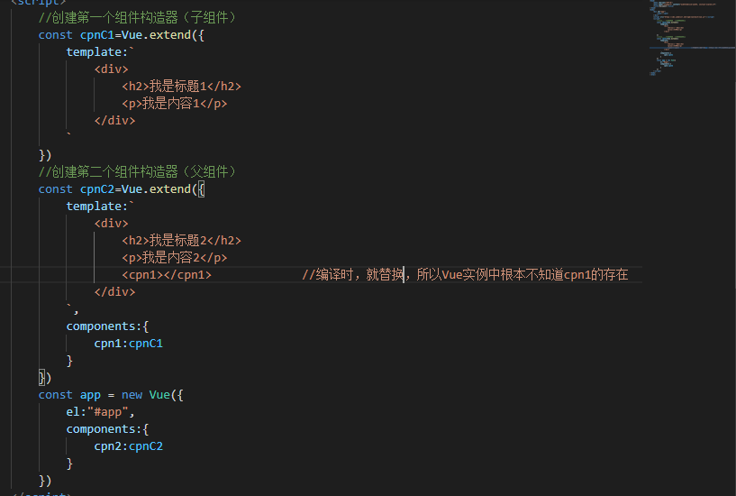
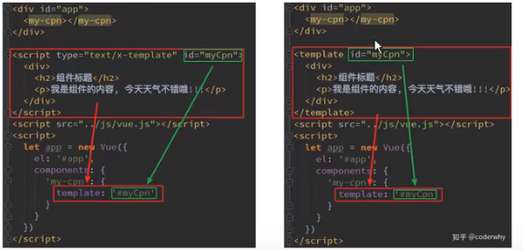
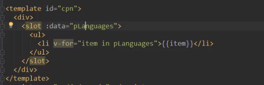
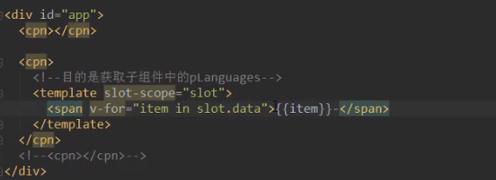
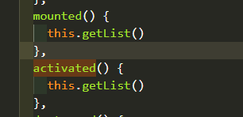

# 一、vue语法
#### mustcahe语法 即{{message}}	

#### 计算属性 computed （el、data、methods、components、filters）
* 也是写方法，但是一般不像方法那样加动词 
* fullName getFullName
* 不写括号() {{fullName}}
* 计算属性与方法的区别
	* 计算属性只调用一次，有缓存，效率更高
	* 每次调用一次执行一次，没有缓存，性能更低
* 计算属性的复杂操作
	* 例如数组里有书对象 ，算总价

#### v-bind
* v-bind 基本	v-bind:src=""
	* v-bind:class="actives"	(actives 是new vue里的data actives:"active")
		v-bind 对象语法v-bind:class="{active:isActive}"	(active类名，isActive是boolean值)
	* 如果计算过于复杂，还可以放在一个methods里 然后调用{getclasses()}
		v-bind 数组语法v-bind:class="['active','line']"	了解
#### v-on
* stop修饰符		---@click.stop=""	阻止事件冒泡
	 prevent修饰符	---	阻止事件默认行为
* once
* enter
#### v-model
* 
# 二、组件化
#### 注册组件的基本步骤
* 创建组件构造器
* 注册组件
* 使用组件

  
  
#### 注意事项


#### 全局组件和局部组件
* 全局组件：可以在多个Vue实例下面使用
* 局部组件：
  * Vue实例里注册的为局部组件
  	 Vue的一个属性components:{cpn:cpnC}	cpn-标签名，cpnC-创建的组件构造器名字
  * 一般只有一个vue，用局部组件的比较多
#### 父组件和子组件


#### 注册组件语法糖
* 就是创建和注册写一起
#### 组件模板的抽离写法


* script标签
* template标签
## 组件data属性

#### 组件是一个单独功能模块的封装
* 这个模块有属于自己的HTML模板，也应该有属于自己的数据data
* Vue组件应该有自己保存数据的地方
* 组件的数据放的位置
	* 组件对象也有一个data属性
	* 这个data属性必须是一个函数
	* 这个函数返回一个对象，对象内部保存着数据
* 为什么data属性必须是一个函数

## 组件methods属性
## 父子组件通信
#### 父传子(props)
```vue
div app
<cpn v-bind:cmovies="movies"></cpn>

<template id="cpn">
  <div><ul><li v-for="items in cmovies"></li></ul></div>
</template>
const cpn={
  template:'#cpn',
  props:['cmovies'],
  data(){}
}

Vue.{
el:#app
data{
movies,
} 
}
```

* props属性：数组
	* props:['cmovies','cmessage']
	* 注：cmovies、cmessage是变量，不是字符串
* props属性：对象
	* 有类型检测
	* props:{cmovies:Array}
	* 提供一些默认值,required,true 必须传一个参数，否则报错
	* props:{ cmessage:{type:String,default:'aaa',required:true} }
	* 类型是对象或数组时，默认值必须是一个函数（2.5.17以上）
	* props:{ cmovies:{type:Array,default(){ return [] },required:true} }
* props属性的驼峰标识
	* v-bind不支持驼峰
		 <cpn :cInfo="info"></cpn>	接收不到，需要转换下
	* <cpn :c-info="info"></cpn>
	* 那就不写大写呗
#### 子传父（自定义事件）
* 子组件发射事件--->父组件绑定该事件--->接收使用
* 也可以理解为父组件给子组件传了一个cnpClick的回调函数,让子组件在其内部调用,并传入实参(item)
	* 在子组件中，通过$emit()来触发事件
	* 在父组件中，通过v-on来监听子组件事件

#### 父访问子（$children 或 $refs）
* （想调用子组件的方法，改数据之类的）
	 this.$children[0].showMessage();		用的比较少
* 需要在标签上写ref属性
  * <cpn ref="aaa"></cpn>
  * this.$refs.aaa 

#### 子访问父（$parent）	都很少用

* 访问父组件 this.$parent
	* 很少用，因为组件一般用在很多地方，访问的父组件内容不一定有，耦合度过高
* 访问根组件 this.$root
#### 总结

1. 创建全局组件时，应该使用Vue对象的component方法，这个方法接收两个参数。第一个字符串：表示组件名称， 第二个为一个对象：表示组件内容

2. 组件要渲染的内容应该写在template选项中，作为其值进行处理

3. 注册时，推荐组件名称为【小写加分隔符链接的形式】，类似于css属性名的写法

4. 组件全局注册后，在任何vue实例中都可以使用，但前提是相关vue实例应该在注册后在声明

5. 组件在使用时，应该以标签形式调用

6. 在某些时候，vue组件会受到html的限制，比如table内就只能写行列，此时我们就可以使用is属性来实现

   ```html
   <table>
       <tr is='my-component'></tr>
   </table>
   ```

   

   

# 三、插槽（slot）

* 基本使用
	* 组件内 <solt></solt>
	* 可以有默认值<solt><button>按钮</button></solt>
	* 使用<cpn><span>显示123</span></cpn>
	
* 具名插槽
	* <slot name="center"></slot>
	* 使用的时候： <span slot="center">替换center插槽</span>
	
* 作用域插槽
	* 父组件替换插槽的标签，但是内容由子组件来提供
	* <slot :data="planguage"></slot>
	* <cpn><template slot-scope="slot">  <span v-for="item in slot.datan">{{item}}</span>  </template></cpn>
	
	
	
	
#四、前端模块化	
#### 问题
* 全局变量同名问题、对js文件的依赖顺序几乎是强制性的
* 用匿名闭包可以解决命名冲突的问题，但是又引起另一个问题，代码不可复用
#### 解决
* ES5 匿名闭包（立即执行函数），导出对象
		 
		var moduleA = (function (){
			var obj={}
			....
			....
			obj.flag=flag;
			obj.sum=sum;
			//		动态添加的
			return obj
		})()
* 以上是模块最基础的封装（核心：导入、导出）
* 常见的模块化规范
	* CommonJS、AMD、CMD、ES6的Modules
	* CommonJS 
	* ES6(export、import)
#### ES6模块化
* <script src="aaa.js" type="module"></script>
* 导出
	* 方式一：var flag=111  export{ flag,name}		
		 方式二：export var num =1000	
	* 方式三：export function mul(num1){ return num1}
		* export class Person{run(){}}
		* 可以定义好，统一导出 export {mul,Person}
	* export default num; 
		* 有时候我们并不希望给这个功能命名，让导入者命名
		* 导入的时候可以改名
		* 同一个模块中，只能有一个default，不能多个
		* import cpn from ''
* 导入
	* import {name,num} from "./info.js"
	* import {name,num} from "./info.js"
	* import {mul,Person} from "./info.js"
	* 统一全部导入 
		* import * as aname from "./info.js"
		* console.log(aname.flag)

# 五、很全的笔记


 [别人的笔记](https://blog.csdn.net/krysliang/article/details/87284483)

# 六、 其他

## 1. 一些问题记忆

####  VUE activated,deactivated使用

项目中keepalive用得不多，记录一下以免遗忘。

页面第一次进入，钩子的触发顺序created-> mounted-> activated，退出时触发deactivated。当再次进入（前进或者后退）时，只触发activated。

事件挂载的方法等，只执行一次的放在 mounted 中；组件每次进去执行的方法放在 activated 中， activated 中的不管是否需要缓存多会执行。

所以当页面设置了keepalive的时候，要想对页面数据进行更改，则可在activated中调用组件中相关的方法。调用方式和mounted一样，如下所示：



[vue-cli keep-alive用法以及activated,deactivated](http://www.mamicode.com/info-detail-2556043.html)