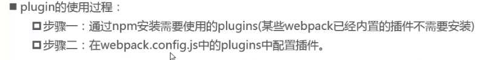
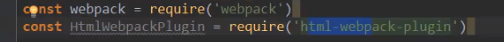
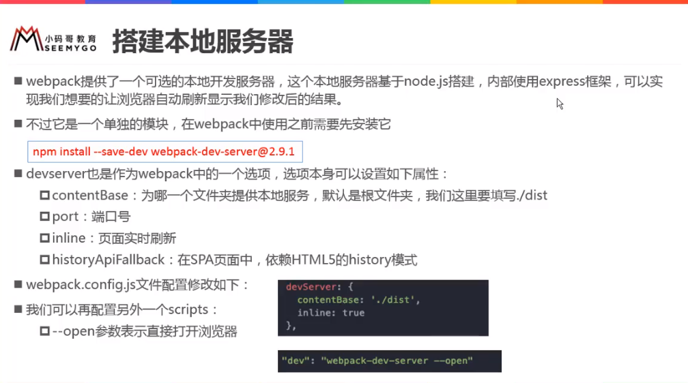

# WebPack


## 介绍

* WebPack前端模块化打包工具
* 全局安装、局部安装

```js
//全局安装
npm install webpack@3.6.0 -g
//局部安装（本地安装）		---->会有个node_modules文件夹
cd 对应目录
npm install webpack@3.6.0  --save-dev
//--save-dev 	---dev是开发时依赖，项目打包后不需要继续使用的
```

* 开发时依赖、运行时依赖

```js
//webpack是开发时依赖
"devDependencies": {
    "webpack": "^3.6.0"
}
//运行时依赖
"dependencies": {
    
}
```

* webpack做什么

```js
1. 在之前的实例中，主要是用webpack来处理写的js代码，webpack会自动处理js之间的相关依赖

2. 在开发中，不仅仅有基本的js代码处理，也需要加载css、图片、ES6转ES5、TypeSricpt转ES5、scss和less转css、.jsx和.vue文件转js文件

3. 对于webpack本身的能力来说，对于这些转化是不支持的，解决：给webpack扩展对应的loader
	loader使用过程：
    	* 通过npm安装需要使用的loader
		* 在webpack.config.js中的modules关键字下进行配置 
```


## 使用

#### 基本使用 ---- js打包配置

* 建一个项目

```js
1. 结构
	一般是：src文件夹 自己开发的；dist文件夹 打包生成的东西放在里面
2. 打包
	例如：src内有两个js文件，两个模块，aaa.js 导出；main.js导入aaa.js。打包需要一个入口文件。		webpack根据依赖关系，最终打包成一个js文件放到dist文件夹内，html只要引入打包后的那个js文件即可。
```

* VSCode中到项目文件夹下（cd）

  ```js
   npm webpack ./src/main.js ./dist/bundle.js			//main.js作为入口文件
  ```

* 配置：（入口出口配置）想要输入webpack就能直接打包

```javascript
//先建一个webpack.config.js文件（必须叫这个名）

const path = require('path')	
//path---node的核心模块之一，要使用path需要先执行命令 npm init---->会生成package.json
//package.json 任何项目需要单独依赖node环境都需要这个文件--->npm包管理文件
//如果package.json依赖一些其他东西的时候 需执行命令 npm install---->会自动安装

module.exports = {
    entry: './src/main.js',
    output: {
        path:path.resolve(__dirname,'dist'),		//动态获取路径
        //path.join是把__dirname与后面的路径进行拼接
        //path.resolve是从__dirname（根路径）开始cd到后面的路径
        filename:'bundle.js'		
    }
}
```

* 配置：npm run build （把其他命令例如：webpack命令等映射到 npm run build）

```json
//package.json		（npm init---->会生成package.json）

"scripts": {
    "test": "echo \"Error: no test specified\" && exit 1",
    "build":"webpack"	
}
//只要在终端执行webpack命令打包 用的都是全局的
//在终端执行的命令，都会去全局找
//在脚本配置，通过npm run build会优先用本地的 
```

#### 基本使用 ---- webpack loader

* css打包

```js
//在入口文件--- 写依赖
require('./css/normal.css')			---ES6中： import css from './css/normal.css'

//css-loader 安装			--- css-loader只负责将css文件进行加载
npm install --save-dev css-loader@2.0.2 
//style-loader 安装			---style-loader负责将样式添加到DOM中
npm install --save-dev style-loader 

//配置	webpack.config.js
module.exports = {
    module: {
        rules:[
            {
                test:/\.css$/,
                use:['style-loader','css-loader']
            }
        ]
    }
}
//test正则匹配css文件，匹配到的css文件使用 style-loader css-loader
//使用多个loader时，是从右向左读取
```

* 图片打包 

```js
npm install --save-dev url-loader@1.1.2
npm install --save-dev file-loader@3.0.1

//小于limit时，用的就是src里的
//大于limit时，会再打包个图片到dist文件夹里，但是，但是原来的路径是src里的
	//配置
	output: {
        path:path.resolve(__dirname,'dist'),
        filename:'bundle.js',
        publicPath:'dist/'			//加这个
    },
     //以后index.html要放到dist里一起发布，那时候就不需要加了   
        
//配置图片路径，图片命名；原来是默认放在dist里
        options: {
             limit: 8100,
             name: 'img/[name].[hash:8].[ext]'
        },
```


* ES6转ES5

```js
npm install --save-dev babel-loader@7 babel-core babel-preset-es2015

//配置	webpack.config.js
	{
            test: /\.m?js$/,
            exclude: /(node_modules|bower_components)/,
            use: {
              loader: 'babel-loader',
              options: {
                presets: ['es2015']
              }
            }
	}
```

#### Vue 的配置过程

* 介绍

```js
//安装Vue三种方式
1. 直接下载引用
2. CDN引入
3. npm安装

//npm安装
npm install vue@2.5.21 --save			//开发运行都要用

//使用
import Vue from 'vue'

//如下图，改webpack配置
resolve: {
      alias: {
        'vue$': 'vue/dist/vue.esm.js'
      }
}
```


* el和template关系

```js
//如果同时有el和template存在
//template内容会自动放入挂载的地方里面	<div id="app"></div>
new Vue({
    el:"#app",
    template:`
		<div>
			<h2>{{message}}</h2>
		</div>
	`,
    data:{
        message:'helloword'
    }
    
})
```

* 抽离组件

```js
//main.js  实例里的内容---->放组件
const cpn={
    template:`
        <div>
        <h2>{{message}}</h2>
        <h3>{{message}}</h3>
        </div>
    `,
    data(){
        return {
            message:'hello world'
        }
    },
    methods:{
        btnclick(item){
            this.$emit('itemclick',item)
        }
    }
}
const app=new Vue({
    el: '#app',
    template:'<cpn></cpn>',
    components:{
        cpn
    }
})
```

```js
//原来放在main的组件---->抽离到app.js
//app.js
export default{
    template:`
        <div>
        <h2>{{message}}</h2>
        <h3>{{message}}</h3>
        </div>
    `,
    data(){
        return {
            message:'hello world2'
        }
    },
    methods:{
        btnclick(item){
            this.$emit('itemclick',item)
        }
    }
}
//main.js
import cpn from './vue/app'
const app=new Vue({
    el: '#app',
    template:'<cpn></cpn>',
    components:{
        cpn
    }
})
```

```vue
//上一个，js没有与模板分离		---->创建一个app.vue
//app.vue
<template>
    <div>
        <h2 class="title">{{message}}</h2>
        <h3>{{message}}</h3>
    </div>
</template>

<script>
export default {
    name: "app",
    data(){
        return {
            message:'hello world2'
        }
    },
    methods:{   
        btnclick(item){
            this.$emit('itemclick',item)
        }
    }
}
</script>

<style>
    .title {
        color: blue;
    }
</style>
```


```js
//使用vue文件，编译 需要配置
npm install vue-loader vue-template-compiler --save-dev
//
{
     test: /\.vue$/,
     use: ['vue-loader']
}

//main.js		
import cpn from './vue/app.vue'
const app=new Vue({
    el: '#app',
    template:'<cpn></cpn>',
    components:{
        cpn
    }
}) 

```

#### plugin（插件）


​                                          

* 添加版权


* 打包html

​                             



* js压缩

​                                      

#### 搭建本地服务器

* 方便测试



```js
npm install --save-dev webpack-dev-server@2.9.3

webpack-dev-server	//--在终端中执行，去全局找，而我们并没有在全局安装webpack-dev-server

//配置命令
 "scripts": {
    "test": "echo \"Error: no test specified\" && exit 1",
    "build": "webpack",
    "dev":"webpack-dev-server --open"
  },
      
//执行
npm run dev
// 然后更改src里的内容，直接实时更新在页面上
```

#### webpack配置文件分离

```js
npm install webpack-merge --save-dev

新建build文件夹---> 三个文件base.config.js、dev.config.js、prod.config.js
---> 分别放入
---> 更改package.json
	"build": "webpack --config ./build/prod.config.js",
    "dev": "webpack-dev-server --open --config ./build/dev.config.js"
---> 因为配置文件位置更改，因此需更改出口位置（base.config.js）
	output: {
        path:path.resolve(__dirname,'../dist'),
        filename:'bundle.js',
        // publicPath:'dist/'
    },

```

