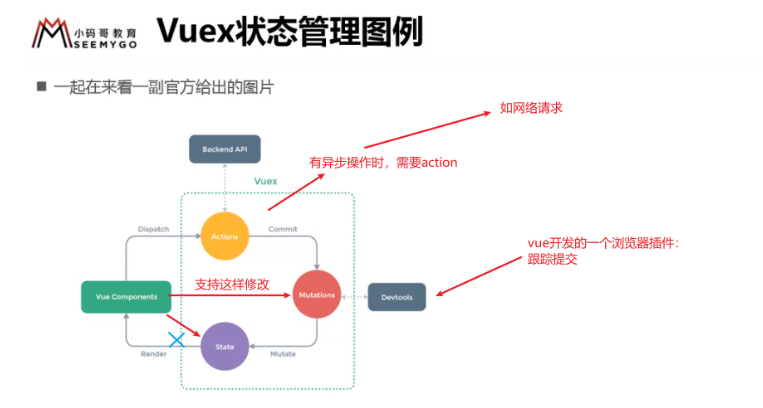

## Vue

### 一、 vue-router

#### 1.  \$route、$router

\$route: 获取当前活跃路由状态。从当前router跳转对象里面可以获取name、path、query、params等（<router-link>传的参数有this.\$route.query或者this.$route.params接收）

\$router: 为VueRouter实例。想要导航到不同URL，则使用\$router.push方式，返回上一个history也是使用\$router.go\$router.back方法

### 二、 vuex

#### 1.  vuex大致介绍

​	**vuex：**状态管理工具。Vue`为这些被多个组件频繁使用的值提供了一个统一管理的工具——`VueX。响应式。

​	**state、getter、mutations、actions、module、**

​	在其他组件使用
​	{{$store.state.counter}}

​	更改：$store.state.counter++ 可以 但是不好，不这样用

​	

### 三、 js稍微复杂

#### 1. 闭包

