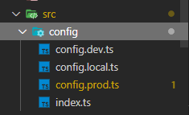
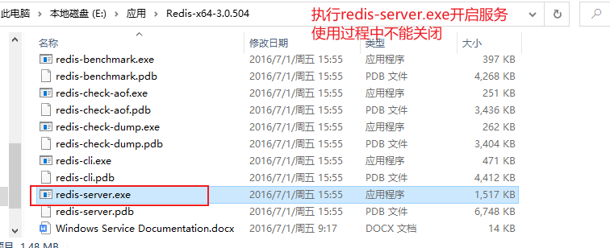
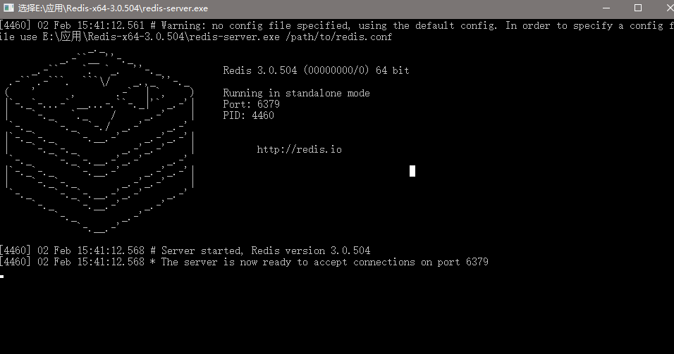
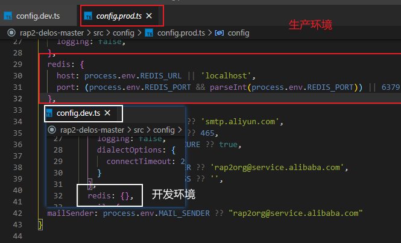
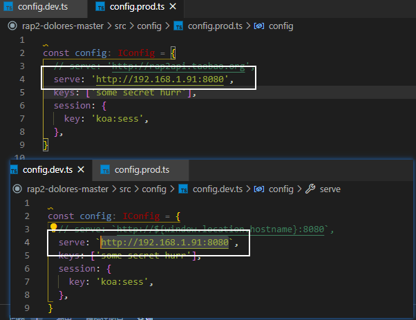
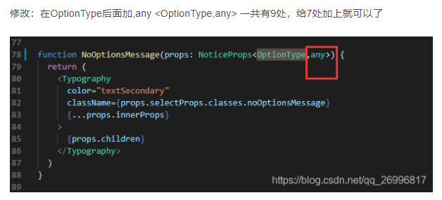
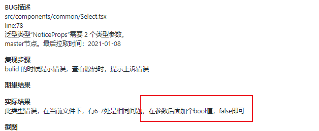
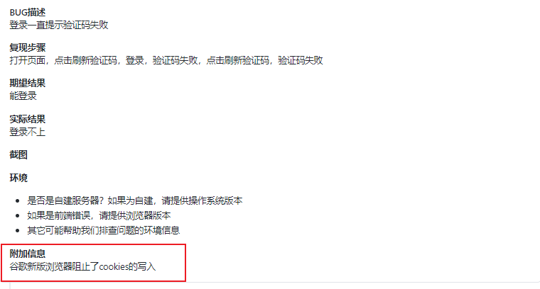
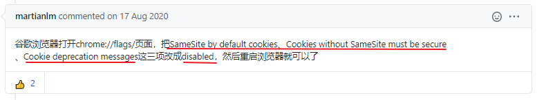

## 内容

#### 阿里rap2接口

* 开发环境、生产环境接口
* 接口状态管理（是否接口，未接入原因...）      涉及更改数据库
* 权限管理 ？
* 文档导出（优化）
* 仓库接口状况（echart）
* mock.js库  数据随机生成

## 项目部署

### 一、 拉取

* [rap2-delos: 后端数据 API 服务器](https://github.com/thx/rap2-delos)
  * git clone https://github.com/thx/rap2-delos.git
* [rap2-dolores: 前端静态资源](https://github.com/thx/rap2-dolores)

### 二、 手动部署（后端）

#### 1. 安装 MySQL 和 Redis 服务器

​	mysql/redis 配置在 config.*.ts 文件



​	注意：修改 cofig 文件后需要重新 `npm run build` 才能生效

##### MySQL

​	使用Navicat Premium工具

##### Redis

* 下载压缩包后，直接解压打开

  

* 运行

  

* 在不修改任何配置的情况下， redis 会通过默认端口 + 本机即可正常访问，确保 redis-server 打开即可。

  ​	

#### 2. 安装 pandoc

​	我们使用 pandoc 来生成 Rap 的离线文档，安装 Pandoc 最通用的办法是在 pandoc 的 [release 页面](https://github.com/jgm/pandoc/releases/tag/2.7.3)下载对应平台的二进制文件安装即可。

​	测试在命令行执行命令 `pandoc -h` 有响应即可。

#### 3. 数据库创建

* 打开Navicat Premium
* 执行`CREATE DATABASE IF NOT EXISTS RAP2_DELOS_APP DEFAULT CHARSET utf8 COLLATE utf8_general_ci`

#### 4. redis服务开启

* 见安装部分

#### 5. 初始化

* 进入目录

* 初始

  ```shell
  npm install
  ```

  确认/config/config.dev.js 中的配置(.dev.js 后缀表示用于开发模式)。

* 安装 && TypeScript 编译

  ```shell
  npm install -g typescript
  npm run build
  ```

* 初始化数据库表

  ```shell
  npm run create-db
  ```

* 启动开发模式的服务器 监视并在发生代码变更时自动重启

  ```shell
  npm run dev
  ```

* 生产模式

  ```shell
  # 1. 修改/config/config.prod.js中的服务器配置
  # 2. 启动生产模式服务器
  npm start
  ```

  

### 三、前端部署

```js
# 获取源代码
git clone https://github.com/thx/rap2-dolores.git
 
# 修改配置文件
cd rap2-dolores/src/config
# 文件目录如下
├── config.dev.js
├── config.prod.js
└── index.js
# 修改两个配置文件的如下部分
serve: 'http://192.168.5.224:8080'
# 注意ip不能写localhost，即使是在同一个机器上写的前端和后端
 
# 回到根目录
cd ../..
# 安装依赖包
npm install
# 编译
# 修改了项目的代码或配置文件之后一定重新编译，不然修改不起作用
# 如果报错说没有权限创建文件夹，可以在后面加上--unsafe-perm参数
npm run build
 
# 安装serve
npm install -g serve 
# 启动
# 其中./build是编译生成的文件路径，8090是前端访问的端口
serve -s ./build -p 8090
# 这里启动后会阻塞会话，可以使用nohup，并且指定全路径启动
nohup serve -s /root/rap/build -p 8090 &
```

以上是别人的，我自己再看一遍

#### 1. 修改配置文件



​	**注：ip不能写localhost**

#### 2. 安装依赖包

npm install

####3. 安装serve

npm install -g serve 


## 别人部署

[RAP2 详细部署、操作指南](https://blog.csdn.net/CL_YD/article/details/90749308)


## 遇到的问题

去issues看

#### 编译问题 Select.tsx



2. 

#### 登录一直提示验证码失败





[谷歌浏览器打开无法登录 #701](https://github.com/thx/rap2-delos/issues/701)