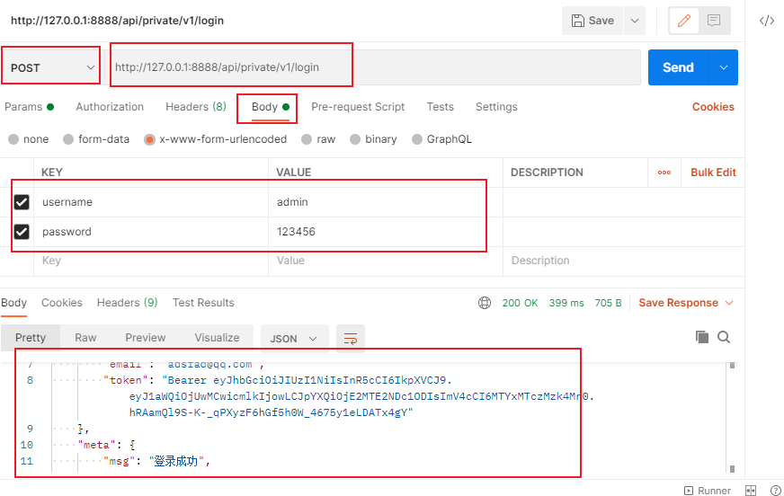
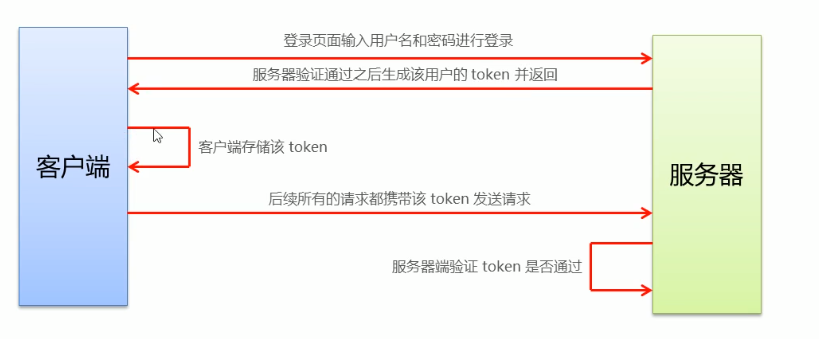

## 通用知识点

### 1. 记录登录状态

**两种方式记录登录状态**

* cookie+session: 前端后端**没有跨域**问题推荐使用此方式记录登录状态

* token：前端后端**存在跨域**问题推荐使用此方式记录登录状态

### 2. token

#### 初次接触

测试接口时，请求接口并输入参数，返回值中包括了token

token作用：用于登录状态保存

#### token概要

* token是由服务器端生成的
* 生成的每个用户的token都不一样

#### token原理分析

* 服务器通过token判断是哪个用户

* token：身份令牌